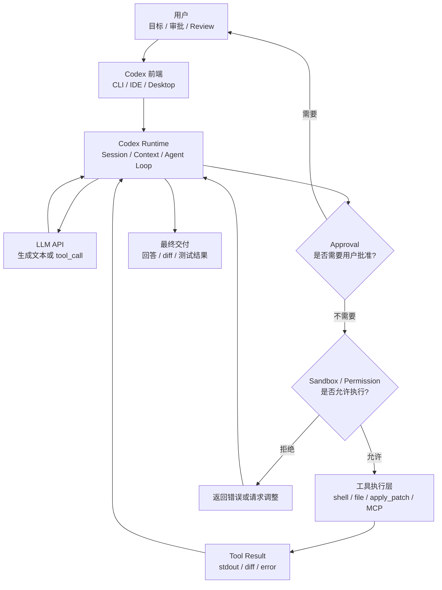

# Codex 运行机制学习手册

> [!abstract] 文档定位
> 这篇文档适合作为理解 Codex agent runtime、tool call、sandbox、approval，以及 Local / Remote / Cloud 执行边界的主线材料。

> [!tip] Obsidian 导航
> 统一索引见 [[开源项目架构设计文档索引]]；建议和 [[openclaw-architecture-learning-guide|OpenClaw]]、[[hermes-architecture-learning-guide|Hermes Agent]] 的执行边界与工具运行时对照阅读。

> [!example] 快速跳转
> - [[#1.1 架构总览图：谁决策，谁执行，谁约束|架构总览图]]
> - [[#2. 从 Prompt 到最终解释：完整生命周期|Prompt 到最终解释]]
> - [[#4. Sandbox：什么时候启动，限制了什么|Sandbox 启动与限制]]
> - [[#6. Local、Remote、Cloud：三条完全不同的执行路径|Local / Remote / Cloud]]
> - [[#10.6 使用前检查清单|使用前检查清单]]
> - [[#12. 一页速记|一页速记]]

> 面向开发者的技术学习文档：从一次用户 Prompt 开始，理解 Codex 如何组织 agent loop、如何调用工具、什么时候进入 sandbox，以及 Local、Remote、Cloud 三种模式的本质区别。  
> 版本日期：2026-05-20

> [!info] 核心结论
> - Codex 的核心不是单次 LLM API 调用，而是由 runtime 驱动的 agent loop。
> - 模型只提出下一步意图；工具执行、权限检查、sandbox 和审批由 Codex runtime 承担。
> - Local sandbox 不是仓库副本，workspace 内允许的写操作会真实发生。
> - Remote 影响远端主机，Cloud 影响云端 repo clone；二者都不是“只换了一个 UI”。
> - 安全来自最小权限、合理审批、外层隔离、Git 可回滚和人工 review 的组合。

---

## 0. 这份文档解决什么问题

很多人第一次接触 Codex 时，会把几个概念混在一起：模型、agent、工具、MCP、skills、sandbox、Docker、Cloud、Remote。它们确实都出现在同一条任务链路里，但不是同一层东西。

这份文档只围绕一个问题展开：

> 用户输入一个 prompt 后，Codex 从开始到结束到底做了什么？

读完你应该能回答：

- LLM API 在整个链路里扮演什么角色？
- Codex runtime / agent loop 是什么？
- tool call 是谁发起、谁执行的？
- sandbox 是什么时候启动的？
- Local sandbox 是不是复制仓库再同步？
- `rm` 在 Local、Remote、Cloud 中分别会删哪里？
- `danger-full-access` 和 `--yolo` 到底危险在哪里？
- Cloud container 和本地 OS sandbox 有什么根本区别？
- MCP、skills、shell、apply_patch 这些能力如何接入 agent loop？

本文不是源码逐行阅读，也不是配置速查表。它是一份帮助你建立正确心智模型的学习文档。

### 0.1 阅读路径

| 目标 | 建议先读 | 读完应该能判断 |
|---|---|---|
| 快速建立心智模型 | [[#1. 最重要的一句话]]、[[#12. 一页速记]] | Codex 中谁决策、谁执行、谁约束 |
| 理解一次任务如何跑完 | [[#2. 从 Prompt 到最终解释：完整生命周期]]、[[#3. 工具层：Codex 到底能“动手”做什么]] | tool call 如何进入 agent loop |
| 判断安全边界 | [[#4. Sandbox：什么时候启动，限制了什么]]、第 5 节 `danger-full-access` / `--yolo`、[[#9. 安全心智模型]] | 哪些操作会真实影响文件系统 |
| 选择运行模式 | [[#6. Local、Remote、Cloud：三条完全不同的执行路径]]、[[#7. Cloud container 和 Local sandbox 的根本区别]]、[[#10. 推荐默认用法]] | Local / Remote / Cloud 该怎么选 |
| 做团队规范 | [[#8. 典型任务拆解]]、[[#10.6 使用前检查清单]]、[[#11. 常见误解 FAQ]] | 如何把权限、审批、review 固化成流程 |

### 0.2 术语边界

| 术语 | 本文中的准确含义 | 容易混淆的说法 |
|---|---|---|
| LLM API | 根据上下文生成文本或 tool call 的模型服务 | “模型直接操作电脑” |
| Codex runtime | 维护 session、组织上下文、调用模型、执行工具调度和安全策略的运行时 | “只是一个聊天界面” |
| tool call | 模型提出的动作意图，由 runtime 接收后再决定是否执行 | “模型已经执行了命令” |
| sandbox | 对 Codex 启动的命令或文件操作施加边界 | “所有 Codex 逻辑都在沙箱里” |
| approval | 是否需要停下来让用户批准的策略 | “权限边界本身” |
| Cloud container | OpenAI 托管环境中的 repo clone 和执行容器 | “在本机启动 Docker” |

---

## 1. 最重要的一句话

先记住这一句话：

> **Codex 不是模型直接操作你的电脑；Codex 是一个 agent runtime。模型负责判断下一步，runtime 负责执行工具，sandbox 负责限制执行边界，approval 负责决定什么时候停下来问你。**

可以把整个系统拆成五个角色：

| 角色 | 负责什么 | 不负责什么 |
|---|---|---|
| 用户 | 给目标、批准高风险动作、review 结果 | 不直接管理 agent loop |
| Codex 前端 | 收输入、展示输出、显示 diff / 审批提示 | 不自己理解代码逻辑 |
| Codex runtime | 管会话、组织上下文、调用模型、路由工具、执行审批和 sandbox 策略 | 不直接产生智能判断 |
| LLM API | 根据上下文决定下一步：回答、读文件、改文件、跑命令、继续探索 | 不直接读写你的文件系统 |
| 工具执行层 | 真实执行 shell、读写文件、apply patch、调用 MCP、运行测试 | 不决定任务目标 |

### 1.1 架构总览图：谁决策，谁执行，谁约束



这张图里最容易误解的是：**模型只返回“我想做什么”，不是直接“动手做”。真正动手的是 Codex runtime。**

### 1.2 架构分层

| 分层 | 关注点 | 典型问题 |
|---|---|---|
| 交互层 | 用户输入、审批提示、diff 展示、最终回答 | 用户如何发起任务和 review 结果 |
| 编排层 | session、上下文构造、模型调用、agent loop | 什么时候继续问模型，什么时候结束 |
| 决策层 | LLM 根据上下文选择回答或 tool call | 下一步该解释、读取、修改还是测试 |
| 执行层 | shell、文件读写、apply_patch、MCP、测试命令 | 动作具体在哪里发生 |
| 边界层 | sandbox、permissions、approval、Cloud 隔离 | 最大可影响范围是什么 |
| 交付层 | diff、测试结果、PR、patch、最终解释 | 结果如何回到用户和代码库 |

---

## 2. 从 Prompt 到最终解释：完整生命周期

假设你在一个项目里输入：

```bash
codex "帮我找出登录失败的原因，并修复"
```

这不是一次简单的“把 prompt 发给模型然后返回答案”。它更像一个循环任务。

### 2.1 前端接收输入

首先，输入进入某个 Codex 前端：

| 入口 | 含义 |
|---|---|
| `codex` | 本地交互式终端界面 |
| `codex exec "..."` | 本地非交互任务，适合脚本或 CI |
| IDE / Desktop App | 图形化界面，但底层仍是 agent runtime |
| `codex app-server` | 在某台机器上启动 Codex 服务端 |
| `codex --remote ws://...` | 当前机器只做 UI，连接远端 app-server |
| `codex cloud ...` | 把任务交给 OpenAI 托管的 Cloud 环境 |
| `codex apply ...` | 把 Cloud 任务生成的 diff 应用回本地 |

这一阶段确定的是：**agent loop 到底在哪里运行**。

- Local：agent loop 在你当前电脑上。
- Remote：agent loop 在你连接的远端机器上。
- Cloud：agent loop 在 OpenAI 托管的云端容器中。

### 2.2 创建 session

进入一次任务后，Codex 会创建或恢复一个 session。session 可以理解为“这次任务的状态容器”。

它通常会包含：

```text
当前工作目录
当前 git/workspace 信息
用户 prompt
历史消息
模型设置
可用工具列表
sandbox / permission profile
approval policy
项目规则，如 AGENTS.md 或配置文件
MCP server 配置
事件日志 / transcript
```

也就是说，模型拿到的并不是裸 prompt，而是 Codex runtime 整理过的上下文。

### 2.3 构造模型请求

Codex runtime 会把这些内容组织成一次模型请求：

```text
系统规则
开发者规则
用户 prompt
项目规则
当前环境摘要
可用工具定义
历史 tool result
当前权限说明
```

然后发送给模型。

模型可以返回两类东西：

```text
自然语言：
  “我先解释一下这个项目的登录流程……”

tool_call：
  “我要读取 package.json”
  “我要 grep login”
  “我要运行 npm test”
  “我要应用这个 patch”
```

### 2.4 agent loop 开始

核心循环可以写成伪代码：

```python
while task_not_done:
    model_input = build_context(session)
    model_output = call_model(model_input)

    if model_output.text:
        show_to_user(model_output.text)

    if model_output.tool_calls:
        for call in model_output.tool_calls:
            decision = check_approval_and_permissions(call)
            if decision.needs_user_approval:
                ask_user()
            result = execute_tool(call, sandbox_policy)
            session.add_tool_result(result)
        continue

    if model_output.is_final:
        finish_turn()
        break
```

更贴近真实任务的流程是：

```text
用户：修复登录失败
  │
  ▼
模型：先看项目结构
  │ tool_call: ls / cat package.json
  ▼
Codex：执行工具，返回结果
  │
  ▼
模型：发现 src/auth/session.ts 可疑
  │ tool_call: read file / grep / sed
  ▼
Codex：读取文件，返回片段
  │
  ▼
模型：生成 patch
  │ tool_call: apply_patch
  ▼
Codex：检查权限并修改文件
  │
  ▼
模型：要求跑测试
  │ tool_call: npm test
  ▼
Codex：在 sandbox 中执行测试，返回 stdout/stderr/exit code
  │
  ▼
模型：根据测试结果继续修复或总结
```

注意这里有两个关键点：

1. **工具结果会回到模型。** 比如测试失败信息不是只显示给用户，而是会重新进入模型上下文，供模型继续判断。
2. **任务完成由模型判断。** 当模型认为目标已经完成，并且没有新的 tool call，Codex 才结束这次 turn。

---

## 3. 工具层：Codex 到底能“动手”做什么

Codex 的能力不是模型本身拥有的，而是 runtime 暴露给模型的一组工具。

### 3.1 shell 命令

典型命令包括：

```bash
ls
grep -R "login" src
npm test
pytest
git diff
rm src/foo.ts
```

模型会提出“我要运行这个命令”，Codex runtime 再决定是否允许、是否需要审批、是否放进 sandbox。

### 3.2 文件读取

模型并不天然知道整个仓库。它通常会逐步探索：

```text
先看文件树
再看 package.json / pyproject.toml
再 grep 关键字
再打开相关文件
再根据上下文决定修改点
```

读取文件可以通过内部文件工具，也可以通过 shell 命令完成。

### 3.3 apply_patch / 文件修改

模型修改文件时，通常不是“直接写磁盘”，而是生成结构化 patch：

```text
模型提出 patch
  │
  ▼
Codex 检查目标文件是否允许写
  │
  ▼
Codex 应用 patch
  │
  ▼
返回成功、失败或 diff 信息
```

如果 patch 上下文不匹配，Codex 会返回失败信息，模型再重新读取文件并生成新 patch。

### 3.4 MCP

MCP 可以理解为外部工具和上下文的接入协议。比如：

```text
查内部文档
查 issue tracker
查数据库元信息
调用公司内部 API
连接日志系统
```

但 MCP 本身不是安全边界。它只是告诉模型：“这里有一组可以调用的外部能力”。

安全边界取决于 MCP server 在哪里运行：

| MCP 类型 | sandbox 能否约束 |
|---|---|
| 本地 MCP server | 取决于它如何被启动，以及是否作为本地进程进入限制边界 |
| 远程 MCP server | 本地 sandbox 通常不能约束远程服务本身 |
| 只读上下文 MCP | 风险主要是信息暴露 |
| 可执行动作 MCP | 风险包括误操作、越权调用、数据写入 |

### 3.5 skills / rules / instructions

Skills 更像是“工作方法包”或“操作规范”。它会影响模型怎么做任务，但不等于工具本身，也不等于 sandbox。

可以这样区分：

```text
skills / rules：告诉模型应该怎么做
MCP / tools：给模型可以调用的能力
runtime：真正执行这些能力
sandbox：限制本地命令能碰哪里
approval：决定什么时候问用户
```

---

## 4. Sandbox：什么时候启动，限制了什么

### 4.1 sandbox 不包住整个 Codex

sandbox 的准确位置在这里：

```text
模型返回 tool_call
        │
        ▼
Codex runtime 收到 tool_call
        │
        ▼
approval policy 判断是否需要问用户
        │
        ▼
sandbox / permission 判断这次动作能碰哪里
        │
        ▼
启动命令或执行本地写操作
        │
        ▼
这次执行受到 sandbox 边界限制
```

所以 sandbox 主要约束的是：

```text
Codex 代表模型启动的本地/远端命令进程
本地文件读写
命令能否访问网络
工具能否写 workspace 外路径
```

sandbox 不包住：

```text
用户输入 prompt
模型 API 请求
模型推理过程
Codex 主程序的所有逻辑
云端远程服务本身
```

### 4.2 Local sandbox 不是复制仓库

这是最重要的误区之一。

Local sandbox 不是：

```text
复制仓库到临时目录
  → 在副本里执行命令
  → 把改动同步回真实目录
```

它更接近：

```text
在你的真实 workspace 上执行命令
  → 但用 OS 级机制限制这个命令能读写哪些路径
```

也就是说，Local 模式下：

```bash
rm src/a.ts
```

如果 `src/a.ts` 在允许写入的 workspace 内，它会被**真实删除**。你随后运行：

```bash
git status
```

会看到真实的 deletion。

sandbox 提供的不是“事务回滚”，而是“越界防护”。

### 4.3 `rm` 在 sandbox 中会怎样

假设你在这个目录启动 Codex：

```text
/Users/you/project
```

| 命令 | workspace-write 下的典型结果 | 说明 |
|---|---|---|
| `rm src/a.ts` | 可能成功，真实删除 | 因为它在 workspace 内 |
| `rm -rf src` | 可能成功，真实删除 | sandbox 不保证 workspace 内不犯错 |
| `rm ../private.txt` | 通常失败 | 越过 workspace 边界 |
| `rm ~/.ssh/config` | 通常失败 | 不在允许写入范围内 |
| `rm -rf .git` | 通常受保护或失败 | 版本控制目录通常应视为敏感路径 |
| `rm -rf /` | 通常失败 | 不在 sandbox 允许范围内 |

所以你要记住：

> **Local sandbox 保护的是 workspace 边界，不是保护 workspace 内每个文件免受错误修改。**

如果 Codex 在允许范围内删错了文件，你仍然需要靠 Git 来恢复：

```bash
git restore src/a.ts
git restore .
git clean -fd
```

### 4.4 和你自己直接执行命令有什么区别

普通 shell：

```text
命令拥有你当前用户本来拥有的权限。
你能删哪里，命令通常就能删哪里。
```

Codex sandboxed shell：

```text
命令仍然以你的机器上的进程运行，
但除了系统用户权限，还多了一层 Codex sandbox policy。
```

因此区别是：

```text
你自己 rm ~/.ssh/config：
  如果当前用户有权限，可能删掉。

Codex workspace-write 里 rm ~/.ssh/config：
  即使当前用户有权限，也通常会被 sandbox 阻止。
```

### 4.5 sandbox mode 和 approval policy 是两根轴

它们经常被混在一起，但其实含义不同。

| 维度 | 回答的问题 | 例子 |
|---|---|---|
| sandbox / permissions | 技术上最多能做什么 | 能写哪些目录？能不能联网？ |
| approval policy | 什么时候停下来问用户 | 越界是否请求批准？网络是否请求批准？ |

可以有这些组合：

```text
有 sandbox + 自动执行低风险命令
有 sandbox + 越界时问用户
有 sandbox + 永不问，失败就失败
无 sandbox + 仍然问用户
无 sandbox + 从不问用户
```

常见模式：

| 模式 | 直观含义 |
|---|---|
| read-only / `:read-only` | 适合解释、审查、只读探索 |
| workspace-write / `:workspace` | 适合日常编码：能改项目内文件，不能随便碰项目外 |
| danger-full-access / `:danger-full-access` | 移除本地 sandbox 限制，应非常谨慎 |
| on-request | 常见审批策略：正常自动跑，越界时问 |
| never | 不问，适合受控 CI 或外层已隔离环境 |

---

## 5. `danger-full-access` 和 `--yolo`

### 5.1 `danger-full-access` 是什么

`danger-full-access` 的核心含义是：

```text
取消 Codex 对本地命令施加的 sandbox 边界。
```

在这个模式下，Codex 发起的命令会非常接近你自己在终端里运行命令。

例如：

```bash
rm -rf ~/Documents/some-folder
```

在 `workspace-write` 下，通常会因为越过 workspace 被挡住。

在 `danger-full-access` 下，如果你的当前用户本来有权限删除，它就可能真的删除。

### 5.2 它不是 root

`danger-full-access` 不等于超级权限。

它不会自动获得：

```text
root
sudo
绕过 Unix 文件权限
绕过 macOS TCC / SIP
绕过企业 MDM / EDR
绕过 Windows ACL
```

它只是表示：

```text
不再额外使用 Codex 本地 sandbox 限制这个命令。
```

剩下的仍然是系统权限。

### 5.3 `--yolo` 更危险

`danger-full-access` 只说 sandbox 边界。

`--yolo` 或类似“bypass approvals and sandbox”的模式通常表示：

```text
无 sandbox
+ 无人工审批
```

这比单独的 `danger-full-access` 更危险，因为它不仅让命令有更大权限，还减少了你中途拦截的机会。

一句话：

> **`danger-full-access` 是“无本地 sandbox”；`--yolo` 是“无本地 sandbox + 无审批”。**

---

## 6. Local、Remote、Cloud：三条完全不同的执行路径

不要把 Local、Remote、Cloud 混在一起。它们的差别不是 UI 不同，而是 agent loop 和文件系统的位置不同。

| 模式 | UI 在哪里 | agent loop 在哪里 | 文件在哪里 | 命令在哪里跑 | 修改是否直接影响本地 |
|---|---|---|---|---|---|
| Local | 你的电脑 | 你的电脑 | 你的真实项目目录 | 你的电脑 | 是 |
| Remote | 你的电脑或其他客户端 | 远端主机 | 远端主机的真实目录 | 远端主机 | 不影响当前客户端，但影响远端目录 |
| Cloud | CLI / Web / App | OpenAI 托管环境 | 云端 repo clone | 云端容器 | 不直接影响，除非你 apply / merge |

### 6.1 Local 模式

Local 模式是最直观的：

```text
你的电脑
  ├── Codex CLI / App / IDE
  ├── Codex runtime
  ├── 你的真实项目目录
  ├── 本地 shell 命令
  └── 本地 OS sandbox
```

Local 中：

```bash
rm src/a.ts
```

如果在 workspace 内且被允许，会真实删除你本机项目里的 `src/a.ts`。

### 6.2 Remote 模式

Remote 不是 Codex Cloud。

Remote 的意思是：当前设备只做客户端，真正的 Codex runtime 在另一台你控制的机器上。

```text
你的笔记本 / 手机 / 客户端
  │
  │ WebSocket / SSH / remote connection
  ▼
远端 devbox / server / Mac mini
  ├── Codex app-server
  ├── Codex runtime
  ├── 远端项目目录
  ├── 远端 shell 命令
  └── 远端 OS sandbox
```

所以 Remote 下执行：

```bash
rm src/a.ts
```

删的是远端主机上的文件，不是你当前客户端机器上的文件。

Remote 的本质是：

> **UI 和执行环境分离。**

### 6.3 Cloud 模式

Cloud 是 OpenAI 托管的远程执行环境。

可以近似理解为：

```text
OpenAI 托管容器
  ├── checkout / clone 你的仓库
  ├── 运行 setup script
  ├── 进入 agent phase
  ├── Codex 在容器里的 repo clone 中读写文件、跑测试
  └── 产出 diff / PR / patch
```

Cloud 中：

```bash
rm src/a.ts
```

删的是云端容器里的 repo clone，不是你本机项目目录。

你的本地目录只有在这些情况下才会变化：

```text
你执行 codex apply
你手动 apply patch
你 merge PR / pull 远端分支
```

### 6.4 三者用 `rm` 对比

| 场景 | `rm src/a.ts` 删除哪里 |
|---|---|
| Local workspace-write | 本机真实 workspace 内的文件 |
| Local danger-full-access | 本机真实文件；范围可能扩大到 workspace 外 |
| Remote | 远端主机上的真实 workspace 文件 |
| Cloud | 云端容器 repo clone 中的文件 |

### 6.5 模式选择决策表

| 场景 | 优先选择 | 原因 | 需要特别注意 |
|---|---|---|---|
| 只解释代码、整理架构 | Local read-only | 上下文最完整，不需要写权限 | 不要让任务升级成自动修改 |
| 日常小修小补 | Local workspace-write + on-request | 反馈快，能直接跑本地测试 | workspace 内修改会真实发生 |
| 需要访问远端开发机资源 | Remote | agent loop 与文件操作发生在远端主机 | 当前客户端不变，但远端目录会被真实修改 |
| 大规模重构或长跑任务 | Cloud | 在云端 repo clone 中产出 diff / PR | 需要 setup script，且看不到本地未提交文件 |
| 不可信仓库或不可信依赖 | Cloud / devcontainer / VM | 外层隔离比单独 sandbox 更稳妥 | 不要把 secrets 暴露给任务环境 |
| 需要安装依赖并联网 | 隔离环境 + 明确审批 | install script 和 registry 都有供应链风险 | 避免 network + full access + never 组合 |

---

## 7. Cloud container 和 Local sandbox 的根本区别

很多人会问：Cloud sandbox 是不是就是 Docker？Local sandbox 是不是也在本机创建了一个 Docker 或仓库副本？

最准确的区分是：

> **Local sandbox 是“真实 workspace 上的受限命令执行”；Cloud container 是“远程隔离容器中的 repo clone”。**

这两个东西解决的是不同问题：

| 问题 | Local sandbox 的回答 | Codex Cloud 的回答 |
|---|---|---|
| 命令在哪里跑 | 你的电脑，或 Remote 模式下的远端主机 | OpenAI 托管环境 |
| 文件是不是副本 | 不是副本，是真实 workspace | 是云端 checkout / clone 出来的仓库副本 |
| `rm src/a.ts` 会怎样 | 如果 `src/a.ts` 在允许写的 workspace 内，会真实删除本机/远端主机文件 | 删除云端容器里的副本，不直接影响本机 |
| 隔离靠什么 | 操作系统原生 sandbox / 权限边界 | 托管隔离容器 + repo 副本 + Cloud 运行策略 |
| 修改如何回来 | 已经直接发生在真实 workspace，需要你用 git review / revert | 以 diff / PR / patch 形式交给你 review / apply |
| 风险重点 | agent 在真实工作区里犯错 | 远程环境、repo 权限、Cloud secrets、diff 审核 |

---

### 7.1 Local sandbox 的实现目标：限制进程，不复制目录

Local sandbox 的目标不是“复制一份项目然后安全地试运行”。它的目标是：

```text
当 Codex 要执行模型发起的命令时，
把这个命令进程放进一个受限环境，
让它只能读写被允许的路径，
并限制它能否联网、能否触碰 workspace 外部。
```

所以 Local 模式下的真实结构更接近：

```text
你的真实项目目录
  /Users/you/project
      src/a.ts
      package.json
      .git/

Codex 执行命令
  run_shell("rm src/a.ts")
      │
      ▼
  OS sandbox 启动受限子进程
      │
      ▼
  子进程直接作用于 /Users/you/project
```

这意味着：

```text
workspace 内的允许写操作 = 真实发生
workspace 外的写操作 = 被 sandbox 拦截或触发审批
受保护路径，例如 .git/.codex = 即使在 workspace 内也可能被只读保护
```

可以把 Local sandbox 想成“给命令戴上手铐”，而不是“把命令搬进复制出来的房间”。OpenAI 官方也把 sandbox 描述为 Codex 运行本地命令时的受限环境，并说明它适用于 `git`、包管理器、test runner 这类 spawned commands，而不只是 Codex 内建文件操作。参考：[Codex Sandbox 文档](https://developers.openai.com/codex/concepts/sandboxing)。

---

### 7.2 macOS：Seatbelt 负责拦截进程的文件与网络能力

macOS 上，Codex 使用系统内置的 **Seatbelt** sandbox 机制。

直观链路是：

```text
模型返回 tool_call: run "npm test"
        │
        ▼
Codex runtime 判断权限与审批策略
        │
        ▼
生成/选择 Seatbelt sandbox policy
        │
        ▼
启动受限子进程
        │
        ▼
命令中的 open / write / unlink / rename / network 等操作
由 macOS sandbox policy 判断是否允许
```

这里最重要的是：命令仍然在你的真实目录上运行。macOS sandbox 不是给目录做副本，而是在进程发起系统调用时判断：

```text
这个路径能不能读？
这个路径能不能写？
这个网络访问能不能发生？
```

例子：

```bash
rm src/a.ts
```

如果 `src/a.ts` 在 workspace 允许写范围内，删除会真实发生。

```bash
rm ~/Documents/private.txt
```

如果 `~/Documents` 不在允许写范围内，macOS sandbox 会阻止这个写/删除操作。

macOS 的心智模型可以总结为：

```text
真实文件系统
  +
Seatbelt policy 对子进程的系统调用做 allow / deny
```

它不像 Docker，不会创建独立 root filesystem；也不像 Git patch staging，不会自动把修改暂存在临时层。

更实现层一点看，macOS 这条路径通常是“动态拼策略，再启动命令”：

```text
Codex 收集当前 permission profile
  ├─ readable roots
  ├─ writable roots
  ├─ protected metadata names，例如 .git / .codex
  ├─ unreadable / denied patterns
  └─ network policy

然后生成 Seatbelt profile：
  ├─ allow file-read* on readable roots
  ├─ allow file-write* on writable roots
  ├─ deny 或 require-not protected subpaths
  ├─ deny / allow network-outbound
  └─ 允许必要的 PTY / IPC / process-info 等基础能力

最后：
  /usr/bin/sandbox-exec -p '<profile>' -- <command>
```

所以 macOS 的限制点在“进程每次访问资源时被 policy 判断”。它不改变你的目录结构，而是改变这个命令进程对系统资源的访问权限。

---

### 7.3 Linux / WSL2：Bubblewrap 构造“受限文件系统视图”

Linux 上最容易理解，因为它的实现非常接近“重新挂载一个受限视图”。Codex 当前默认使用 **bubblewrap** 作为文件系统 sandbox；如果环境不支持，也保留 legacy Landlock fallback。Codex 仓库的 `linux-sandbox/README.md` 说明：Bubblewrap 是默认 filesystem sandbox，WSL2 走正常 Linux bubblewrap 路径，WSL1 不支持所需 user namespace。参考：[openai/codex linux-sandbox README](https://github.com/openai/codex/blob/main/codex-rs/linux-sandbox/README.md)。

核心机制可以这样理解：

```text
1. 创建新的 namespace
   - user namespace
   - PID namespace
   - 必要时 network namespace

2. 把整个根文件系统以只读方式挂进去
   --ro-bind / /

3. 再把允许写的 workspace roots 重新以可写方式挂进去
   --bind /repo /repo

4. 把受保护子路径重新覆盖成只读
   --ro-bind /repo/.git /repo/.git
   --ro-bind /repo/.codex /repo/.codex

5. 对网络再加 seccomp / network namespace / proxy 策略
```

这一步尤其关键：

```text
--bind /repo /repo
```

是把真实 `/repo` 挂到 sandbox 进程看到的 `/repo`，不是复制一份 `/repo`。

所以在 Linux workspace-write 下：

```bash
rm /repo/src/a.ts
```

如果 `/repo` 是可写 root，这会删除真实的 `/repo/src/a.ts`。

但：

```bash
rm /home/you/.ssh/config
```

因为整个 `/` 默认是只读，且 `.ssh` 不在 writable roots 中，所以会失败。

再比如：

```bash
rm -rf /repo/.git
```

即使 `/repo` 整体可写，`.git` 这类 protected subpath 会被重新只读挂载，因此通常会失败。

Linux 的心智模型可以总结为：

```text
不是复制目录，
而是用 mount namespace 给命令进程构造一个“哪些地方只读、哪些地方可写、哪些地方不可见/被遮罩”的文件系统视图。
```

更细一点，各机制分别负责不同事情：

| Linux 机制 | 负责什么 | 直观理解 |
|---|---|---|
| `--ro-bind / /` | 把整个根文件系统默认只读暴露给命令 | 先把整台机器变成“只能看不能改” |
| `--bind <root> <root>` | 把 workspace / writable roots 重新变成可写 | 只给项目目录开写权限 |
| protected subpath `--ro-bind` | 把 `.git`、resolved `gitdir:`、`.codex` 等重新覆盖成只读 | 项目能改，但版本元数据不能乱改 |
| masked / denied path | 用 `/dev/null` 或更窄规则遮住不允许的路径 | 防止创建或探测某些敏感路径 |
| `--unshare-user` | 隔离 user namespace | 让命令进程处在受限用户视图中 |
| `--unshare-pid` | 隔离 PID namespace | 让命令看不到完整外部进程树 |
| `--unshare-net` | 隔离 network namespace | 网络受限时，命令不直接使用主机网络 |
| seccomp filter | 在 syscall 层阻断不允许的 socket / network 行为 | 就算程序绕过 shell，也会在系统调用层被挡 |
| `PR_SET_NO_NEW_PRIVS` | 防止子进程获得新特权 | 避免通过 setuid 等路径扩大权限 |

这也是为什么 Linux 路径看起来“像容器”，但它不等于 Docker：它是给这次命令构造 namespace / mount / syscall 边界，不是启动一个完整 Docker daemon 管理的镜像环境。

---

### 7.4 Windows：native sandbox 分 elevated 和 unelevated

Windows 不应该简单套用“Seatbelt”或“bubblewrap”的模型。OpenAI 当前文档把原生 Windows sandbox 分成两种：

| Windows sandbox 模式 | 实现思路 | 安全强度 |
|---|---|---|
| `elevated` | 使用专门的低权限 sandbox users、文件系统权限边界、防火墙规则和本地策略 | 推荐，较强 |
| `unelevated` | 使用从当前用户派生的 restricted token、ACL-based 文件系统边界，以及环境级 offline controls | 回退方案，较弱 |

参考：[Codex Windows 文档](https://developers.openai.com/codex/windows)。

所以 Windows native 模式下，Codex 的目标同样是：

```text
阻止 agent 写 working folder 之外的文件，
并在没有明确批准时阻止网络访问。
```

但实现方式是 Windows 自己的用户、token、ACL、防火墙或环境控制，而不是 Linux 的 mount namespace。

Windows 还有一个特别重要的分支：

```text
Windows native Codex
  → 使用 Windows native sandbox

WSL2 中运行 Codex
  → 使用 Linux sandbox 语义，也就是 bubblewrap 路径
```

因此如果你的开发目录本来就在 WSL2 里，`codex` 的行为更接近 Linux；如果你在原生 PowerShell / Windows app / Windows IDE surface 里运行，就按 Windows native sandbox 理解。

Windows 的实现重点不是 mount namespace，而是“身份 + ACL + 网络控制”：

```text
文件系统边界：
  用 ACL / filesystem permission 让命令只能写 working folder 等允许路径。

身份边界：
  elevated 模式使用更低权限的 sandbox users；
  unelevated 模式使用当前用户派生的 restricted token。

网络边界：
  elevated 模式可以使用防火墙规则；
  unelevated 模式更多依赖环境级 offline controls，因此弱一些。

UI 边界：
  默认使用 private desktop，减少 agent 命令和用户桌面交互的风险。
```

所以 Windows 上的 `rm` 等价命令、PowerShell 删除命令或脚本写文件，最终都会落到 Windows token / ACL / policy 的判断上。

---

### 7.5 Cloud container：远程 repo clone + 两阶段运行模型

Codex Cloud 的模型不同。它不是在你的电脑上给真实目录加一层 OS sandbox，而是在 OpenAI 托管环境中创建容器，并 checkout 你的仓库。

Cloud 任务的大致流程是：

```text
1. 你提交 cloud task
2. Codex Cloud 创建或恢复容器
3. checkout repo 到选定分支/commit
4. 运行 setup script
5. 应用 internet access 设置
6. agent phase 开始
7. Codex 在容器里的 repo clone 中运行命令、改文件、跑测试
8. 任务结束后显示回答和 diff
9. 你选择 open PR / apply patch / 继续追问
```

OpenAI 的 Cloud environments 文档说明，Cloud task 会创建 container、checkout repo、运行 setup script，然后 agent 在终端命令循环中编辑代码和运行检查；默认镜像叫 `universal`，有常用语言和工具，Cloud 还会缓存容器状态以加速后续任务。参考：[Codex Cloud environments](https://developers.openai.com/codex/cloud/environments)。

Cloud 的关键安全边界是：

```text
你的本机 host 不在容器里。
你的本机文件不会被 cloud task 直接改。
Cloud agent 看到的是云端 repo clone。
```

所以 Cloud 里执行：

```bash
rm src/a.ts
```

删除的是：

```text
云端容器里的 /repo/src/a.ts
```

不是：

```text
你电脑上的 ~/project/src/a.ts
```

本机只有在这些操作之后才会变化：

```text
你 apply 它生成的 patch
你 merge 它开的 PR
你 pull 了包含这些删除的分支
```

---

### 7.6 用一个 `rm` 命令比较四种环境

假设仓库路径是：

```text
Local:  /Users/you/project
Cloud:  /workspace/project 或容器中的 repo clone
```

现在模型想执行：

```bash
rm src/a.ts
```

| 环境 | 删除对象 | 是否真实影响你的本机项目 |
|---|---|---|
| Local macOS workspace-write | 本机真实 workspace 内的 `src/a.ts` | 是 |
| Local Linux / WSL2 workspace-write | 本机或 WSL2 真实 workspace 内的 `src/a.ts` | 是 |
| Local Windows workspace-write | Windows working folder 内的真实 `src/a.ts` | 是 |
| Remote | 远端 app-server 所在机器的真实 workspace | 不影响当前客户端，但影响远端主机 |
| Cloud | 云端容器 repo clone 中的 `src/a.ts` | 否，除非你 apply / merge |

再看越界删除：

```bash
rm ~/.ssh/config
```

| 环境 | 结果 |
|---|---|
| Local workspace-write | 通常被 sandbox 拦截，或触发审批 |
| Local danger-full-access | 不再被 Codex sandbox 限制，取决于当前用户权限 |
| Cloud | 只能碰云端容器里存在且有权限访问的路径，碰不到你本机 `~/.ssh/config` |

---

### 7.7 各操作系统实现对比总表

| 平台 | 主要实现 | 文件系统隔离方式 | 网络隔离方式 | 子进程是否继承限制 | 最容易误解的点 |
|---|---|---|---|---|---|
| macOS | Seatbelt / `sandbox-exec` / SBPL | 不重挂文件系统；用 policy 拦截 file-read / file-write / unlink 等行为 | SBPL 中控制 network-outbound / network-inbound | 是，spawned commands 在同一 sandbox 边界内 | 不是 Docker，也不是目录副本 |
| Linux / WSL2 | Bubblewrap + namespace + bind mount + seccomp | 通过 mount namespace 构造只读根 + 可写 workspace + 只读 protected subpaths | network namespace、seccomp、可选 proxy | 是，命令进程树在同一 namespace / seccomp 边界中 | `--bind` 是挂真实目录，不是复制 |
| Linux legacy | Landlock + mount protections + seccomp | kernel-level path access policy | seccomp / policy | 是 | Landlock 是 fallback，不是当前默认 filesystem path |
| Windows elevated | lower-privilege sandbox users + ACL + firewall + local policy | 专门低权限身份 + 文件系统权限边界 | 防火墙规则 | 是 | 推荐模式，但可能需要管理员批准的 setup |
| Windows unelevated | restricted token + ACL + environment-level offline controls | 当前用户派生 restricted token + ACL | 环境级 offline controls，较弱 | 是 | 是 fallback，不如 elevated 强 |
| WSL2 on Windows | Linux bubblewrap path | 按 Linux 理解 | 按 Linux 理解 | 是 | 不走 Windows native sandbox |

这张表可以压缩成三个实现范式：

```text
macOS：用策略拦系统调用
Linux：用 namespace / mount 造受限视图，再用 seccomp 卡 syscall
Windows：用受限身份、ACL、防火墙/环境控制画边界
```

共同点也很重要：

```text
都不是复制仓库；
都让允许范围内的修改真实发生；
都主要保护 workspace 边界之外的资源；
都不能保证 workspace 内不会被模型误删。
```

---

### 7.8 为什么 Local 不做“复制后同步”

“复制仓库 → 在副本里跑 → 再同步回来”听起来更安全，但它会带来很多工程问题：

```text
node_modules / vendor / target / .venv 很大，复制成本高
symlink、submodule、worktree、绝对路径很难完全还原
本地 dev server、数据库 socket、Unix socket、缓存路径可能失效
命令的行为可能与真实开发环境不一致
同步 rename/delete/patch 时容易冲突
```

所以 Local CLI 更像一个本地开发助手：

```text
直接在真实工作区工作
用 OS sandbox 限制越界
用 approval 控制高风险动作
用 git diff / git restore / branch 来 review 和回滚
```

Cloud 则选择另一种 trade-off：

```text
在远程容器副本里工作
本机更安全
但环境需要 setup
最后通过 diff / PR / patch 回来
```

---

### 7.9 一句话总结

```text
Local sandbox 保护的是“命令进程的权限边界”；
它不复制仓库，所以 workspace 内修改会真实发生。

Cloud container 保护的是“你的本机和云端任务之间的隔离边界”；
它操作云端 repo clone，所以结果要通过 diff / PR / patch 回来。
```


## 8. 典型任务拆解

### 8.1 任务一：解释项目结构

用户输入：

```text
解释这个仓库的认证流程
```

可能流程：

```text
1. Codex 收到 prompt
2. 模型决定先看目录结构
3. Codex 执行 ls / find / tree 类命令
4. 模型发现 auth、session、middleware 等文件
5. Codex 读取相关文件
6. 模型整理调用链
7. 输出解释
```

这个任务一般不需要写文件。

推荐权限：

```text
read-only 或 workspace 但不主动修改
```

### 8.2 任务二：修复测试失败

用户输入：

```text
跑测试，找出失败原因并修复
```

可能流程：

```text
1. 模型要求运行测试
2. Codex 在 sandbox 中执行 test command
3. 测试失败输出回到模型
4. 模型读取失败相关代码和测试
5. 模型生成 patch
6. Codex 应用 patch
7. 模型要求重跑测试
8. 测试通过后，模型总结修改内容
```

推荐权限：

```text
workspace-write / :workspace
approval = on-request
```

### 8.3 任务三：需要装依赖

用户输入：

```text
这个项目跑不起来，你帮我安装依赖并修复
```

风险点：

```text
包管理器可能需要网络
install script 可能执行任意脚本
依赖可能写缓存目录
```

建议：

```text
先让 Codex 解释要做什么
确认 package manager 和命令
在隔离开发环境里运行
必要时使用 Cloud 或 devcontainer
不要在含敏感文件的本机目录里直接 yolo
```

### 8.4 任务四：大规模重构

用户输入：

```text
把整个项目从旧 API 迁移到新 API
```

Local 可以做，但建议更谨慎：

```text
1. 保持 git clean
2. 创建分支
3. 让 Codex 先生成迁移计划
4. 小批量修改
5. 每批跑测试
6. review diff
```

Cloud 适合长跑任务或多尝试并行任务，因为它在云端副本中执行，不直接改你本机目录。

---

## 9. 安全心智模型

### 9.1 你真正信任的是什么

当你让 Codex 自动工作时，你信任的不是“模型永远不会犯错”。你信任的是几层边界组合：

```text
任务 prompt 是否清晰
模型是否理解上下文
工具调用是否被 runtime 路由
sandbox 是否限制了命令范围
approval 是否拦住高风险动作
git 是否能恢复误改
你是否 review 了最终 diff
```

其中任何一层都不是绝对安全。

### 9.2 workspace-write 不是防误删保险

`workspace-write` 可以阻止很多越界行为，但它不保证 workspace 内不出错。

风险例子：

```bash
rm -rf src
python scripts/migrate.py
npm run clean
```

这些命令如果在 workspace 内，可能是允许的。

所以使用 Codex 之前最好：

```bash
git status
```

确保没有未保存的重要改动。

### 9.3 外层隔离仍然有价值

如果代码、prompt、依赖或 MCP 工具不可信，推荐再加一层外部隔离：

```text
devcontainer
Docker
VM
专用开发机
临时云主机
Cloud task
```

Codex sandbox 是内部边界，外层隔离是额外防线。

---

## 10. 推荐默认用法

### 10.1 日常开发

推荐：

```text
workspace-write / :workspace
approval = on-request
保持 git clean
任务开始前让 Codex 先解释计划
任务结束后 review diff
```

不要一上来用：

```text
danger-full-access
--yolo
```

### 10.2 只想理解代码

推荐：

```text
read-only / :read-only
```

让 Codex 只读探索，不做修改。

### 10.3 需要访问多个目录

不要马上使用 full access。

更好的方式是：

```text
明确添加需要访问的 workspace roots
只给相关目录写权限
对 secrets / .env / ssh key 等做 deny 或保持不可读
```

### 10.4 需要网络

网络访问比文件写入更敏感，因为它可能：

```text
下载脚本
上传数据
访问内网服务
连接 package registry
触发供应链风险
```

建议：

```text
只在需要时放开
优先使用 allowlist
不把 network + full access + never approval 组合在真实工作机上
```

### 10.5 什么时候用 Cloud

适合 Cloud：

```text
长时间任务
大规模重构
并行尝试多个方案
不希望直接改本机目录
希望任务在远程副本中产出 diff
```

不适合 Cloud：

```text
必须访问你本机未提交文件
必须访问本地私有服务
有高度敏感数据且不应进入云端环境
```

### 10.6 使用前检查清单

> [!todo] 最小安全基线
> - 当前目录是否是预期 workspace？
> - `git status` 是否干净，或未提交改动是否已经备份？
> - 这次任务是否真的需要写权限？
> - 是否需要网络？如果需要，是否知道会访问哪些 registry / API？
> - 是否会运行 install script、migration、clean、delete 等高风险命令？
> - 是否包含 secrets、`.env`、SSH key、生产数据或私有日志？
> - 任务结束后是否会 review diff 和测试结果？

| 如果答案是 | 推荐动作 |
|---|---|
| 只是理解代码 | 用 read-only |
| 需要改项目内文件 | 用 workspace-write，并保持 on-request |
| 要跑不可信依赖 | 加 devcontainer / VM / Cloud |
| 要长时间自动执行 | 优先 Cloud 或专用开发机 |
| 要 full access | 先确认没有更窄的 workspace root 可以满足 |

---

## 11. 常见误解 FAQ

### Q1：LLM API 在 sandbox 里吗？

不在。sandbox 主要约束的是 Codex 执行的本地/远端命令或本地文件操作。模型推理本身发生在模型服务侧。

### Q2：Local sandbox 会创建仓库副本吗？

通常不是。Local 模式是在真实 workspace 上执行，只限制命令能碰哪些路径。

### Q3：那 Local 里删文件是真的删吗？

是。只要目标在允许写入范围内，删除会真实发生。

### Q4：Cloud 是不是在我电脑上启动 Docker？

不是。Cloud 是 OpenAI 托管的远程隔离环境。它处理的是云端 repo clone，不是你本机目录。

### Q5：Remote 是不是 Cloud？

不是。Remote 是你用当前客户端连接另一台你控制的机器；Cloud 是 OpenAI 托管环境。

### Q6：MCP 会自动受 sandbox 保护吗？

不一定。MCP 是工具协议，具体安全边界取决于 MCP server 在哪里运行、有什么权限、Codex 如何连接它。

### Q7：`danger-full-access` 是不是 root？

不是。它只是取消 Codex 本地 sandbox，仍受当前用户权限、sudo、系统安全机制限制。

### Q8：`--yolo` 为什么危险？

因为它通常同时减少审批并取消 sandbox。也就是说，模型发起的命令可能更接近“自动替你操作 shell”。

### Q9：Codex Cloud 中的删除会影响本地吗？

不会直接影响。它删除的是云端容器中的 repo clone。只有你 apply diff、merge PR 或 pull 变更后，本地才会变化。

### Q10：sandbox 能保证 Codex 不犯错吗？

不能。sandbox 限制边界，不保证逻辑正确。你仍然要 review diff 和测试结果。

---

## 12. 一页速记

```text
Codex = agent runtime，不是模型直接操作电脑。

用户输入 prompt
  → Codex 创建 session
  → 整理上下文和工具定义
  → 调 LLM API
  → 模型返回 text 或 tool_call
  → runtime 检查 approval / sandbox
  → 执行工具
  → 工具结果回到模型
  → 循环直到完成

Local:
  在真实本机 workspace 上执行。
  sandbox 限制越界，不创建副本。

Remote:
  UI 在当前设备，agent 在远端主机。
  命令和文件操作发生在远端。

Cloud:
  agent 在 OpenAI 托管容器里。
  操作的是云端 repo clone。
  最后产出 diff / PR / patch。

workspace-write:
  能改 workspace 内文件。
  workspace 内 rm 可能真实删除。

Danger:
  danger-full-access = 无 Codex 本地 sandbox。
  --yolo = 通常无 sandbox + 无审批。

安全实践:
  保持 git clean。
  用最小权限。
  不信任任务用外层隔离。
  永远 review diff。
```

---

## 13. 学习实验：自己验证这些概念

下面实验只建议在临时测试目录里做。

### 实验 1：验证 Local 不是副本

```bash
mkdir /tmp/codex-lab
cd /tmp/codex-lab
git init
echo "hello" > a.txt
git add . && git commit -m init
```

让 Codex 删除 `a.txt`，然后退出 Codex：

```bash
git status
```

如果删除成功，你会看到真实的 deletion。这说明 Local workspace 内修改不是发生在副本里。

### 实验 2：验证越界保护

在测试目录外创建一个文件：

```bash
echo "private" > /tmp/private-outside.txt
```

然后让 Codex 尝试删除它。workspace-write 下，这类 workspace 外写操作通常应该被拒绝或触发审批。

### 实验 3：观察工具结果如何回到模型

让 Codex 执行一个故意失败的测试命令：

```text
请运行一个会失败的命令，然后解释失败原因
```

你会看到模型不是只返回命令输出，而是会基于 stdout/stderr 继续解释。这就是 agent loop 的“观察 → 判断 → 行动”循环。

---

## 14. 参考资料

以下是理解本文概念时最有用的官方资料：

1. [OpenAI Developers — Codex Sandbox](https://developers.openai.com/codex/concepts/sandboxing)
2. [OpenAI Developers — Agent approvals & security](https://developers.openai.com/codex/agent-approvals-security)
3. [OpenAI Developers — Codex CLI reference](https://developers.openai.com/codex/cli/reference)
4. [OpenAI Developers — Codex Cloud environments](https://developers.openai.com/codex/cloud/environments)
5. [OpenAI Developers — Remote connections](https://developers.openai.com/codex/remote-connections)
6. [OpenAI Developers — Permissions](https://developers.openai.com/codex/permissions)
7. [OpenAI Developers — Windows](https://developers.openai.com/codex/windows)
8. [openai/codex — codex-rs/linux-sandbox README](https://github.com/openai/codex/blob/main/codex-rs/linux-sandbox/README.md)

---

## 15. 最后的心智模型

可以把 Codex 想成一个被约束的实习工程师：

```text
你给目标。
它先读项目。
不懂就继续查。
需要动手时，它提出工具调用。
Codex runtime 决定能不能执行。
sandbox 规定它最多能碰哪里。
approval 决定它什么时候必须问你。
它把执行结果再拿回去分析。
最后给你 diff、测试结果和解释。
```

真正的安全来自组合：

```text
清晰任务
最小权限
受限 sandbox
合理 approval
git 可回滚
测试可验证
人工 review
```
