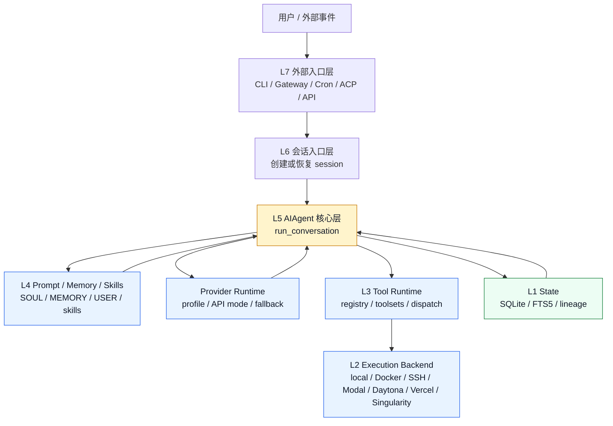

# Hermes Agent 架构设计学习手册

> [!abstract] 文档定位
> 这篇文档重点解释 Hermes 的 `AIAgent` 中心化架构、prompt / memory / skills 学习闭环、tool runtime、terminal backend、Gateway 和插件边界。

> [!tip] Obsidian 导航
> 统一索引见 [[开源项目架构设计文档索引]]；如果要比较 Gateway-first 与 AIAgent-first 的设计差异，优先对照 [[openclaw-architecture-learning-guide|OpenClaw 架构设计学习手册]]。

> [!example] 快速跳转
> - [[#00 · 30 秒速览|30 秒速览]]
> - [[#02 · 整体架构地图|整体架构地图]]
> - [[#04 · `AIAgent`：真正的 agent loop|AIAgent 与 agent loop]]
> - [[#05 · Prompt、Memory、Skills：Hermes 的学习闭环|学习闭环]]
> - [[#07 · Tool Runtime：工具如何注册、暴露和执行|Tool Runtime]]
> - [[#08 · Terminal Backends 与 Sandbox：命令到底在哪里跑|Terminal backend 与 sandbox]]
> - [[#13 · 安全模型：Hermes 保护什么，不保护什么|安全模型]]
> - [[#14 · 与 OpenClaw 的架构差异|与 OpenClaw 的架构差异]]
> - [[#16 · 架构速查表|架构速查表]]

**从 AIAgent 到学习闭环、Gateway、工具运行时、Sandbox 后端与 OpenClaw 对比**

> 这是一份面向学习者的技术文档。它不按“源码调研报告”的写法堆文件名，而是先建立心智模型，再沿着一条真实消息的生命周期，拆解 Hermes Agent 的核心架构：入口层、`AIAgent`、prompt/memory/skills、tool runtime、terminal backend、Gateway、插件系统和安全模型。

> [!note] 推荐阅读方式
> - **先建立心智模型**：读 [[#00 · 30 秒速览|00]]、[[#01 · 核心心智模型：Hermes 到底是什么|01]]、[[#02 · 整体架构地图|02]]。
> - **理解运行链路**：读 [[#03 · 一条消息的完整生命周期|03]]、[[#04 · `AIAgent`：真正的 agent loop|04]]、[[#07 · Tool Runtime：工具如何注册、暴露和执行|07]]。
> - **做部署或安全评审**：读 [[#08 · Terminal Backends 与 Sandbox：命令到底在哪里跑|08]]、[[#09 · Messaging Gateway：Hermes 的长驻入口层|09]]、[[#13 · 安全模型：Hermes 保护什么，不保护什么|13]]、[[#16.4 架构评审检查清单|16.4]]。

**更新时间**：2026-05-22  
**适合读者**：想理解 Hermes / OpenClaw 这类个人 AI agent 平台架构、准备部署自托管助手、或者想学习持久化 agent runtime 设计的工程师。  
**资料依据**：以 Hermes Agent 官方文档、NousResearch GitHub 仓库、OpenClaw 迁移文档为主；少量和 OpenClaw 的对比是基于官方文档事实做出的架构性归纳。

---

<a id="tldr"></a>

## 00 · 30 秒速览

Hermes Agent 可以先理解成一句话：

> **一个围绕 `AIAgent` 构建的自托管、可长驻、会记忆、会写技能、能从 CLI / 消息平台 / Cron / IDE / API 多入口运行的 AI agent runtime。**

最重要的三点：

1. **Hermes 的架构中心是 `AIAgent`，不是单一 Gateway。**  
   官方架构图把 CLI、Gateway、ACP、Batch Runner、API Server、Python Library 都放在入口层，它们最终都进入 `run_agent.py` 里的 `AIAgent`。`AIAgent` 负责 prompt assembly、provider resolution、tool dispatch、compression、session persistence 等核心工作。[^hermes-arch]

2. **Hermes 的“学习闭环”来自三件事：memory、session search、skill self-improvement。**  
   GitHub README 将 Hermes 描述为 built-in learning loop：它会从经验创建技能、在使用中改进技能、主动提示保存知识，并跨 session 搜索历史对话；技能和记忆不是一回事，技能是“怎么做”的流程知识，记忆是“是什么”的事实知识。[^hermes-github][^hermes-skills]

3. **Hermes 的 sandbox 不是 Codex 那种本机 OS policy，也不是 OpenClaw 那种 Gateway 控制面下的 tool backend 思路，而是通过 `terminal.backend` 选择命令真正在哪里跑。**  
   默认 `local` 后端直接在你的机器上运行命令，没有隔离；生产或不可信任务推荐切到 Docker / Modal / Daytona / Vercel Sandbox / Singularity 等后端。Docker 后端是一个长驻容器，Hermes 通过 `docker exec` 把 terminal、file、`execute_code` 调用路由进去。[^hermes-config][^hermes-security]

> [!success] 读完这篇文档应该能回答的问题
> - 一条来自 CLI、Gateway 或 Cron 的输入如何汇入同一个 `AIAgent.run_conversation()`？
> - `MEMORY.md`、`USER.md`、skills、session search 分别承担哪类学习能力？
> - tool call 从模型输出到实际执行，经过哪些注册、过滤、审批和后端路由步骤？
> - `local`、Docker、Modal、Daytona、Vercel Sandbox、Singularity 的安全边界差异在哪里？
> - Hermes 与 OpenClaw 的架构重心差异会怎样影响迁移和部署决策？

---

<a id="mental-model"></a>

## 01 · 核心心智模型：Hermes 到底是什么

Hermes 官方 README 把它定位为 “the agent that grows with you” 和 “self-improving AI agent”。它可以运行在 VPS、GPU 集群、serverless 环境，也可以从 Telegram、Discord、Slack、WhatsApp、Signal 和 CLI 接入；模型供应商可以是 Nous Portal、OpenRouter、Anthropic、OpenAI、NVIDIA NIM、Moonshot、MiniMax、Hugging Face 或任何兼容端点。[^hermes-github]

从架构上看，Hermes 不是单纯的聊天机器人，也不是单纯的 coding CLI，而是一个由以下部分组成的 agent runtime：

```text
用户 / 外部事件
  │
  ├─ CLI / TUI
  ├─ Telegram / Discord / Slack / WhatsApp / Signal / Email / SMS / Teams 等
  ├─ Cron scheduled task
  ├─ ACP-compatible editor
  ├─ OpenAI-compatible API server
  └─ Python library / batch runner
      │
      ▼
Entry Point Layer
  cli.py / gateway/run.py / acp_adapter / batch_runner / API server
      │
      ▼
AIAgent
  run_agent.py
  - prompt assembly
  - provider resolution
  - model API call
  - tool execution
  - retries / fallback
  - compression
  - persistence
      │
      ├─────────────┬──────────────┬──────────────────┐
      ▼             ▼              ▼                  ▼
Prompt System   Provider Runtime   Tool Runtime       Session Storage
SOUL/MEMORY     OpenAI wire        registry.py        SQLite + FTS5
USER/skills     Anthropic native   toolsets           lineage/cost/search
AGENTS.md       Codex responses    terminal backend
      │             │              │
      └─────────────┴──────────────┴──────────────────┐
                                                       ▼
Execution Boundary
  local / docker / ssh / singularity / modal / daytona / vercel_sandbox
```

一句话概括：

> **OpenClaw 更像 Gateway-first 的个人助手控制面；Hermes 更像 AIAgent-first 的自改进 runtime，Gateway 是其中一个入口，而不是唯一中心。**

这个差异会影响后面的所有设计：

| 对比项 | OpenClaw | Hermes Agent |
|---|---|---|
| 架构重心 | 长驻 Gateway control plane | `AIAgent` 核心循环，多个入口共用 |
| 典型入口 | 消息平台、节点、Gateway API | CLI、Gateway、Cron、ACP、Batch、API、Python library |
| 记忆/技能重点 | Gateway workspace、skills、plugins | `MEMORY.md` / `USER.md`、session search、agent-created skills |
| 命令执行边界 | Gateway 管理的 tool backend / node / sandbox | `terminal.backend` 决定 local、Docker、SSH、Modal 等 |
| 适合场景 | always-on personal assistant、设备/消息面集成 | 自托管可学习 agent、长期记忆、技能积累、多模型/多执行环境 |

这个表不是“谁更好”的判断，而是心智模型：**OpenClaw 先问“消息从哪里来、要路由到哪个能力”；Hermes 先问“这个入口如何创建或恢复一个 `AIAgent` run”。**

---

<a id="architecture-map"></a>

## 02 · 整体架构地图

Hermes 官方架构页把系统分成 Entry Points、`AIAgent`、Session Storage 和 Tool Backends。入口包括 CLI、Gateway、ACP、Batch Runner、API Server、Python Library；`AIAgent` 里有 Prompt Builder、Provider Resolution、Tool Dispatch、Compression & Caching、Tool Registry；底层有 SQLite + FTS5 的 session storage，以及 terminal/browser/web/MCP/file/vision 等工具后端。[^hermes-arch]

可以把 Hermes 压缩成七层：



> [!tip] 读图方法
> 纵向看控制流：入口先被转换成一次 agent run，再由 `AIAgent` 调度 provider、prompt、tools 和 state。横向看扩展面：provider、tool、memory/context、terminal backend 都能独立替换，但它们最终都服务于同一个 agent loop。

| 层级 | 名称 | 负责什么 | 典型文件 / 模块 |
|---|---|---|---|
| L7 | 外部入口层 | 接收用户输入、平台消息、Cron 触发、IDE/API 调用 | CLI、Gateway、ACP、Batch、API、Python Library |
| L6 | 会话入口层 | 把输入转换成 `AIAgent.run_conversation()` 调用 | `cli.py`、`gateway/run.py`、`batch_runner.py` |
| L5 | Agent 核心层 | prompt、provider、tool、fallback、compression、persistence | `run_agent.py` / `AIAgent` |
| L4 | Prompt / Memory / Skills 层 | 拼系统提示、注入身份、记忆、用户画像、技能索引、项目上下文 | `agent/prompt_builder.py`、`SOUL.md`、`MEMORY.md`、`USER.md` |
| L3 | Tool Runtime 层 | 工具发现、schema 生成、toolset 过滤、dispatch、hooks、error wrapping | `model_tools.py`、`tools/registry.py`、`toolsets.py` |
| L2 | Execution Backend 层 | 决定 shell、file、code execution 在哪里跑 | local、Docker、SSH、Singularity、Modal、Daytona、Vercel Sandbox |
| L1 | State / Extension 层 | session DB、插件、provider 插件、memory provider、context engine、MCP | SQLite/FTS5、plugins、MCP、Honcho 等 |

Hermes 的目录结构也能反映这种分层：

```text
hermes-agent/
├── run_agent.py              # AIAgent：核心 agent loop
├── cli.py                    # 交互式终端 UI
├── model_tools.py            # 工具发现、schema 收集、dispatch
├── toolsets.py               # 工具集分组和平台 preset
├── hermes_state.py           # SQLite session/state database with FTS5
│
├── agent/
│   ├── prompt_builder.py     # system prompt assembly
│   ├── context_engine.py     # ContextEngine ABC
│   ├── context_compressor.py # 默认压缩引擎
│   ├── prompt_caching.py     # Anthropic prompt caching
│   ├── memory_manager.py     # memory provider orchestration
│   └── trajectory.py         # 轨迹保存
│
├── tools/
│   ├── registry.py           # 中央工具注册表
│   ├── approval.py           # 危险命令检测
│   ├── terminal_tool.py      # terminal orchestration
│   ├── file_tools.py         # read/write/patch/search
│   ├── web_tools.py          # web_search / web_extract
│   ├── browser_tool.py       # browser automation tools
│   ├── delegate_tool.py      # subagent delegation
│   ├── mcp_tool.py           # MCP client
│   └── environments/         # local/docker/ssh/modal/daytona/singularity 等
│
├── gateway/
│   ├── run.py                # GatewayRunner
│   ├── session.py            # SessionStore
│   ├── delivery.py           # outbound delivery
│   ├── pairing.py            # DM pairing authorization
│   ├── hooks.py              # gateway hooks
│   └── platforms/            # 20+ messaging adapters
│
├── acp_adapter/              # IDE/Editor integration
├── cron/                     # scheduler
├── plugins/                  # memory/context/provider 等插件
├── skills/                   # bundled skills
└── optional-skills/          # optional official skills
```

学习这个系统时，最重要的是不要被“入口多”吓到。所有入口最后都要回答同一个问题：

> **这条输入如何变成一次 `AIAgent.run_conversation()`？**

---

<a id="lifecycle"></a>

## 03 · 一条消息的完整生命周期

Hermes 的官方架构页给了三条数据流：CLI Session、Gateway Message、Cron Job。它们入口不同，但最终都进入 `AIAgent.run_conversation()`。[^hermes-arch]

### 3.1 CLI Session

```text
User input
  │
  ▼
HermesCLI.process_input()
  │
  ▼
AIAgent.run_conversation()
  │
  ├─ prompt_builder.build_system_prompt()
  ├─ runtime_provider.resolve_runtime_provider()
  ├─ API call: chat_completions / codex_responses / anthropic_messages
  ├─ tool_calls? → model_tools.handle_function_call() → loop
  └─ final response → display → save to SessionDB
```

CLI 是最接近 Codex/Claude Code 的用法，但 Hermes 的 CLI 不是孤立的一次性运行。它会使用同一套 session DB、skills、memory、model provider、terminal backend 配置。

### 3.2 Gateway Message

```text
Platform event
  │
  ▼
Adapter.on_message()
  │
  ▼
MessageEvent
  │
  ▼
GatewayRunner._handle_message()
  │
  ├─ authorize user
  ├─ resolve session key
  ├─ slash command? → dispatch command
  ├─ agent already running? → interrupt / queue / status
  └─ create AIAgent with session history
        │
        ▼
      AIAgent.run_conversation()
        │
        ▼
      deliver response back through adapter
```

Gateway 是长驻进程，连接 Telegram、Discord、Slack、WhatsApp、Signal、Email、SMS、Home Assistant、Matrix、Mattermost、DingTalk、Feishu、WeCom、Weixin、BlueBubbles、QQ、Yuanbao、Microsoft Teams、LINE、Webhooks 等渠道。用户文档明确说 Gateway 是一个单一后台进程，连接所有已配置平台、处理 sessions、运行 cron jobs、传递 voice messages。[^hermes-messaging]

### 3.3 Cron Job

```text
Scheduler tick
  │
  ▼
load due jobs from jobs.json
  │
  ▼
create fresh AIAgent (no history)
  │
  ▼
inject attached skills as context
  │
  ▼
run job prompt
  │
  ▼
deliver response to target platform
  │
  ▼
update job state and next_run
```

这点很重要：Hermes 的 cron 不是简单 shell cron，而是 “agent task”。官方架构页明确说 Cron 是 first-class agent tasks，job 存储在 JSON 中，可以附加 skills/scripts，并把结果发送到任意平台。[^hermes-arch]

---

<a id="agent-loop"></a>

## 04 · `AIAgent`：真正的 agent loop

Hermes 的核心 orchestration engine 是 `run_agent.py` 里的 `AIAgent`。官方 Agent Loop 文档说，`AIAgent` 负责从 prompt assembly 到 tool dispatch、provider failover 的全部流程，包括：[^hermes-loop]

- 通过 `prompt_builder.py` 组装有效 system prompt 和 tool schemas。
- 选择 provider / API mode：`chat_completions`、`codex_responses`、`anthropic_messages`。
- 发起可中断的模型调用。
- 执行 tool calls，可以顺序执行，也可以通过 thread pool 并发执行。
- 维护 OpenAI message format 的 conversation history。
- 处理 compression、retry、fallback model switching。
- 跟踪 parent / child agent 的 iteration budget。
- 在上下文丢失前 flush persistent memory。

### 4.1 两个入口：`chat()` 和 `run_conversation()`

官方文档把它分成两个层级：

```python
# 简单接口：返回 final response string
response = agent.chat("Fix the bug in main.py")

# 完整接口：返回 messages、metadata、usage stats 等
result = agent.run_conversation(
    user_message="Fix the bug in main.py",
    system_message=None,
    conversation_history=None,
    task_id="task_abc123",
)
```

`chat()` 只是薄 wrapper，真正核心是 `run_conversation()`。

### 4.2 一轮 turn 的生命周期

官方文档给出的 sequence 可以翻译成下面这条链：[^hermes-loop]

```text
run_conversation()
  1. 如果没有 task_id，生成 task_id
  2. 把用户消息追加到 conversation history
  3. 构建或复用 cached system prompt
  4. 检查是否需要 preflight compression
  5. 按 API mode 构建消息：
       - chat_completions: OpenAI format as-is
       - codex_responses: 转成 Responses API input items
       - anthropic_messages: 经 anthropic_adapter.py 转换
  6. 注入 ephemeral prompt layers：budget warning、context pressure 等
  7. 如果是 Anthropic，应用 prompt caching markers
  8. 发起 interruptible API call
  9. 解析 response：
       - 如果有 tool_calls：执行工具，追加 tool results，回到第 5 步
       - 如果是文本回复：持久化 session，必要时 flush memory，然后 return
```

用更直观的伪代码表示：

```python
def run_conversation(user_message):
    history.append({"role": "user", "content": user_message})

    while True:
        system_prompt = build_or_reuse_system_prompt()
        maybe_compress_context()

        api_messages = format_messages(
            system_prompt=system_prompt,
            history=history,
            api_mode=current_provider.api_mode,
        )

        response = interruptible_model_call(api_messages, tool_schemas)

        if response.tool_calls:
            for call in schedule_tool_calls(response.tool_calls):
                result = execute_tool(call)
                history.append({
                    "role": "tool",
                    "tool_call_id": call.id,
                    "content": result,
                })
            continue

        if response.text:
            persist_session(history)
            flush_memory_if_needed()
            return response.text
```

### 4.3 和 Codex/OpenClaw 的共同点与差异

共同点：

```text
模型不直接操作环境。
模型返回 tool_call。
runtime 执行 tool_call。
结果作为 tool role 回到上下文。
模型继续下一轮判断。
```

差异：

```text
Codex 更强调 coding workspace + sandbox policy。
OpenClaw 更强调 Gateway control plane + channels + nodes。
Hermes 更强调一个可复用的 AIAgent 核心 + memory/skill/context/provider/tool 后端。
```

---

<a id="prompt-memory-skills"></a>

## 05 · Prompt、Memory、Skills：Hermes 的学习闭环

Hermes 最有特色的地方不是“有工具”，而是它把身份、记忆、技能、项目上下文和 session 历史组合成了一个可长期演进的 prompt 系统。

### 5.1 Cached system prompt layers

官方 Prompt Assembly 文档说，Hermes 刻意把 cached system prompt state 和 API-call-time ephemeral additions 分开，这是为了控制 token usage、prompt caching、session continuity 和 memory correctness。[^hermes-prompt]

Cached system prompt 大致按这个顺序组装：[^hermes-prompt]

```text
1. Agent identity
   ~/.hermes/SOUL.md 或 DEFAULT_AGENT_IDENTITY

2. Tool-aware behavior guidance
   告诉 agent 何时使用 memory、session_search、tools

3. Honcho static block
   如果启用外部 memory/user modeling provider

4. Optional system message
   用户配置或 API 传入

5. Frozen MEMORY snapshot
   ~/.hermes/memories/MEMORY.md

6. Frozen USER profile snapshot
   ~/.hermes/memories/USER.md

7. Skills index
   只放 compact list，不把所有 SKILL.md 全量塞进去

8. Project context files
   .hermes.md / HERMES.md / AGENTS.md / CLAUDE.md / .cursorrules 等

9. Timestamp / session id

10. Platform hint
    CLI / Gateway / ACP 等入口差异提示
```

这套设计背后的原则是：

> **稳定的东西进 cached prompt；每次 API 调用才需要的临时东西不要污染 cached prefix。**

### 5.2 `SOUL.md`：身份层

`SOUL.md` 位于 `~/.hermes/SOUL.md`，是 agent identity，在 system prompt 的第一层。官方文档说，如果 `SOUL.md` 存在，它会替换内置 `DEFAULT_AGENT_IDENTITY`；如果不存在，则回退到默认身份。[^hermes-prompt]

这和很多 agent 只是把 persona 当普通上下文不同：Hermes 把它放在 prompt 的最前面，所以它是更高优先级的身份层。

### 5.3 Project context：项目规则层

Hermes 会发现项目上下文文件，并且采用“优先级 first match wins”的策略：[^hermes-prompt]

| 优先级 | 文件 | 搜索范围 | 含义 |
|---|---|---|---|
| 1 | `.hermes.md` / `HERMES.md` | 从 CWD 向上走到 git root | Hermes-native project config |
| 2 | `AGENTS.md` | CWD only | 通用 agent instruction file |
| 3 | `CLAUDE.md` | CWD only | Claude Code compatibility |
| 4 | `.cursorrules` / `.cursor/rules/*.mdc` | CWD only | Cursor compatibility |

所有 context files 都会做安全扫描、截断和 YAML frontmatter stripping。安全扫描会检查 invisible unicode、“ignore previous instructions”、credential exfiltration 等 prompt injection pattern。[^hermes-prompt]

### 5.4 Skills：按需加载的流程知识

Hermes skills 是 on-demand knowledge documents，用来教 agent 处理特定任务。官方 Skills 文档强调 progressive disclosure：[^hermes-skills]

```text
session start:
  skills_list() 只加载 compact list，大约 3k tokens

agent 判断需要某个 skill:
  skill_view(name) 加载该 skill 的完整 SKILL.md

需要细节引用:
  skill_view(name, file_path) 加载 skill 里的 reference file
```

这解决了两个矛盾：

- skills 可以很多、很长，但不能每次都塞进 prompt。
- agent 需要知道有哪些 skills，但只在需要时加载详情。

### 5.5 Skills vs Memory

官方文档给了一个非常清楚的区分：[^hermes-skills]

| 项目 | Skills | Memory |
|---|---|---|
| 本质 | Procedural knowledge：怎么做事 | Factual knowledge：事实是什么 |
| 加载时机 | 按需加载，只有相关时才花 token | 每个 session 自动注入 |
| 大小 | 可以很长，几百行也可以 | 应该短小，关键事实即可 |
| 例子 | “如何部署到 Kubernetes” | “用户喜欢 Python 3.12，默认编辑器是 nvim” |
| 创建者 | 用户、agent、Hub、plugin | agent 基于对话维护 |

可以这样记：

> **会贴在便利贴上的，是 memory；会写成操作手册的，是 skill。**

### 5.6 自改进：agent-created skills

官方 Skills 指南说，agent 可以用 `skill_manage` 创建和更新技能；在解决复杂问题后，Hermes 可能会主动提出把方法保存成 skill，供下次复用。[^hermes-skills]

这就是 Hermes 和很多“只会调用静态 skills 的 agent”最核心的区别：

```text
普通 agent:
  人写好 skills → agent 使用

Hermes:
  人写 skills + agent 从完成任务中提炼 skills + 使用中继续修订 skills
```

这个设计也带来风险：如果 agent 自动写入的 skill 含有错误流程、过时命令或 prompt injection，之后会被反复调用。因此 Hermes 提供了 agent-created skill guard 配置：可以对新建/更新 skill 做危险关键词扫描，虽然默认关闭，因为正常工作流也可能触发过多误报。[^hermes-config]

---

<a id="context-storage"></a>

## 06 · Context Compression、Session Storage 与跨会话召回

Hermes 要做长会话和多平台入口，就必须解决两个问题：

1. 上下文窗口不够怎么办？
2. 历史会话怎么查回来？

### 6.1 双层压缩系统

官方 Context Compression 文档说，Hermes 使用 dual compression system，并且 context management 是可插拔的 `ContextEngine`。默认 engine 是 `ContextCompressor`，插件可以替换成其他 context engine，例如 lossless context management。[^hermes-compression]

两层 compression 是：[^hermes-compression]

```text
Incoming message
  │
  ▼
Gateway Session Hygiene
  - pre-agent
  - 粗略估算
  - 85% context threshold
  - 防止 overnight Telegram/Discord session 太大导致 API 失败
  │
  ▼
Agent ContextCompressor
  - in-loop
  - 使用真实 API token usage
  - 默认 50% context threshold
  - 正常上下文管理
```

默认配置大致是：

```yaml
compression:
  enabled: true
  threshold: 0.50
  target_ratio: 0.20
  protect_last_n: 20
```

压缩时，Hermes 会先 flush memory，再把中间 conversation turns 摘要成 compact summary，保留最近 N 条消息，并保持 tool call/result pairs 不被拆开。官方 Agent Loop 文档还提到，compression 会生成新的 session lineage ID，也就是压缩后的子 session。[^hermes-loop]

### 6.2 Session Storage：SQLite + FTS5

Hermes 使用 SQLite 数据库 `~/.hermes/state.db` 持久化 session metadata、完整消息历史和 model configuration。官方 Session Storage 文档说，这替代了早期 per-session JSONL 的方式。[^hermes-storage]

结构大致是：

```text
~/.hermes/state.db
├── sessions              # session metadata, token counts, billing
├── messages              # full message history per session
├── messages_fts          # FTS5 full-text search
├── messages_fts_trigram  # CJK / substring search
├── state_meta            # metadata key/value
└── schema_version        # migration state
```

关键设计：[^hermes-storage]

- WAL mode：支持多 reader + 单 writer，适合 gateway 多平台读写。
- FTS5：快速搜索所有 session messages。
- `parent_session_id`：记录 compression 触发的 session lineage。
- source tagging：按 CLI、Telegram、Discord 等来源过滤。
- messages 中记录 tool calls、reasoning、token count、finish reason 等信息。

这使 `session_search` 成为一个真正的跨会话召回工具，而不是从文本日志里 grep。

### 6.3 `session_search` 与长期记忆的区别

`MEMORY.md` / `USER.md` 是小而常用的事实，会被放进系统提示。`session_search` 是从历史对话数据库中按需召回，适合：

```text
用户说：“你还记得上周我让你调过的那个部署问题吗？”
  │
  ▼
AIAgent 判断需要历史上下文
  │
  ▼
session_search 查询 SQLite FTS5
  │
  ▼
返回相关历史片段
  │
  ▼
模型继续回答或执行任务
```

所以 Hermes 的 recall 不是只有一个 memory 文件，而是两级：

```text
短小、稳定、每次都需要 → MEMORY / USER
长尾、历史、按需查询 → session_search / SQLite FTS5
```

---

<a id="tools-runtime"></a>

## 07 · Tool Runtime：工具如何注册、暴露和执行

Hermes 的工具系统是 central registry + self-registering functions 的设计。官方 Tools Runtime 文档说，每个 tool module 在 import time 调用 `registry.register(...)`，`model_tools.py` 负责发现工具、构建模型可见的 schema list。[^hermes-tools]

### 7.1 注册模型

一个工具注册大致长这样：

```python
registry.register(
    name="terminal",
    toolset="terminal",
    schema={...},
    handler=handle_terminal,
    check_fn=check_terminal,
    requires_env=["SOME_VAR"],
    is_async=False,
    description="Run commands",
    emoji="",
)
```

每个工具注册后变成一个 `ToolEntry`，存放在 singleton `ToolRegistry._tools` 中，key 是工具名。工具名冲突时，后注册的会覆盖先注册的。[^hermes-tools]

### 7.2 自动发现

`model_tools.py` import 时会调用 `discover_builtin_tools()`。它通过 AST 扫描 `tools/*.py`，找包含 top-level `registry.register()` 的模块再 import。这样新增工具文件不需要维护手工列表。[^hermes-tools]

发现顺序可以理解为：

```text
discover_builtin_tools()
  │
  ├─ scan tools/*.py
  ├─ import files with top-level registry.register()
  ├─ each import triggers registry.register()
  │
  ├─ discover MCP tools
  │    tools.mcp_tool.discover_mcp_tools()
  │
  └─ discover plugin tools
       hermes_cli.plugins.discover_plugins()
```

### 7.3 Toolset resolution

Hermes 的 tools 会被组织成 toolsets。`get_tool_definitions(enabled_toolsets, disabled_toolsets, quiet_mode)` 大致做这些事：[^hermes-tools]

```text
1. 如果 enabled_toolsets 存在：只包含指定 toolsets
2. 如果 disabled_toolsets 存在：从全部 toolsets 中扣掉 disabled
3. 如果都没有：包含所有已知 toolsets
4. 交给 registry.get_definitions() 做 check_fn 过滤
5. 对 execute_code / browser_navigate 做动态 schema patching
```

这让 Hermes 可以按平台开放不同能力。例如 Telegram 上不一定开放所有开发工具，ACP/IDE 可能开放文件和终端，Cron job 可以挂特定 skill。

### 7.4 Tool dispatch flow

模型返回 tool call 后，Hermes 的执行路径大致是：

```text
Model response with tool_call
  │
  ▼
run_agent.py agent loop
  │
  ▼
model_tools.handle_function_call(name, args, task_id, user_task)
  │
  ├─ agent-loop tools?
  │    todo / memory / session_search / delegate_task
  │    → run_agent.py 直接拦截处理
  │
  ├─ plugin pre_hook
  │
  ▼
registry.dispatch(name, args, **kwargs)
  │
  ├─ lookup ToolEntry by name
  ├─ async handler? → bridge via _run_async()
  ├─ sync handler? → call directly
  │
  ▼
return result string or JSON error
  │
  ▼
plugin post_hook
  │
  ▼
append {role: "tool", content: result} to history
```

几个特殊工具会被 agent loop 直接拦截，因为它们要改 agent state：[^hermes-tools]

| 工具 | 为什么拦截 |
|---|---|
| `todo` | 读写 agent-local task state |
| `memory` | 写 persistent memory files |
| `session_search` | 查询 session DB |
| `delegate_task` | 创建 subagent sessions |

### 7.5 并发执行

官方 Agent Loop 文档说：如果模型返回单个 tool call，直接在主线程执行；如果有多个 tool calls，则通过 `ThreadPoolExecutor` 并发执行，除非工具被标记为 interactive，例如 `clarify`，这类会强制顺序执行。执行结果会按原始 tool call 顺序重新插回历史，而不是按完成时间排序。[^hermes-loop]

这对工具协议很关键：

```text
模型返回 tool_call A, B, C
  │
  ├─ 实际完成顺序可能是 B, C, A
  │
  ▼
回填历史仍是 A, B, C
```

这样可以避免模型看到乱序结果。

---

<a id="sandbox-backends"></a>

## 08 · Terminal Backends 与 Sandbox：命令到底在哪里跑

这是理解 Hermes 的关键。

Hermes 配置文档明确说，`terminal.backend` 决定 agent shell commands 真正在哪里执行：本机、Docker 容器、SSH 远端、Modal cloud sandbox、Daytona workspace、Vercel Sandbox、Singularity/Apptainer 容器。[^hermes-config]

### 8.1 七种 terminal backend

| Backend | 命令在哪里跑 | 隔离边界 | 适合场景 |
|---|---|---|---|
| `local` | 你的机器本机 | 无隔离 | 开发、可信任务、轻量使用 |
| `docker` | 单个长驻 Docker container | container namespaces + cap-drop | 安全 sandbox、CI/CD、生产 gateway |
| `ssh` | 远端服务器 | 网络/主机边界 | 远程开发、强算力机器 |
| `modal` | Modal cloud sandbox | cloud VM | 临时云计算、评测 |
| `daytona` | Daytona workspace | cloud container | 托管云开发环境 |
| `vercel_sandbox` | Vercel Sandbox microVM | cloud microVM | snapshot-backed cloud execution |
| `singularity` | Singularity/Apptainer container | namespaces / `--containall` | HPC、共享机器、rootless 容器 |

默认是：

```yaml
terminal:
  backend: local
```

官方配置页明确警告：local backend 下，命令直接运行在你的机器上，agent 拥有和你的用户账号一样的 filesystem access；如果担心安全，应禁用不想要的工具或切到 Docker。[^hermes-config]

这和 Codex 的 `workspace-write` 很不一样：

```text
Codex local workspace-write:
  本地真实 workspace + OS-level sandbox policy

Hermes terminal.backend=local:
  本机直接执行，没有额外 OS sandbox
  主要靠 dangerous command approval / hardline blocklist / 用户配置兜底
```

### 8.2 Docker backend：一个长驻容器，不是每条命令一个容器

Hermes 的 Docker 后端是最重要的 sandbox 模式。官方文档说它不是 per-command container，而是启动一个长驻容器，然后通过 `docker exec` 把 terminal、file、`execute_code` 调用路由进去，跨 sessions、`/new`、`/reset`、`delegate_task` subagents 共享，直到 Hermes 进程结束或 idle-sweep 清理。[^hermes-config]

```text
Hermes host process
  │
  ├─ AIAgent / Gateway / CLI 仍在 host 上
  │
  ▼
terminal.backend=docker
  │
  ├─ first use: docker run -d ... sleep 2h
  │
  ├─ every terminal call: docker exec ...
  ├─ every file-tool call: route into same container
  └─ execute_code: route into same container
```

这意味着：

```text
pip install foo
  → 后续 tool call 还在同一容器里，foo 还在

cd /workspace/project
  → 后续命令可能继承该 persistent shell 状态

并行 subagents
  → 默认共享同一个 Docker container，路径和环境变量可能相互影响
```

官方文档也明确提醒：parallel subagents 默认共享这个容器；如果子任务需要独立 sandbox，需要注册 per-task image override。[^hermes-config]

### 8.3 Docker hardening

Hermes Docker backend 会添加一组 security flags。官方 Security 文档列出了 `_SECURITY_ARGS`：[^hermes-security]

```text
--cap-drop ALL
--cap-add DAC_OVERRIDE
--cap-add CHOWN
--cap-add FOWNER
--security-opt no-new-privileges
--pids-limit 256
--tmpfs /tmp:rw,nosuid,size=512m
--tmpfs /var/tmp:rw,noexec,nosuid,size=256m
--tmpfs /run:rw,noexec,nosuid,size=64m
```

资源也可配置：

```yaml
terminal:
  backend: docker
  docker_image: "nikolaik/python-nodejs:python3.11-nodejs20"
  docker_forward_env: []
  container_cpu: 1
  container_memory: 5120
  container_disk: 51200
  container_persistent: true
```

持久化模式：[^hermes-security]

```text
container_persistent: true
  → bind-mount /workspace and /root from ~/.hermes/sandboxes/docker/<task_id>/

container_persistent: false
  → workspace 用 tmpfs，cleanup 后丢失
```

### 8.4 Docker volume / host workspace 的关键风险

配置里有两个会影响 host 的选项：

```yaml
terminal:
  docker_mount_cwd_to_workspace: false
  docker_volumes:
    - "/home/user/projects:/workspace/projects"
    - "/home/user/data:/data:ro"
```

如果你把 host 目录读写挂到容器里，agent 在容器里对挂载目录的删除/写入会影响 host。也就是说：

```text
docker backend 没挂 host workspace:
  rm -rf /workspace/project
  → 删除容器内文件，不影响 host

挂了 /home/user/project:/workspace/project:
  rm -rf /workspace/project/src
  → 删除 host 上 /home/user/project/src
```

所以 Docker 是隔离边界，但挂载是刻意打开的通道。

### 8.5 SSH / Modal / Daytona / Vercel / Singularity

官方配置页说明：[^hermes-config]

- `ssh`：通过 SSH 在远端服务器执行，默认启用 persistent shell，状态（cwd、env vars）跨命令保留。需要 `TERMINAL_SSH_HOST`、`TERMINAL_SSH_USER` 等配置。
- `modal`：每个 task 得到一个可配置 CPU/memory/disk 的 isolated VM，filesystem 可 snapshot/restore，但不保证 live process、PID space、background jobs 持久。
- `daytona`：托管 workspace，支持 stop/resume 持久化。
- `vercel_sandbox`：cloud microVM，Hermes 通过常规 terminal/file tool surface 使用。
- `singularity`：使用 `--containall --no-home` 做 namespace isolation，不挂 host home，适合 HPC。

远端/云端后端还有一个重要机制：remote-to-host file sync。对于 SSH、Modal、Daytona，只要 agent working tree 在另一个环境，Hermes 会在 session teardown / sandbox cleanup 时追踪 agent touched files，并同步到 host 的 `~/.hermes/cache/remote-syncs/<session-id>/`。这用于恢复 ephemeral cloud sandbox 中生成的结果。[^hermes-config]

### 8.6 和 Codex / OpenClaw 的 sandbox 对比

| 问题 | Codex Local | OpenClaw | Hermes |
|---|---|---|---|
| 默认 local 命令是否隔离 | 是，`workspace-write` 等 OS sandbox policy | 取决于工具后端和 sandbox 配置 | 否，`terminal.backend=local` 无隔离 |
| 隔离边界在哪里 | 本机 OS policy 限制 spawned commands | Gateway 留 host，tool execution 进入 Docker/SSH/OpenShell/node 等 | `terminal.backend` 决定命令运行地 |
| Docker 是默认 local sandbox 吗 | 不是 | 常见 sandbox 后端之一 | `docker` 是显式 terminal backend |
| `rm` 会不会影响 host | workspace 内会真实影响 host | 看 workspaceAccess / backend | local 会；docker 不挂载 host 时不会；挂载 host 时会 |
| 云端/远端结果如何回 host | Cloud diff / PR / patch | 看节点/后端协议 | remote-to-host sync / file mounts / delivery |

Hermes 的安全策略可以总结为：

```text
如果用 local：
  主要靠危险命令审批、hardline blocklist、用户授权、工具禁用。

如果用 container/cloud backend：
  容器/云 sandbox 成为主要边界，危险命令检查甚至会跳过，
  因为文档认为 destructive commands inside container can't harm the host。
```

官方 Security 文档明确说，在 Docker、Singularity、Modal、Daytona、Vercel Sandbox 后端中，dangerous command checks 会被跳过，因为 container 本身是安全边界。[^hermes-security]

---

<a id="gateway"></a>

## 09 · Messaging Gateway：Hermes 的长驻入口层

Hermes 虽然不是 Gateway-first，但 Gateway 仍然是它最重要的入口之一。

官方 Gateway Internals 文档说，messaging gateway 是长驻进程，通过统一架构连接 Hermes 到 20+ 外部消息平台。关键文件包括 `gateway/run.py`、`gateway/session.py`、`gateway/delivery.py`、`gateway/pairing.py`、`gateway/hooks.py`、`gateway/mirror.py`、`gateway/status.py` 和各平台 adapters。[^hermes-gateway]

### 9.1 Gateway 架构

```text
GatewayRunner
  │
  ├─ Telegram Adapter
  ├─ Discord Adapter
  ├─ Slack Adapter
  ├─ WhatsApp Adapter
  ├─ Email / SMS / Matrix / Teams / Webhook / Home Assistant ...
  │
  ▼
_handle_message()
  │
  ├─ Slash command dispatch
  ├─ AIAgent creation
  ├─ Queue / background sessions
  └─ SessionStore (SQLite persistence)
```

每个 adapter 实现共同接口：[^hermes-gateway]

```text
connect() / disconnect()
send_message()
on_message() → normalize into MessageEvent
```

### 9.2 Message flow

当消息从任意平台进来：[^hermes-gateway]

```text
1. Platform adapter 接收 raw event，归一化为 MessageEvent
2. Base adapter 检查 active session guard
   - 如果该 session 正在跑 agent：queue message，set interrupt event
   - 如果是 /approve / /deny / /stop：inline dispatch，绕过 guard
3. GatewayRunner._handle_message()
   - 解析 session key
   - authorization check
   - slash command? → command handler
   - agent already running? → intercept /stop /status 等
   - 否则 create AIAgent and run conversation
4. Response 通过 platform adapter 发回
```

Session key 格式：[^hermes-gateway]

```text
agent:main:{platform}:{chat_type}:{chat_id}
```

例如：

```text
agent:main:telegram:private:123456789
```

### 9.3 Two-level message guard

当 agent 正在运行时，Gateway 有两层 guard：[^hermes-gateway]

```text
Level 1: Base adapter
  - 检查 _active_sessions
  - 如果 active，消息进入 _pending_messages，set interrupt event

Level 2: Gateway runner
  - 检查 _running_agents
  - 特殊处理 /stop /new /queue /status /approve /deny
  - 其他消息触发 running_agent.interrupt()
```

这解释了为什么你能在 Telegram/Discord 上“打断”正在执行的 agent。

### 9.4 Authorization

Gateway 默认安全策略是 deny-by-default。Messaging 文档说，默认情况下，未在 allowlist 或未通过 DM pairing 的用户都会被拒绝；这是一个有 terminal access 的 bot 的安全默认值。[^hermes-messaging]

Gateway Internals 文档给出的授权顺序是：[^hermes-gateway]

```text
1. Per-platform allow-all flag
2. Platform allowlist
3. DM pairing
4. Global allow-all
5. Default: deny
```

Security 文档中也给出了更细的 authorization order：per-platform allow-all、DM pairing approved list、platform allowlist、global allowlist、global allow-all、default deny。[^hermes-security]

这意味着：

```text
如果你没有配置 allowlist，
也没有打开 GATEWAY_ALLOW_ALL_USERS，
陌生用户默认不能和你的 Hermes bot 交互。
```

### 9.5 Delivery path 与 hooks

Gateway 的 outbound delivery 支持：[^hermes-gateway]

- 直接回复原始聊天。
- 向 home channel 发送 Cron 结果或后台任务结果。
- 通过 `send_message` tool 指定显式目标，例如 `telegram:-1001234567890`。
- 跨平台发送，例如从 Discord 触发任务，结果发到 Email。

Gateway hooks 是 lifecycle events：[^hermes-gateway]

| Event | 触发时机 |
|---|---|
| `gateway:startup` | Gateway 启动 |
| `session:start` | 新会话开始 |
| `session:end` | 会话结束或超时 |
| `session:reset` | 用户 `/new` 重置 |
| `agent:start` | agent 开始处理消息 |
| `agent:step` | agent 完成一个 tool-calling iteration |
| `agent:end` | agent 完成并返回响应 |
| `command:*` | 任意 slash command 执行 |

这让 Gateway 既是消息入口，也是 automation hub。

---

<a id="providers"></a>

## 10 · Provider Runtime：多模型、多 API 模式与 fallback

Hermes 的 provider runtime resolver 被 CLI、Gateway、Cron、ACP 和 auxiliary model calls 共用。官方 Provider Runtime 文档说，核心文件包括 `hermes_cli/runtime_provider.py`、`hermes_cli/auth.py`、`hermes_cli/model_switch.py`、`agent/auxiliary_client.py`、`providers/` 和 `plugins/model-providers/<name>/`。[^hermes-provider]

### 10.1 三种 API mode

`AIAgent` 支持三种 API execution modes：[^hermes-loop]

| API mode | 用途 | client type |
|---|---|---|
| `chat_completions` | OpenAI-compatible endpoints：OpenRouter、自定义端点、多数 provider | `openai.OpenAI` |
| `codex_responses` | OpenAI Codex / Responses API | `openai.OpenAI` with Responses format |
| `anthropic_messages` | Native Anthropic Messages API | `anthropic.Anthropic` via adapter |

所有模式最终都会汇聚到 Hermes 内部统一的 OpenAI-style message format：

```json
{"role": "system", "content": "..."}
{"role": "user", "content": "..."}
{"role": "assistant", "content": "...", "tool_calls": [...]}
{"role": "tool", "tool_call_id": "...", "content": "..."}
```

这使 Hermes 能在 provider 层切换 API 格式，但 agent loop 不需要完全重写。

### 10.2 Resolution precedence

Provider resolution 的优先级是：[^hermes-provider]

```text
1. explicit CLI/runtime request
2. config.yaml model/provider config
3. environment variables
4. provider-specific defaults or auto resolution
```

Hermes 把保存的 model/provider choice 当作正常运行的 source of truth，避免一个过期 shell export 悄悄覆盖用户上次通过 `hermes model` 选的 endpoint。[^hermes-provider]

### 10.3 Provider plugin

Provider profiles 可以通过插件注册：`plugins/model-providers/<name>/` 或 `$HERMES_HOME/plugins/model-providers/<name>/`。只要插件调用 `register_provider()`，runtime resolver 就能在 resolution 时拿到 canonical `base_url`、env var 优先级、`api_mode` 和 fallback models；不需要在 resolver 里加 if/else 分支。[^hermes-provider]

这是一种典型的 registry pattern：

```text
provider plugin declares profile
  │
  ▼
register_provider()
  │
  ▼
get_provider_profile(provider_id)
  │
  ▼
runtime_provider.py resolves base_url/api_key/api_mode
  │
  ▼
AIAgent uses correct API mode
```

### 10.4 Fallback model

当 primary model 失败，如 429、5xx、401/403 时，`AIAgent` 会查看 `fallback_providers`，按顺序尝试 fallback；401/403 时还会尝试 credential refresh。辅助任务如 vision、compression、web extraction 也有独立 fallback chain。[^hermes-loop]

这让 Hermes 的模型层更像“运行时路由器”，而不是单 provider CLI。

---

<a id="plugins"></a>

## 11 · 插件系统：Hermes 的扩展边界

官方架构页说，Hermes 有三种 plugin discovery source：`~/.hermes/plugins/`、`.hermes/plugins/` 和 pip entry points；插件可以通过 context API 注册 tools、hooks、CLI commands。另有两个专门的插件类型：memory providers 和 context engines，并且两者都是 single-select，一次只能激活一个。[^hermes-arch]

### 11.1 插件能扩展什么

Build a Plugin 文档给了扩展面地图：[^hermes-plugin]

| 想扩展 | 机制 |
|---|---|
| custom tools / hooks / slash commands / skills / CLI subcommands | general plugin |
| LLM inference backend | model provider plugin |
| gateway channel | platform adapter |
| memory backend | memory provider plugin |
| context compression engine | context engine plugin |
| image generation backend | image generation provider plugin |
| video generation backend | video provider plugin |
| TTS backend | custom command provider |
| STT backend | local command wrapper |
| external tools | MCP servers in `config.yaml` |
| gateway event hooks | `HOOK.yaml` + `handler.py` |
| additional skill sources | skills tap |

这说明 Hermes 的扩展不是只有 “MCP”。MCP 是 external tool server 接入方式之一；Hermes 自己还有一整套 plugin / provider / hook / skill tap 机制。

### 11.2 插件 manifest

一个插件通常有 `plugin.yaml`：

```yaml
name: calculator
version: 1.0.0
description: Math calculator — evaluate expressions and convert units
provides_tools:
  - calculate
  - unit_convert
provides_hooks:
  - post_tool_call
```

插件可带工具 schema、handler、hook、bundled skill。工具 schema 是给 LLM 看的，handler 是实际执行逻辑。

### 11.3 MCP：外部工具服务器

Integrations 文档说，Hermes 可以通过 MCP 连接外部工具服务器，访问 GitHub、数据库、文件系统、browser stacks、internal APIs 等工具；支持 stdio 和 SSE transports、per-server tool filtering、capability-aware resource/prompt registration。[^hermes-integrations]

架构上可以这样看：

```text
AIAgent
  │
  ▼
Tool Registry
  │
  ├─ built-in tools
  ├─ plugin tools
  └─ mcp tools
        │
        ▼
      MCP client
        │
        ▼
      external MCP server
```

MCP server 本身的安全边界不等同于 Hermes 的 terminal backend。MCP 如果连接到外部系统，它能做什么取决于 MCP server 的权限、credentials 和过滤配置。

---

<a id="automation"></a>

## 12 · Delegation、Cron、Batch、ACP 与 API Server

Hermes 不只是“一个 agent 一次处理一个聊天”。它提供多种自动化和集成路径。

### 12.1 Subagent Delegation

Features 文档说，`delegate_task` 工具可以创建 child agent instances，拥有 isolated context、restricted toolsets 和自己的 terminal sessions；默认可以并发运行 3 个 subagents，可配置。[^hermes-features]

结合前面的 terminal backend，需要注意：

```text
agent context 可以隔离，
但如果 terminal.backend=docker 且没有 per-task override，
并行 subagents 可能共享同一个 Docker container。
```

所以 Hermes 的“subagent 隔离”分两层：

| 层 | 是否隔离 |
|---|---|
| prompt / context / toolset | 可以隔离 |
| terminal runtime | 取决于 backend 和 per-task env override |

### 12.2 Cron scheduled tasks

Cron 是 first-class agent task：

```text
natural language / cron expression
  │
  ▼
job store
  │
  ▼
scheduler tick
  │
  ▼
create fresh AIAgent
  │
  ▼
attach skills/scripts
  │
  ▼
run prompt
  │
  ▼
deliver to platform
```

和普通 shell cron 最大区别是：Hermes cron 可以调用 agent、skills、tools、delivery path，而不只是执行 bash command。

### 12.3 `execute_code`：脚本化工具调用

Features 文档说，`execute_code` 让 agent 写 Python scripts，并通过 sandboxed RPC execution 调用 Hermes tools，把多步 workflow 压缩成一个 LLM turn。[^hermes-features]

这是一种把“多次模型往返”变成“脚本内多次工具调用”的优化：

```text
传统 agent loop:
  model → tool A → model → tool B → model → tool C

execute_code:
  model writes script → script calls tool A/B/C via RPC → one tool result back to model
```

优点是 token 成本低、延迟少；风险是代码一次性做太多事，debug 和安全审计更难。

### 12.4 ACP / IDE integration

Integrations 文档说，Hermes 可以作为 ACP-compatible editors 的 agent server，在 VS Code、Zed、JetBrains 等编辑器中显示 chat、tool activity、file diffs、terminal commands。[^hermes-integrations]

这让 Hermes 不只是消息平台 bot，也能进入开发工作流。

### 12.5 API Server

Integrations 文档还说，Hermes 可以暴露成 OpenAI-compatible HTTP endpoint，Open WebUI、LobeChat、LibreChat、NextChat、ChatBox 等能把 Hermes 当后端，用它的完整 toolset。[^hermes-integrations]

这是一种很有意思的反转：

```text
普通 Chat UI → 直接打 LLM API

Hermes API Server:
  普通 Chat UI → OpenAI-compatible endpoint → Hermes Agent → LLM + tools + memory + skills
```

---

<a id="security"></a>

## 13 · 安全模型：Hermes 保护什么，不保护什么

官方 Security 文档把 Hermes 的安全模型总结为七层：[^hermes-security]

1. User authorization：谁能和 agent 说话。
2. Dangerous command approval：破坏性操作需要人工确认。
3. Container isolation：Docker / Singularity / Modal sandboxing。
4. MCP credential filtering：MCP subprocess 的环境变量隔离。
5. Context file scanning：项目文件里的 prompt injection 检测。
6. Cross-session isolation：session 不能读彼此数据，cron 路径防 traversal。
7. Input sanitization：terminal backend 的 working directory 参数基于 allowlist 校验。

### 13.1 Dangerous command approval

Hermes 的 approval 配置：[^hermes-security]

```yaml
approvals:
  mode: manual    # manual | smart | off
  timeout: 60
```

| 模式 | 行为 |
|---|---|
| `manual` | 默认，对危险命令提示用户批准 |
| `smart` | 用辅助 LLM 判断低风险/高风险，不确定时升级人工确认 |
| `off` | 关闭 approval checks，类似 `--yolo` |

YOLO 可以通过三种方式开启：[^hermes-security]

```text
hermes --yolo
/yolo
HERMES_YOLO_MODE=1
```

但 YOLO 不等于完全无底线。Hermes 有 hardline blocklist，一些不可恢复的命令无论 YOLO、approvals off、cron headless、allow always 都会被拒绝，例如 `rm -rf /`、fork bomb、格式化 root device、对物理磁盘写零等。[^hermes-security]

### 13.2 容器后端下审批会被跳过

官方 Security 文档明确说，Docker / Singularity / Modal / Daytona / Vercel Sandbox 后端下，dangerous command checks 会被跳过，因为 container 本身是 security boundary。[^hermes-security]

这既是优点也是风险：

```text
优点:
  容器里 rm -rf /workspace 不会毁 host。
  不需要每次 destructive command 都打断用户。

风险:
  如果你挂载了 host 目录，容器里的 destructive command 仍可能影响挂载目录。
  如果你 forward 了 GITHUB_TOKEN / NPM_TOKEN，容器内代码可以读取并外传。
```

### 13.3 Gateway 安全

Gateway 默认 deny unauthorized users；支持 allowlists、DM pairing、admin/user tier、slash-command gating。Messaging 文档建议对有 terminal access 的 bot 使用 allowlist，而不是开放所有用户。[^hermes-messaging]

需要特别小心：

```text
GATEWAY_ALLOW_ALL_USERS=true
```

这会把 agent 暴露给所有能到达 bot 的人。除非你的 terminal backend 是强隔离的 Docker/cloud sandbox，且工具/credentials 做了严格过滤，否则不建议。

### 13.4 Checkpoints & rollback

Features 文档提到，Hermes 会在进行文件修改前自动 snapshot working directory，可以用 `/rollback` 回滚。[^hermes-features]

这和 sandbox 是两回事：

```text
sandbox:
  限制命令在哪里执行、能碰哪些资源

checkpoint/rollback:
  在文件被改坏后提供恢复路径
```

如果你用 local backend，checkpoint 可以救项目文件，但不能替代 OS 级隔离。比如 agent 删除了 home 下的其他文件，是否能恢复取决于它有没有被纳入 checkpoint。

---

<a id="openclaw-comparison"></a>

## 14 · 与 OpenClaw 的架构差异

Hermes 官方迁移文档有一个非常直接的信号：它提供 `hermes claw migrate`，可以从 `~/.openclaw/`、legacy `~/.clawdbot/` 或 `~/.moltbot/` 导入配置。可迁移内容包括 persona、workspace instructions、long-term memory、user profile、daily memory files、四类 skills、model/provider config、agent behavior、session reset policies、MCP servers、TTS、messaging platforms 等。[^hermes-migrate]

这说明 Hermes 不是“完全无关的聊天工具”，而是明确把 OpenClaw 用户作为迁移对象之一。

### 14.1 设计取向差异

| 维度 | OpenClaw | Hermes |
|---|---|---|
| 核心抽象 | Gateway control plane | `AIAgent` runtime |
| 入口重心 | 消息面、设备节点、WebSocket 控制面 | CLI / Gateway / Cron / ACP / Batch / API / Python Library 均可入口 |
| 会话存储 | Gateway-owned session/state | SQLite `state.db` + FTS5 + lineage |
| 技能模型 | skills / plugins / nodes / MCP | progressive skills + agent-created skills + skill hub + plugin skills |
| 记忆模型 | workspace memory / persona / user profile | `MEMORY.md`、`USER.md`、session_search、memory provider plugin |
| 命令执行 | Gateway policy + sandbox/backend/node | `terminal.backend` 明确选择 local/docker/ssh/cloud |
| 安全默认 | 控制谁能通过 Gateway/节点触发能力 | local 无隔离，但有 approval；容器/cloud backend 作为 sandbox |
| 最有特色的能力 | 多渠道/多设备 control plane | 自改进学习闭环、provider/backend 可插拔、多入口复用同一 `AIAgent` |

### 14.2 一句话区分

```text
OpenClaw:
  “我有一个长驻 Gateway，把消息平台、设备节点、工具和模型都接起来。”

Hermes:
  “我有一个会记忆、会写技能、可从多入口调用的 AIAgent，Gateway 只是其中一个入口。”
```

### 14.3 迁移时最需要注意的地方

从 OpenClaw 转 Hermes，不应只关注“配置能不能迁移”，还要关注这些架构语义是否改变：

1. **Sandbox 语义不同**  
   Hermes 默认 `local` 无隔离；要安全运行 terminal，要显式切换 Docker/Modal/Daytona/Vercel/Singularity 等 backend。

2. **Skill 语义更动态**  
   Hermes skills 可以由 agent 创建和修改；这带来自改进能力，也带来 stale skill / prompt injection / 错误流程积累风险。

3. **Memory 注入成本不同**  
   Hermes 的 `MEMORY.md` / `USER.md` 会进入每次 system prompt；大而杂的 memory 会持续消耗 token，应该保持 compact。

4. **Gateway 不是唯一中心**  
   同一个 Hermes agent 可以从 CLI、Gateway、Cron、ACP、API Server 进入；因此配置、session、工具权限需要按入口区分。

5. **Provider routing 更灵活，但也更复杂**  
   Hermes 支持 provider profiles、custom providers、fallback providers、auxiliary model chains。好处是抗故障和可替换性强；坏处是调试时要知道当前到底用的是哪个 provider/mode/key。

---

<a id="reading-path"></a>

## 15 · 建议的源码/文档阅读路径

如果你要学习 Hermes 架构，建议按这个顺序读：

1. **GitHub README**  
   先理解 Hermes 的产品定位：self-improving、multi-platform、multi-provider、seven terminal backends。[^hermes-github]

2. **Developer Guide / Architecture**  
   建立入口层、`AIAgent`、tool backend、session storage 的总图。[^hermes-arch]

3. **Agent Loop Internals**  
   重点看 `run_agent.py` 的职责、turn lifecycle、API modes、tool execution、fallback、compression。[^hermes-loop]

4. **Prompt Assembly**  
   理解 `SOUL.md`、`MEMORY.md`、`USER.md`、skills index、project context files 如何进入 system prompt。[^hermes-prompt]

5. **Context Compression and Caching**  
   理解 Gateway 85% hygiene 和 Agent 50% compressor 的区别。[^hermes-compression]

6. **Tools Runtime**  
   学会 registry、toolsets、check_fn、auto-discovery、dispatch、dangerous command approval。[^hermes-tools]

7. **Configuration / Security**  
   重点看 `terminal.backend`、Docker hardening、YOLO、hardline blocklist、gateway authorization。[^hermes-config][^hermes-security]

8. **Gateway Internals / Messaging Gateway**  
   理解消息平台 adapter、session key、two-level guard、allowlist/pairing、delivery path、hooks。[^hermes-gateway][^hermes-messaging]

9. **Provider Runtime Resolution**  
   了解多 provider / 多 API mode / fallback / model provider plugin。[^hermes-provider]

10. **Working with Skills / Build a Plugin**  
    理解 progressive disclosure、agent-created skills、插件扩展面。[^hermes-skills][^hermes-plugin]

---

<a id="cheatsheet"></a>

## 16 · 架构速查表

### 16.1 “我输入一句话”发生了什么

```text
CLI / Gateway / Cron / ACP / API receives input
  │
  ▼
create or resume session
  │
  ▼
AIAgent.run_conversation()
  │
  ├─ build cached system prompt
  ├─ inject memory / user profile / skills index / context files
  ├─ resolve provider and API mode
  ├─ build tool schemas from registry and toolsets
  ├─ maybe compress context
  ├─ call model
  ├─ if tool_calls: execute tools and append tool results
  ├─ loop until final text
  └─ persist session / flush memory / deliver response
```

### 16.2 “模型要执行命令”发生了什么

```text
model returns tool_call: terminal(command="...")
  │
  ▼
AIAgent sees tool call
  │
  ▼
model_tools.handle_function_call()
  │
  ▼
registry.dispatch("terminal", args)
  │
  ▼
terminal_tool checks backend + approval
  │
  ├─ local: run on host, no isolation
  ├─ docker: docker exec into persistent container
  ├─ ssh: run on remote server
  ├─ modal/daytona/vercel: run in cloud sandbox
  └─ singularity: run in Apptainer/Singularity container
  │
  ▼
stdout / stderr / exit code
  │
  ▼
append tool result
  │
  ▼
model继续下一轮
```

### 16.3 “Hermes 学会了什么”保存在哪里

| 学到的东西 | 保存位置 | 如何进入下一次任务 |
|---|---|---|
| 用户偏好 / 稳定事实 | `~/.hermes/memories/USER.md` / `MEMORY.md` | 进入 system prompt |
| 操作流程 / 经验教训 | `~/.hermes/skills/.../SKILL.md` | skills index + 按需 `skill_view` |
| 历史对话 | `~/.hermes/state.db` | `session_search` |
| 压缩后的 session | SQLite lineage | resume / child session |
| Gateway pairing / auth | `~/.hermes/pairing/`、`.env`、config | Gateway authorization |
| Cron jobs | `~/.hermes/cron/` | scheduler tick |
| Docker sandbox state | `~/.hermes/sandboxes/docker/<task_id>/` | container persistent mode |

### 16.4 架构评审检查清单

如果把 Hermes 用作长期运行的个人 agent 或团队内部 agent，可以用这组问题做上线前复盘：

- [ ] **入口边界**：CLI、Gateway、Cron、ACP、API Server 是否使用了不同的权限、session 和工具集策略？
- [ ] **身份与授权**：Gateway 是否启用了 allowlist / pairing / admin-user 分层，而不是直接开放给所有可触达 bot 的用户？
- [ ] **执行后端**：涉及不可信任务或生产环境时，`terminal.backend` 是否显式切到 Docker / Modal / Daytona / Vercel Sandbox / Singularity？
- [ ] **凭证暴露**：容器或远程 backend 是否只注入必要 token，避免把宿主机的全量环境变量传进去？
- [ ] **记忆治理**：`MEMORY.md` / `USER.md` 是否保持短小、稳定、低噪声，避免把临时偏好长期注入 system prompt？
- [ ] **技能治理**：agent-created skills 是否有 review / prune 机制，避免 stale skill、错误流程或 prompt injection 被长期复用？
- [ ] **成本与可观测性**：provider fallback、compression、session lineage、tool error 是否能被追踪到具体 session 和入口？
- [ ] **回滚策略**：文件修改依赖 checkpoint / rollback 时，是否清楚它只保护纳入快照的工作目录，而不是完整 OS 隔离？

---

<a id="takeaways"></a>

## 17 · 最终总结

Hermes 的架构可以压缩成四句话：

1. **入口很多，但核心统一。**  
   CLI、Gateway、Cron、ACP、Batch、API Server 最终都进入 `AIAgent.run_conversation()`。

2. **它的核心竞争力不是“工具数量”，而是学习闭环。**  
   `MEMORY.md` / `USER.md` 提供事实记忆，`session_search` 召回历史，skills 提供流程知识，agent 可以把复杂任务沉淀成新的 skill。

3. **命令执行安全取决于 terminal backend。**  
   `local` 没有隔离；Docker/Modal/Daytona/Vercel/Singularity 才是主要 sandbox 边界。不要把 Hermes 的 local backend 误解成 Codex 那种默认 local sandbox。

4. **和 OpenClaw 相比，Hermes 更 AIAgent-first。**  
   OpenClaw 更像一个多渠道/多节点 Gateway control plane；Hermes 更像一个可从多入口调用、带长期记忆和技能自改进的 agent runtime。

一句话心智模型：

> **Hermes = AIAgent 核心循环 + 持久记忆 + 技能自改进 + 可插拔 provider/tool/backend + 可选长驻 Gateway。**

---

## 资料来源

[^hermes-github]: NousResearch/hermes-agent GitHub README, “The agent that grows with you”, multi-provider / gateway / learning-loop / terminal backend overview. <https://github.com/NousResearch/hermes-agent>

[^hermes-arch]: Hermes Agent Developer Guide, “Architecture”, system overview, directory structure, data flow, major subsystems, design principles. <https://hermes-agent.nousresearch.com/docs/developer-guide/architecture>

[^hermes-loop]: Hermes Agent Developer Guide, “Agent Loop Internals”, `AIAgent` responsibilities, turn lifecycle, API modes, tool execution, callback surfaces, fallback, compression. <https://hermes-agent.nousresearch.com/docs/developer-guide/agent-loop>

[^hermes-prompt]: Hermes Agent Developer Guide, “Prompt Assembly”, cached system prompt layers, `SOUL.md`, context file discovery, API-call-time-only layers. <https://hermes-agent.nousresearch.com/docs/developer-guide/prompt-assembly>

[^hermes-compression]: Hermes Agent Developer Guide, “Context Compression and Caching”, pluggable context engine and dual compression system. <https://hermes-agent.nousresearch.com/docs/developer-guide/context-compression-and-caching>

[^hermes-storage]: Hermes Agent Developer Guide, “Session Storage”, SQLite `state.db`, FTS5, sessions/messages schema, lineage, source tagging. <https://hermes-agent.nousresearch.com/docs/developer-guide/session-storage>

[^hermes-tools]: Hermes Agent Developer Guide, “Tools Runtime”, self-registering tools, registry, discovery, toolsets, dispatch flow, dangerous command approval flow, terminal environments. <https://hermes-agent.nousresearch.com/docs/developer-guide/tools-runtime>

[^hermes-config]: Hermes Agent User Guide, “Configuration”, `~/.hermes/` layout, configuration precedence, terminal backend configuration, Docker lifecycle, SSH/Modal/Daytona/Vercel/Singularity, remote-to-host file sync. <https://hermes-agent.nousresearch.com/docs/user-guide/configuration>

[^hermes-security]: Hermes Agent User Guide, “Security”, seven-layer security model, approval modes, YOLO, hardline blocklist, Docker security flags, backend comparison, gateway authorization. <https://hermes-agent.nousresearch.com/docs/user-guide/security>

[^hermes-gateway]: Hermes Agent Developer Guide, “Gateway Internals”, GatewayRunner, platform adapters, message flow, session keys, two-level guard, authorization, delivery path, hooks. <https://hermes-agent.nousresearch.com/docs/developer-guide/gateway-internals>

[^hermes-messaging]: Hermes Agent User Guide, “Messaging Gateway”, supported platforms, gateway architecture, session policies, security, commands, interrupt behavior. <https://hermes-agent.nousresearch.com/docs/user-guide/messaging/>

[^hermes-provider]: Hermes Agent Developer Guide, “Provider Runtime Resolution”, provider registry, provider plugins, resolution precedence, provider families, runtime output. <https://hermes-agent.nousresearch.com/docs/developer-guide/provider-runtime>

[^hermes-skills]: Hermes Agent Guides, “Working with Skills”, progressive disclosure, Skills Hub, creating skills, agent-created skills, skills vs memory. <https://hermes-agent.nousresearch.com/docs/guides/work-with-skills>

[^hermes-plugin]: Hermes Agent Guides, “Build a Hermes Plugin”, plugin surfaces, manifest, tools/hooks/skills, provider/memory/context/MCP extension points. <https://hermes-agent.nousresearch.com/docs/guides/build-a-hermes-plugin>

[^hermes-integrations]: Hermes Agent Integrations overview, AI providers, MCP servers, web search backends, browser automation, voice/TTS, ACP, API Server, memory providers. <https://hermes-agent.nousresearch.com/docs/integrations/>

[^hermes-features]: Hermes Agent Features overview, tools/toolsets, skills, persistent memory, context files, checkpoints, scheduled tasks, delegation, code execution, event hooks, media/web features. <https://hermes-agent.nousresearch.com/docs/user-guide/features/overview>

[^hermes-migrate]: Hermes Agent Guides, “Migrate from OpenClaw”, `hermes claw migrate`, migrated persona/memory/instructions/skills/provider/MCP/TTS/messaging settings. <https://hermes-agent.nousresearch.com/docs/guides/migrate-from-openclaw>
