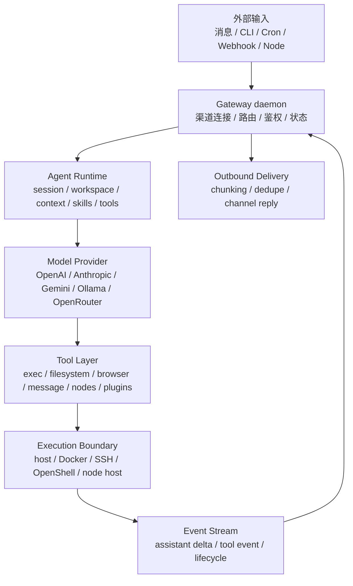

# OpenClaw 架构设计学习手册

> [!abstract] 文档定位
> 这篇文档适合作为理解 OpenClaw Gateway-first 架构的入口，重点关注长驻 Gateway、Agent Runtime、工具/技能/插件扩展模型、sandbox 后端和远程节点。

> [!tip] Obsidian 导航
> 统一索引见 [[开源项目架构设计文档索引]]；如果要理解 AI Agent-first 的相邻设计，优先对照 [[hermes-architecture-learning-guide|Hermes Agent 架构设计学习手册]]。

> [!example] 快速跳转
> - [[#02 · 整体架构地图|整体架构地图]]
> - [[#05 · Agent Runtime 与 Agent Loop|Agent Runtime 与 Agent Loop]]
> - [[#08 · Sandbox、Tool Policy 与 Elevated：执行边界|Sandbox / Tool Policy / Elevated]]
> - [[#12 · 和 Codex 的关键区别|和 Codex 的关键区别]]

**从 Gateway 到 Agent Loop、插件系统、Sandbox 与远程节点**

> 这是一份面向学习者的技术文档。它不按“源码调研报告”的写法堆文件名，而是先建立心智模型，再沿着一条真实消息的生命周期，把 OpenClaw 的关键架构层拆开说明。资料依据以 OpenClaw 官方文档和 GitHub 仓库为主，非官方博客只作为背景参考，未作为结论来源。

**更新时间**：2026-05-22  
**适合读者**：想理解 OpenClaw 架构、准备部署个人 AI 助手、或者想学习 agent 系统设计的工程师。

> [!important] 核心结论
> - OpenClaw 的架构中心是长驻 Gateway，而不是单次 CLI 调用或某个聊天入口。
> - Agent Runtime 负责把一次输入变成可排队、可流式、可持久化的 agent run。
> - Tools / Skills / Plugins 分别解决“能做什么”“如何做”“如何扩展系统能力”。
> - Sandbox / Tool Policy / Elevated 是三个不同控制面，分别约束执行位置、工具可见性和 sandbox escape。
> - OpenClaw 的安全模型默认是 personal assistant trust boundary，不是 hostile multi-tenant SaaS 隔离边界。

> [!tip] 阅读路线
> - 想快速建立心智模型：读 [[#00 · 30 秒速览]]、[[#01 · 核心心智模型：OpenClaw 到底是什么]]、[[#02 · 整体架构地图]]。
> - 想理解请求如何流转：读 [[#03 · 从一条消息到最终回复：完整生命周期]]、[[#04 · Gateway 与 WebSocket 协议]]、[[#05 · Agent Runtime 与 Agent Loop]]。
> - 想部署或评估风险：读 [[#08 · Sandbox、Tool Policy 与 Elevated：执行边界]]、[[#10 · 安全模型：OpenClaw 的边界在哪里]]、[[#14 · 使用与部署建议]]。

---

<a id="tldr"></a>

## 00 · 30 秒速览

OpenClaw 可以先理解成一句话：

> **一个你自己运行的、长驻的个人 AI 助手控制面。Gateway 负责接消息、管会话、连设备、调模型和工具；Agent Runtime 负责把一次输入变成一个 agent loop；工具、插件、技能和 sandbox 决定它能做什么、怎么做、在哪里做。**

最重要的三点：

1. **OpenClaw 的核心不是单次 CLI 调用，而是长驻 Gateway。**  
   Gateway 是单一控制面，连接 WhatsApp、Telegram、Slack、Discord、Signal、iMessage、WebChat 等消息面，也连接 CLI、Web UI、macOS app、自动化客户端和移动/桌面节点。

2. **Agent loop 是一条固定链路：intake → context assembly → model inference → tool execution → streaming replies → persistence。**  
   模型不直接操作设备。模型看到工具定义后提出 tool call，OpenClaw runtime 再根据工具策略、sandbox、approval、节点能力和通道策略来执行。

3. **OpenClaw 的 sandbox 和 Codex 的 local sandbox 很不一样。**  
   Codex local sandbox 更像“本机真实目录上的 OS 权限边界”；OpenClaw sandbox 默认更像“把工具执行放到 Docker / SSH / OpenShell 后端里”，Gateway 仍在宿主机，tool execution 才进入隔离后端。

---

<a id="mental-model"></a>

## 01 · 核心心智模型：OpenClaw 到底是什么

OpenClaw 官方 README 把它描述为一个运行在你自己设备上的 personal AI assistant，可以在你已经使用的渠道上回应，并且 Gateway 只是 control plane，真正的产品是 assistant 本身。[1]

更工程化地说，它由下面几层组成：

```text
用户 / 外部事件
  │
  ├─ WhatsApp / Telegram / Slack / Discord / Signal / iMessage / WebChat
  ├─ CLI / Web UI / macOS app / 自动化客户端
  └─ Cron / Webhook / Node 事件
      │
      ▼
Gateway daemon
  连接渠道、维护会话、路由消息、暴露 WebSocket API、管理状态
      │
      ▼
Agent Runtime
  准备 workspace、session、context、system prompt、skills、tools
      │
      ▼
Model Provider
  OpenAI / Anthropic / Gemini / Ollama / OpenRouter / 本地模型等
      │
      ▼
Tool Layer
  exec / read / write / edit / browser / message / sessions / nodes / cron / plugin tools
      │
      ▼
Execution Boundary
  Host direct execution / Docker sandbox / SSH sandbox / OpenShell / Node host
      │
      ▼
Outbound delivery
  流式回复、分块、去重、通道限制、最终发送回原渠道
```

这里有一个很关键的区别：

| 对比项 | Codex CLI | OpenClaw |
|---|---|---|
| 默认形态 | 面向代码仓库的本地 coding agent | 面向个人生活/工作消息面的 always-on assistant |
| 核心进程 | CLI session / local runtime | 长驻 Gateway daemon |
| 输入来源 | 终端 prompt / IDE / cloud task | 多消息渠道、CLI、Web、Cron、Webhook、节点事件 |
| 状态中心 | 当前 session / repo | Gateway 拥有 sessions、auth profiles、channels、agent state |
| 工具执行 | 本机/远端/云端 coding 环境 | host、sandbox backend、remote node、browser、message channels |
| 安全重点 | 限制 coding agent 操作项目外资源 | 限制谁能触发 agent、agent 能用哪些工具、工具在哪里运行 |

因此，理解 OpenClaw 时不要从“模型怎么改代码”开始，而要从下面这个问题开始：

> **一个来自 WhatsApp/Slack/Telegram/CLI 的输入，是如何进入 Gateway，被路由成某个 session 的一次 agent run，然后经过模型和工具，最终返回到原渠道的？**

---

<a id="architecture-map"></a>

## 02 · 整体架构地图

OpenClaw 的官方文档明确说，一个长驻 Gateway 拥有所有 messaging surfaces；控制面客户端通过 WebSocket 连接 Gateway，节点也通过 WebSocket 连接 Gateway，但节点会声明 `role: node` 和自己的 capabilities / commands。[2]

可以把架构压缩成七层。

| 层级 | 名称 | 负责什么 | 典型组件 |
|---|---|---|---|
| L7 | 外部入口层 | 接收人类消息、UI 操作、定时任务、Webhook、设备事件 | WhatsApp、Telegram、Slack、Discord、WebChat、CLI、Cron、Node |
| L6 | Gateway 控制面 | 持有渠道连接、WebSocket API、会话状态、路由、鉴权、配对、事件广播 | `openclaw gateway`、Gateway WS、HTTP canvas host |
| L5 | Agent 运行时 | 解析 session、准备 workspace、组装 prompt/context、加载技能、执行 agent loop | `agent` RPC、`agent.wait`、`runEmbeddedPiAgent` |
| L4 | 模型与上下文层 | 选择 provider/model，管理 system prompt、context、compaction、memory | providers、context engine、system prompt、compaction |
| L3 | 工具层 | 让 agent 读写文件、跑命令、发消息、控制浏览器、调节点、管理 session | `exec`、`read/write/edit`、`browser`、`message`、`nodes`、`cron` |
| L2 | 扩展层 | 通过插件和技能扩展渠道、模型、工具、语音、媒体、工作流 | plugins、skills、ClawHub、plugin SDK |
| L1 | 执行边界 | 决定工具是在宿主机、容器、SSH 远端、OpenShell 还是 Node 上执行 | host、Docker、SSH、OpenShell、node host |

OpenClaw 仓库本身是一个 Node/TypeScript 风格的 pnpm monorepo。仓库的 `pnpm-workspace.yaml` 包含根包、`ui`、`packages/*` 和 `extensions/*`。[3] 仓库根部的 `AGENTS.md` 也给出了源码地图：core TS 在 `src/`、`ui/`、`packages/`，插件在 `extensions/`，SDK 在 `src/plugin-sdk/*`，渠道在 `src/channels/*`，Gateway protocol 在 `src/gateway/protocol/*`。[4]

> [!info] 架构主线
> 阅读 OpenClaw 时，可以先抓住一条线：外部输入进入 Gateway，Gateway 选择 session 和 agent run，Agent Runtime 组织上下文并调用模型，模型通过工具层产生动作，执行边界决定动作落在哪里，最后 Gateway 再把结果送回原渠道。



### 2.1 Gateway 是控制面，不是普通 HTTP server

Gateway 负责：

- 维护消息渠道连接。
- 暴露 typed WebSocket API。
- 校验入站 frame 的 JSON Schema。
- 发出 `agent`、`chat`、`presence`、`health`、`heartbeat`、`cron` 等事件。
- 托管 Canvas / A2UI 的 HTTP 路径。
- 处理设备配对、operator/node 角色、session 状态、tool approval。

官方架构页强调：**一个 host 一个 Gateway**；比如 WhatsApp session 只应该由 Gateway 打开。[2]

### 2.2 Agent Runtime 是 Gateway 之上的“脑”

OpenClaw 官方文档说，OpenClaw runs a single embedded agent runtime；它在一个 agent workspace 目录中工作，这个 workspace 是工具和上下文的默认 cwd。[5]

但 runtime 本身又不是从零写的所有模型/tool loop。OpenClaw 文档说，embedded agent runtime 建在 Pi agent core 之上，而 session management、discovery、tool wiring、channel delivery 是 OpenClaw 自己在这个 core 之上的层。[5]

可以这样拆：

```text
Pi agent core
  └─ 模型、工具、prompt pipeline 的底层 agent core

OpenClaw-owned layers
  ├─ Gateway RPC / channel routing
  ├─ Session 管理
  ├─ Workspace/bootstrap 文件注入
  ├─ Skills / plugins / tools wiring
  ├─ Streaming event bridge
  ├─ Outbound channel delivery
  └─ Sandbox / tool policy / elevated gates
```

---

<a id="lifecycle"></a>

## 03 · 从一条消息到最终回复：完整生命周期

OpenClaw 的 agent loop 官方定义是：**intake → context assembly → model inference → tool execution → streaming replies → persistence**。它是把一条消息转成动作和最终回复的权威路径，并且保持 session state 一致。[6]

下面用 Telegram 消息作为例子，但 CLI、WebChat、Slack、Discord、Cron、Webhook 的核心路径类似。

```text
1. 用户在 Telegram 发消息
   │
   ▼
2. 渠道适配器把消息交给 Gateway
   │
   ▼
3. Gateway 做 sender / group / allowlist / pairing / dedupe 检查
   │
   ▼
4. Routing/bindings 决定 agentId 和 session key
   │
   ▼
5. 如果同 session 已有 run，进入 queue / collect / steer / followup
   │
   ▼
6. Gateway 接受 agent run，返回 runId / acceptedAt
   │
   ▼
7. Agent command 解析模型、thinking、trace、skills snapshot
   │
   ▼
8. runEmbeddedPiAgent 序列化 run，准备 pi session
   │
   ▼
9. 组装 system prompt + context + tools schema
   │
   ▼
10. 调模型 provider
   │
   ▼
11. 模型返回文本 delta 或 tool call
   │
   ▼
12. Tool layer 执行工具：文件、shell、浏览器、消息、node、plugin tool
   │
   ▼
13. Tool result 回到模型，可能继续下一轮
   │
   ▼
14. Assistant delta / tool event / lifecycle event 被 bridge 到 OpenClaw event stream
   │
   ▼
15. Gateway 根据通道限制做 chunking / final / suppress duplicate
   │
   ▼
16. 回复发送回 Telegram，并把 transcript 写入 session JSONL
```

### 3.1 CLI 入口只是另一种 Gateway 客户端

OpenClaw README 的 quick start 里有两条命令很典型：[7]

```bash
openclaw gateway --port 18789 --verbose
openclaw agent --message "Ship checklist" --thinking high
```

第一个命令启动长驻 Gateway。第二个命令不是直接把 prompt 发给模型，而是通过 OpenClaw 的 CLI 路径把消息交给 Gateway / agent runtime。CLI 是入口，Gateway 仍然是状态中心。

### 3.2 消息流的最小模型

官方 messages 文档给出的高层消息流是：[8]

```text
Inbound message
  -> routing/bindings -> session key
  -> queue (if a run is active)
  -> agent run (streaming + tools)
  -> outbound replies (channel limits + chunking)
```

这个模型非常重要，因为 OpenClaw 的难点不是“一次模型调用”，而是：

- 同一个人连续发多条消息怎么办？
- 群聊里的消息如何判断是否要响应？
- 一个 session 已经在跑工具时，新消息是打断、跟随、收集，还是等待？
- 一个 assistant 回复如何在 Telegram / Slack / Discord / WhatsApp 的不同长度和线程规则下发送？

这就是 Gateway、queue、session、streaming 和 delivery 要独立存在的原因。

---

<a id="gateway-protocol"></a>

## 04 · Gateway 与 WebSocket 协议

Gateway WS protocol 是 OpenClaw 的 single control plane + node transport。官方协议文档说，所有客户端，包括 CLI、Web UI、macOS app、iOS/Android nodes、headless nodes，都会通过 WebSocket 连接，并在 handshake 时声明 role 和 scope。[9]

### 4.1 三种连接角色

| 角色 | 谁使用 | 典型权限 |
|---|---|---|
| `operator` | CLI、Web UI、macOS app、自动化客户端 | 读写 Gateway 状态、发消息、审批、配置、配对 |
| `node` | iOS/Android/macOS/headless node | 暴露 camera、canvas、screen、location、system.run 等命令 |
| channel adapter | WhatsApp/Telegram/Slack 等 | 通常由 Gateway 内部持有连接，不是独立 operator |

协议的第一帧必须是 `connect`。之后 frames 分成三类：[2][9]

```text
Request:  { type: "req", id, method, params }
Response: { type: "res", id, ok, payload | error }
Event:    { type: "event", event, payload, seq?, stateVersion? }
```

OpenClaw 的很多“看起来像本地命令”的操作，其实都是 Gateway RPC：

- `agent` / `agent.wait`：启动或等待 agent run。
- `send`：发送消息到渠道。
- `sessions.*`：查 session、订阅消息、重置、compact。
- `node.invoke`：让 paired node 执行某个 command。
- `exec.approval.*`：处理 exec approval。
- `plugins.*` / `tools.*` / `skills.*`：插件和工具目录相关。

### 4.2 Gateway 的状态所有权

OpenClaw 的 remote access 文档说，要把 Gateway host 理解成“agent lives”的地方；它拥有 sessions、auth profiles、channels 和 state，笔记本、桌面和 nodes 都连接到这台 host。[10]

这解释了一个常见误解：

> 远程访问 OpenClaw 时，远程机器不是“UI 服务器”，而是 agent 的状态中心。你的本机客户端只是 operator UI。

如果你的 Gateway 跑在家里的 Mac mini 上，Telegram 消息、agent session、channel login、tool policy、credential store 都以那台 Mac mini 为准。

---

<a id="agent-loop"></a>

## 05 · Agent Runtime 与 Agent Loop

OpenClaw 的 agent loop 不是简单的 `prompt -> answer`。官方 agent loop 文档把它拆成五段：[6]

1. `agent` RPC 校验参数、解析 session、持久化 session metadata，并立即返回 `{ runId, acceptedAt }`。
2. `agentCommand` 解析模型、thinking、verbose、trace 默认值，加载 skills snapshot，然后调用 `runEmbeddedPiAgent`。
3. `runEmbeddedPiAgent` 通过 per-session + global queues 序列化 run，解析 model + auth profile，构建 pi session，订阅 pi events，并在 timeout 时 abort。
4. `subscribeEmbeddedPiSession` 把 pi-agent-core 事件桥接成 OpenClaw 的 `agent` stream：tool events、assistant deltas、lifecycle events。
5. `agent.wait` 通过 `waitForAgentRun` 等待 lifecycle end/error，并返回状态。

### 5.1 队列：为什么同一个 session 要串行

OpenClaw 的 command queue 文档解释：入站 auto-reply runs 会经过一个 lane-aware FIFO queue，以避免多个 agent run 互相碰撞，同时允许不同 session 之间安全并行。[11]

关键设计：

```text
session lane: session:<key>
  同一个 session key 同时只允许一个 active run

main/global lane:
  控制整体并发，避免 LLM 调用、日志、CLI stdin、共享资源争抢
```

这使得 OpenClaw 在消息渠道上更像一个“可靠服务”，而不是一个简单 REPL：

- 同一个聊天线程不会同时有两个模型在写同一个 transcript。
- 工具结果和 session history 的顺序更稳定。
- 速率限制和 provider 并发更容易控制。
- inbound 消息可以选择 `collect`、`steer`、`followup` 等策略。

### 5.2 Steering / Followup / Collect

当一个 run 正在执行时，新的消息可以有不同处理方式：[11]

| 模式 | 含义 | 适合场景 |
|---|---|---|
| `collect` | 把排队消息合并成下一轮 followup | 默认安全选择，避免一条条打断 |
| `followup` | 当前 run 结束后新开一轮 | 明确的后续补充 |
| `steer` | 在下一个模型边界注入当前 run | 用户要纠正正在进行的任务 |
| `steer-backlog` | 既 steer，又保留为 followup | 需要实时纠偏但也要完整回复 |
| `interrupt` | 中止 active run，只处理新消息 | 强打断 |

这和 Codex 里“用户中途追加一条消息”很像，但 OpenClaw 要面对更多通道和多用户/群聊环境，所以 queue mode 是一等公民。

### 5.3 Event stream：模型流、工具流、生命周期流

OpenClaw 把 agent run 中的事件分成三类：[6]

```text
lifecycle: start / end / error
assistant: 模型输出 delta
工具: tool start / update / end
```

这些事件既可以给控制台 UI，也可以给 WebChat、Control UI、channel delivery、session transcript、debugging tooling 使用。

---

<a id="context-workspace-memory"></a>

## 06 · Context、Workspace 与 Memory

OpenClaw 的 context 文档对“context”的定义很清楚：context 是 OpenClaw 在一次 run 中发送给模型的所有内容，包括 system prompt、对话历史、工具调用/结果、附件等；context 不等于 memory，memory 可以存盘并在以后加载，context 是当前模型窗口里的内容。[12]

### 6.1 Workspace 是 agent 的家，但不是硬 sandbox

官方 workspace 文档说：workspace 是 agent 的 home，是 file tools 和 workspace context 使用的唯一工作目录；但它也是 default cwd，不是 hard sandbox。若没有启用 sandbox，绝对路径仍可能访问 host 上 workspace 外的文件。[13]

默认 workspace：

```text
~/.openclaw/workspace
```

常见 bootstrap 文件：

```text
AGENTS.md     操作指令 + memory
SOUL.md       persona、边界、语气
TOOLS.md      用户维护的工具约定
IDENTITY.md   agent 名字、风格、emoji
USER.md       用户档案和称呼偏好
BOOTSTRAP.md  首次运行 ritual
HEARTBEAT.md  heartbeat 相关上下文
MEMORY.md     可选长期记忆入口
```

这些文件的关键作用不是“给人看”，而是**在系统提示词里给模型提供稳定背景**。

### 6.2 System Prompt 是 OpenClaw 自己组装的

官方 system prompt 文档明确说，OpenClaw 每次 agent run 都会构建 custom system prompt，OpenClaw 不使用 pi-coding-agent 的默认 prompt；provider plugin 可以贡献 cache-aware prompt guidance，但不是替换整个 OpenClaw-owned prompt。[14]

系统提示词包含：

- Tooling：工具使用约束。
- Execution Bias：任务执行偏好。
- Safety：短安全提醒。
- Skills：可用技能列表及如何按需读取。
- OpenClaw Self-Update：如何安全读取和 patch config。
- Workspace：工作目录。
- Sandbox：sandbox enabled 时的路径和 elevated exec 说明。
- Current Date & Time：用户时区/时间格式。
- Runtime：host、OS、Node、model、repo root、thinking level。
- Injected workspace files：AGENTS/SOUL/TOOLS/USER 等。

### 6.3 Context Engine：谁决定“模型看到什么”

Context engine 控制每次运行如何构造模型上下文：包括哪些消息、如何总结旧历史、如何跨 subagent 边界管理 context。OpenClaw 内置 `legacy` engine，插件可以注册替代 engine。[15]

可以这样理解：

```text
Session transcript on disk
  ├─ 很长的历史
  ├─ 工具结果
  ├─ compacted summary
  └─ recent tail
      │
      ▼
Context Engine
  选择这次模型需要看到的内容
      │
      ▼
Model context window
```

### 6.4 Compaction：长会话如何继续

当会话接近模型上下文窗口时，OpenClaw 会把旧消息总结成 compact entry，并保存到 session transcript，最近消息保持原样；完整历史仍在磁盘上，compaction 只改变下一次模型看到的内容。[16]

这是一种非常实用的设计：

- transcript 是持久记录。
- context 是当前模型窗口。
- compaction summary 是“把旧上下文压缩后继续工作”的桥。
- memory 文件和 memory tools 是更长期的检索/保存层。

---

<a id="tools-skills-plugins"></a>

## 07 · Tools、Skills、Plugins：三层扩展模型

OpenClaw 官方 tools 文档用一句话概括：agent 生成文本之外的一切动作都通过 tools 完成；tools 让 agent 读文件、运行命令、浏览网页、发消息、与设备交互。[17]

三者区别如下：[17]

| 概念 | 本质 | 给谁用 | 例子 |
|---|---|---|---|
| Tool | 模型可以调用的 typed function | 给模型实际执行动作 | `exec`、`read`、`write`、`browser`、`message` |
| Skill | Markdown 指南，告诉模型何时/如何用工具 | 给模型增加流程和领域知识 | `SKILL.md`、YAML frontmatter、操作步骤 |
| Plugin | 打包能力的扩展包 | 给系统新增渠道、模型、工具、技能、语音、媒体能力 | native plugin、bundle plugin、ClawHub/npm 包 |

### 7.1 Built-in tools

OpenClaw 内置工具包括：[17]

```text
runtime:    exec / process / code_execution
filesystem: read / write / edit / apply_patch
web:        browser / web_search / x_search / web_fetch
messaging:  message
ui/device:  canvas / nodes
automation: cron / gateway
media:      image / image_generate / music_generate / video_generate / tts
sessions:   sessions_* / subagents / session_status
```

这意味着 OpenClaw 不是“聊天机器人 + API 调用”，而是一个广义 action runtime。模型可以通过结构化工具驱动真实系统。

### 7.2 Skills 是 prompt 层的能力，不是执行层权限

OpenClaw 使用 AgentSkills-compatible skill folders。每个 skill 是一个目录，里面有 `SKILL.md`，包含 YAML frontmatter 和 Markdown 指令。[18]

Skill 主要告诉模型：

- 在什么场景应该使用这个技能。
- 需要先读什么文件/检查什么状态。
- 应该调用哪些工具。
- 应避免哪些危险操作。

但它不等于权限。一个 skill 里写“使用 exec”不代表 exec 一定可用。真正可用性仍由 tool policy、sandbox、provider restrictions、approval/elevated 控制。

### 7.3 Plugins 是能力包

OpenClaw 插件可以扩展 channels、model providers、tools、skills、speech、realtime transcription、voice、media understanding、image/video generation、web fetch/search 等。[19]

插件有两种格式：[19]

| 格式 | 说明 |
|---|---|
| Native | `openclaw.plugin.json` + runtime module，进程内执行 |
| Bundle | Codex/Claude/Cursor-compatible layout，映射到 OpenClaw features |

插件发现顺序：[20]

1. `plugins.load.paths` 显式路径。
2. workspace extensions。
3. global extensions。
4. bundled plugins。

启用规则里，`deny` 优先，workspace-origin plugins 默认禁用，需要显式启用。[20]

### 7.4 设计启发

OpenClaw 把“会做什么”拆成三个不同层级，这一点很值得学习：

```text
Tool   = 能执行的原子动作
Skill  = 怎么组合动作的使用说明
Plugin = 给系统安装/注册这些动作和说明的扩展包
```

这种设计可以同时满足：

- 模型可见的工具 schema 保持结构化。
- 用户可以用 Markdown 自定义工作流。
- 社区可以用 npm/ClawHub 分发复杂能力包。
- 安全策略仍可在 tool policy 层统一收口。

---

<a id="sandbox-security"></a>

## 08 · Sandbox、Tool Policy 与 Elevated：执行边界

这是 OpenClaw 和 Codex 最容易混淆的地方。

> [!warning] 先分清三个问题
> - **Tool Policy**：模型是否看得到、能否调用某个工具。
> - **Sandbox**：被允许的工具调用在哪里执行。
> - **Elevated**：sandboxed `exec` 是否允许跳回 host。
>
> 这三者不能互相替代。启用 sandbox 不等于启用了最小工具权限；允许 elevated 也不等于授予模型所有工具。

OpenClaw sandbox 文档明确说：如果 sandboxing 开启，tool execution 会在 isolated sandbox 中运行；Gateway 仍在 host 上。sandboxing 不是完美安全边界，但能显著限制模型做蠢事时的文件系统和进程访问 blast radius。[21]

### 8.1 哪些东西会进入 sandbox

会被 sandbox 的是：[21]

```text
exec / read / write / edit / apply_patch / process 等工具执行
可选 sandboxed browser
prompt media reads / inbound media staging 等与工具执行相关的路径
```

不会被 sandbox 的是：[21]

```text
Gateway 进程本身
明确允许在 sandbox 外执行的工具，例如 tools.elevated
```

这意味着：

> **OpenClaw 的 sandbox 保护的是 tool execution，不是 Gateway daemon 本身。**

### 8.2 三个控制不是一回事

OpenClaw 官方文档把三个控制分得很清楚：[22]

| 控制 | 决定什么 | 配置位置 |
|---|---|---|
| Sandbox | 工具在哪里运行：host 还是 sandbox backend | `agents.defaults.sandbox.*` / `agents.list[].sandbox.*` |
| Tool Policy | 哪些工具存在、可被模型调用 | `tools.*` / `agents.list[].tools.*` |
| Elevated | sandboxed 时，`exec` 是否能逃逸到 host | `tools.elevated.*` / `agents.list[].tools.elevated.*` |

记住这一句：

> **Tool policy 是“有没有这个按钮”；sandbox 是“按下按钮后在哪里执行”；elevated 是“某些 exec 是否允许跳出 sandbox”。**

### 8.3 Sandbox modes

`sandbox.mode` 决定什么时候使用 sandbox：[21][22]

| mode | 含义 |
|---|---|
| `off` | 所有工具都在 host 上运行 |
| `non-main` | 只 sandbox 非 main session；群聊/频道 session 通常是 non-main |
| `all` | 所有 session 都进入 sandbox |

README 也提醒：默认情况下，main session 的 tools 在 host 上运行，因此当“只有你自己使用”时，agent 具有 host access；如果要做 group/channel safety，可以把 `agents.defaults.sandbox.mode` 设成 `non-main`，Docker 是默认 sandbox backend，也支持 SSH 和 OpenShell。[23]

### 8.4 Sandbox scope

`sandbox.scope` 决定创建几个 sandbox：[21]

| scope | 含义 |
|---|---|
| `agent` | 每个 agent 一个 sandbox，默认 |
| `session` | 每个 session 一个 sandbox |
| `shared` | 所有 sandboxed sessions 共用一个 sandbox |

### 8.5 Sandbox backends

OpenClaw 支持三类 sandbox backend：[21]

| backend | 在哪里运行 | 工作区模型 | 适合场景 |
|---|---|---|---|
| Docker | 本地容器 | bind-mount 或 sandbox workspace | 本地开发、强隔离、常规推荐 |
| SSH | 任意 SSH 主机 | 远端 canonical，seed 一次 | 把工具执行 offload 到远端机器 |
| OpenShell | OpenShell managed sandbox | `mirror` 或 `remote` | 托管远端 sandbox，可选双向同步 |

这里要特别注意 Docker backend 与 Codex local sandbox 的区别：

```text
Codex local sandbox:
  在本机真实 workspace 上用 OS policy 限制命令越界。
  workspace 内 rm 真实删除本机文件。

OpenClaw Docker sandbox:
  Gateway 在 host；tool execution 在容器后端。
  workspaceAccess 决定容器看到 host workspace 的方式。
  workspaceAccess="none" 时，工具看到的是 ~/.openclaw/sandboxes 下的 sandbox workspace。
```

### 8.6 Workspace access

`workspaceAccess` 决定 sandbox 能看到什么：[21]

| workspaceAccess | 含义 |
|---|---|
| `none` | 默认；工具看到 `~/.openclaw/sandboxes` 下的 sandbox workspace |
| `ro` | 把 agent workspace 只读挂载到 `/agent`，禁用 write/edit/apply_patch |
| `rw` | 把 agent workspace 读写挂载到 `/workspace` |

这回答一个非常关键的问题：

> OpenClaw sandbox 里执行 `rm` 是删哪里的文件？

要看 backend 和 workspaceAccess：

| 配置 | `rm file` 的效果 |
|---|---|
| sandbox off | 在 host workspace / cwd 上执行，可能真实删除 host 文件 |
| Docker + `workspaceAccess="none"` | 删除 sandbox workspace 里的文件，不是 host workspace 原件 |
| Docker + `workspaceAccess="ro"` | host workspace 只读，写/删应失败 |
| Docker + `workspaceAccess="rw"` | 读写挂载 host workspace，删除可能影响 host workspace |
| SSH backend | 初次 seed 后在远端 workspace 上执行；不会自动同步回本地 |
| OpenShell `mirror` | exec 前同步到远端，exec 后同步回本地 |
| OpenShell `remote` | 远端 workspace 成为 canonical，不自动同步回本地 |

### 8.7 Bind mounts 是危险边界

官方文档提醒，`docker.binds` 会刺穿 sandbox 文件系统：挂进去的 host path 会按你设置的 `:ro` / `:rw` 暴露给容器。[22]

OpenClaw 会阻止危险 bind source，比如 `docker.sock`、`/etc`、`/proc`、`/sys`、`/dev`，也会阻止常见 home 目录 credential roots，比如 `~/.aws`、`~/.docker`、`~/.gnupg`、`~/.netrc`、`~/.npm`、`~/.ssh`。[21]

但原则仍然是：

```text
bind mount 是主动扩大 sandbox 视野。
除非确实需要，否则用 :ro；敏感目录不要 bind。
```

### 8.8 Elevated：不是权限提升，而是 sandbox escape hatch

Elevated 只影响 `exec`，不会赋予额外工具。如果你已经在 sandbox 中，`/elevated on` 或 `exec` with `elevated: true` 会让 exec 在 sandbox 外运行；如果已经是 direct host execution，elevated 基本是 no-op，但仍受 gate 控制。[22]

这与 Codex 的 `danger-full-access` 有点像，但 OpenClaw 的语义更细：

```text
sandbox = 工具在哪里跑
工具策略 = 哪些工具可用
exec approval = exec 是否要问
 elevated = sandboxed exec 是否能跳到 host
```

---

<a id="multi-agent-nodes"></a>

## 09 · Multi-Agent、Sessions 与 Nodes

OpenClaw 的 multi-agent 设计不是“多个模型实例”的简单堆叠，而是多个隔离的 agent scope。

### 9.1 一个 agent 是什么

官方 multi-agent 文档定义：一个 agent 是一个 fully scoped brain，拥有自己的 workspace、state directory、session store。[24]

| 组成 | 每个 agent 独立吗 | 说明 |
|---|---|---|
| Workspace | 是 | AGENTS/SOUL/USER、本地 notes、persona rules |
| agentDir | 是 | auth profiles、model registry、per-agent config |
| sessions | 是 | `~/.openclaw/agents/<agentId>/sessions` |
| skills | 部分共享、部分独立 | 每个 workspace 的 skills + shared roots + allowlist |
| credentials | 默认不自动共享 | 要共享需复制 auth profiles |

这使得你可以设计：

```text
main agent      处理日常私人聊天
work agent      只处理公司 Slack / GitHub / docs
family agent    只在家庭群里响应
coding agent    有 repo bind 和 runtime tools
read-only agent 只有消息和查询能力
```

### 9.2 Session routing

Session 管理文档说，OpenClaw 会根据消息来源把消息路由到 session：DM 默认共享 session，group chats 按 group 隔离，rooms/channels 按 room 隔离，cron 每次新 session，webhook 按 hook 隔离。[25]

如果多个人可以 DM 你的 agent，官方建议启用 DM isolation；否则 Alice 的私聊上下文可能对 Bob 可见。[25]

推荐：

```json
{
  "session": {
    "dmScope": "per-channel-peer"
  }
}
```

### 9.3 Nodes 是外围设备，不是 Gateway

官方 nodes 文档说，node 是连接到 Gateway WebSocket 的 companion device，声明 `role: "node"`，并通过 `node.invoke` 暴露 command surface，例如 `canvas.*`、`camera.*`、`device.*`、`notifications.*`、`system.*`。[26]

关键点：

- Nodes 是 peripherals，不运行 Gateway service。
- Telegram/WhatsApp 等消息落在 Gateway，不落在 node。
- macOS app 可以 node mode 暴露本机 canvas/camera 能力。
- node host 可以让 Gateway 在另一台机器上执行 `system.run` / `system.which`。

### 9.4 Remote node host：工具执行可以发生在另一台机器

如果 Gateway 跑在 A 机器，而你希望命令在 B 机器执行，可以用 node host。官方文档说：模型仍然和 Gateway 交互，Gateway 在 `host=node` 被选中时把 exec calls 转发到 node host。[26]

```text
Gateway host:
  接收消息、运行模型、路由 tool calls

Node host:
  执行 system.run / system.which

Approvals:
  在 node host 通过 ~/.openclaw/exec-approvals.json 执行
```

这与 sandbox backend 又是两个概念：

| 概念 | 目的 |
|---|---|
| remote Gateway | agent 状态和控制面在远端 |
| node host | 某些设备/命令能力在另一台机器 |
| SSH sandbox backend | tool execution 放到 SSH 远端 sandbox workspace |
| OpenShell backend | tool execution 放到 OpenShell managed sandbox |

---

<a id="security-model"></a>

## 10 · 安全模型：OpenClaw 的边界在哪里

OpenClaw 的安全文档开头就说：它假设 personal assistant deployment，即一个 trusted operator boundary；OpenClaw 不是为多个 adversarial users 共享一个 gateway/agent 而设计的 hostile multi-tenant security boundary。[27]

这句话是安全理解的核心。

> [!danger] 不要误用安全边界
> 如果部署场景里存在互不信任的用户，不应该只靠多 agent、session routing 或 workspace 区分来做强隔离。更稳妥的做法是拆分 Gateway、credentials、OS user、host 或 VM，把信任边界放到系统层。

### 10.1 最小安全模型

OpenClaw 要保护的不是“所有人共享一个超级安全 SaaS”，而是：

```text
一个可信用户 / 一个可信团队 / 一个明确边界
  │
  ├─ 控制哪些人能触发 agent
  ├─ 控制 agent 能调用哪些工具
  ├─ 控制工具在哪个环境运行
  ├─ 控制 credentials / logs / sessions 的磁盘权限
  └─ 控制 Gateway 是否暴露到网络
```

官方安全文档给出的 hardened baseline 思路是：Gateway loopback、token auth、DM 按 channel+peer 隔离、禁用 runtime/fs/session-send 等高风险工具、exec deny + ask always、elevated disabled、WhatsApp DM pairing 和群聊 require mention。[27]

### 10.2 入口控制优先于“模型聪明”

OpenClaw 安全文档非常强调：你是在把 frontier-model behavior 接到真实消息面和真实工具上，没有完美安全配置；目标是明确谁能对 bot 说话、bot 允许在哪里行动、bot 可以触碰什么。[27]

所以应按这个顺序做安全设计：

1. **Trigger control**：谁能触发 agent？DM pairing、allowlist、group mention。
2. **Session isolation**：不同人/群/账户是否共享上下文？
3. **Tool policy**：这个 agent 有哪些工具？deny 是否优先？
4. **Execution boundary**：host、Docker、SSH、OpenShell、node？
5. **Approval / elevated**：高风险 exec 是否需要人类批准？是否允许跳出 sandbox？
6. **Credential hygiene**：凭证和 transcript 是否安全存盘？
7. **Network exposure**：Gateway 是否只绑定 loopback？是否走 SSH/Tailscale？

### 10.3 DM、群聊和工具权限的组合风险

README 也提醒，OpenClaw 连接真实消息面，入站 DM 要当作 untrusted input；默认 Telegram/WhatsApp/Signal/iMessage/Microsoft Teams/Discord/Google Chat/Slack 使用 DM pairing，未知发送者会收到 pairing code，bot 不处理消息。[28]

最危险的组合通常是：

```text
public/open inbound channel
  + shared session
  + exec/browser/fs tools enabled
  + no sandbox
  + no allowlist/mention gate
```

换句话说，prompt injection 不是凭空产生危害；它需要连接到可触发的工具权限和上下文可见性。

---

<a id="design-tradeoffs"></a>

## 11 · 架构设计取舍

OpenClaw 的架构可以总结成四个取舍。

| 取舍 | 收益 | 主要代价 | 设计动作 |
|---|---|---|---|
| Local-first 长驻 Gateway | 掌握本地设备、凭证、会话和私有网络 | Gateway host 成为关键安全边界 | 绑定 loopback、管好 token、备份 state |
| 集中控制面 | 多渠道共享 routing、session、tool policy | Gateway 复杂度和配置风险上升 | 明确配置变更流程和最小权限 |
| 插件/技能开放 | 扩展 provider、渠道、工具、工作流 | 插件和 skill 可能引入恶意能力或指令 | workspace plugin 默认禁用，使用 allow/deny |
| Sandbox 分层执行 | 降低工具误操作的 blast radius | 不是完美安全边界，bind 和 elevated 会扩大风险 | 默认 deny-first，敏感场景用隔离 host/VM |

### 11.1 Local-first 长驻 Gateway，而不是纯云端 agent

优点：

- 你控制 Gateway host、credentials、workspace、sessions。
- 可以连接本地设备、浏览器、iMessage、文件、私有网络。
- 可以作为全天候 personal assistant，等消息、等定时任务、等节点事件。

代价：

- Gateway host 是关键安全边界。
- 需要管理本机 daemon、网络暴露、token、state 备份。
- 插件和工具如果配置过宽，会把风险带到宿主机。

### 11.2 Gateway 集中控制面，而不是每个渠道各跑一个 agent

优点：

- 所有渠道共享一个 session/routing/tool policy 模型。
- 多渠道身份、session、reply、presence、cron、nodes 可以统一管理。
- Control UI / CLI / WebChat / macOS app 看到的是同一套状态。

代价：

- Gateway 复杂度很高。
- 它既是消息路由器，又是 agent orchestrator，又是配置/安全控制面。
- 一旦 Gateway config 被篡改，等于控制面被接管。

### 11.3 插件/技能生态开放，但必须配套扫描与 allow/deny

优点：

- 社区可扩展模型 provider、渠道、工具、技能、媒体能力。
- skill 用 Markdown 写，学习门槛低。
- native plugin 可注册深度能力。

代价：

- 技能和插件可能携带恶意指令或危险代码。
- workspace-origin plugins 默认禁用是必要设计。
- 安装插件和启用工具应看作安全决策，不只是功能开关。

### 11.4 Sandbox 是 blast-radius control，不是万能安全边界

官方也明确说 sandbox 不是 perfect security boundary，只是显著限制 filesystem 和 process access。[21]

所以推荐心智模型是：

```text
安全不是单个开关，而是一组叠加控制：

入口 allowlist / pairing
  + session isolation
  + tool policy deny-first
  + sandbox backend
  + exec approval
  + elevated gate
  + separate OS user / host / VM
  + credential hygiene
```

---

<a id="codex-comparison"></a>

## 12 · 和 Codex 的关键区别

因为你前面一直在研究 Codex，这里专门放一张对照表。

| 维度 | Codex | OpenClaw |
|---|---|---|
| 核心目标 | 帮你在代码仓库中完成 coding task | 做长驻个人 AI 助手，连接消息、设备、工具和工作流 |
| 主要入口 | CLI / IDE / Cloud task | Gateway + messaging channels + CLI/Web/macOS/node |
| 状态中心 | session + repo | Gateway + agent workspace + sessions + credentials + channels |
| Tool loop | 以代码读写、shell、测试为中心 | 以消息、文件、shell、浏览器、节点、自动化、插件为中心 |
| 本地 sandbox | OS 级边界限制模型命令越界；真实 workspace 内修改真实发生 | 默认 Docker/SSH/OpenShell 后端；Gateway 仍在 host，tool execution 进 sandbox |
| 远程模式 | app-server / Cloud 容器等 | remote Gateway、node host、SSH sandbox、OpenShell backend 是不同概念 |
| 多 agent | 可有 subagent/skills 等，但核心仍偏 coding | 多 agent 是产品一等概念：独立 workspace、agentDir、sessions、routing |
| 安全重点 | 不要让 coding agent 越权破坏本机 | 不要让不可信消息驱动高权限工具；控制 Gateway 和插件生态 |

一句话：

> **Codex 更像“帮你写代码的受限本地执行代理”；OpenClaw 更像“你自己托管的个人 AI 操作系统控制面”。**

---

<a id="reading-path"></a>

## 13 · 建议的源码与文档阅读路径

### 第一阶段：先建立产品心智模型

1. 读 README：知道它是 personal AI assistant、Gateway control plane、支持哪些渠道、安装方式和安全默认值。[1][7][23]
2. 读 Gateway architecture：理解 single Gateway、clients、nodes、WebSocket、pairing。[2]
3. 读 Remote Access：理解 Gateway host 是“agent lives”的地方。[10]

### 第二阶段：读 agent loop

4. 读 Agent Runtime：workspace、bootstrap files、skills、runtime boundaries、sessions。[5]
5. 读 Agent Loop：agent RPC、runEmbeddedPiAgent、queue、prompt、tool execution、streaming。[6]
6. 读 Command Queue：理解 collect/steer/followup 和 per-session lane。[11]
7. 读 Messages：理解 inbound → routing → session → queue → agent run → outbound。[8]

### 第三阶段：读 context 与 memory

8. 读 Context：context 和 memory 区分、工具 schema 也占 context。[12]
9. 读 System Prompt：看 OpenClaw 如何组装 prompt。[14]
10. 读 Agent Workspace：理解 workspace 是默认 cwd，不是 hard sandbox。[13]
11. 读 Compaction：理解长会话压缩机制。[16]

### 第四阶段：读工具和扩展

12. 读 Tools and Plugins：理解 tools/skills/plugins 三层模型。[17]
13. 读 Skills：理解技能加载优先级和 per-agent/shared skills。[18]
14. 读 Plugins：理解 native/bundle 插件、发现顺序、slots、allow/deny。[19][20]

### 第五阶段：读安全与 sandbox

15. 读 Security：先理解 personal assistant trust model。[27]
16. 读 Sandboxing：理解 Docker/SSH/OpenShell backend、scope、workspaceAccess。[21]
17. 读 Sandbox vs Tool Policy vs Elevated：理解三个控制面的区别。[22]
18. 最后再读源码：从 `src/gateway/*`、`src/agents/*`、`src/plugin-sdk/*`、`src/channels/*`、`extensions/*` 开始。[4]

---

<a id="recommendations"></a>

## 14 · 使用与部署建议

### 14.1 个人本地助手

适合：只有你自己使用，Gateway 在个人 Mac mini / laptop / home server。

建议：

- Gateway 绑定 loopback。
- 用 SSH/Tailscale 做远程访问。
- DM pairing 保持默认。
- main session 可以 host tools，但高风险 `exec` 建议开启 ask。
- sensitive workspace 放私有 git 备份，但不要提交 secrets。

### 14.2 群聊 / 家庭 / 团队共享 bot

适合：多人能给 bot 发消息。

建议：

- 设置 `session.dmScope: "per-channel-peer"` 或更细。
- 群聊 require mention。
- 非 main sessions 开 sandbox：`agents.defaults.sandbox.mode="non-main"`。
- 工具策略从 `messaging` 或 `minimal` profile 起步。
- 不要给共享 agent 宿主机全量 personal credentials。

### 14.3 工具型 / Coding / Automation agent

适合：需要 `exec`、browser、file tools、GitHub、Cron。

建议：

- 专门创建一个 agent，而不是让 main agent 兼任。
- 给它单独 workspace 和 agentDir。
- Docker sandbox + `workspaceAccess="ro"` 或 `none` 起步。
- 真要写 host workspace 时，改成 `rw` 前先理解删除/写入影响。
- `elevated` 默认关闭，需要时按 agent + sender allowlist 打开。

### 14.4 远程执行 / 远程设备

适合：Gateway 在 A 机器，命令要在 B 机器执行。

建议：

- 只是远程控制 Gateway：用 Remote Access / SSH tunnel。
- 只是把工具放到远端隔离环境：用 SSH sandbox backend。
- 需要托管 sandbox 生命周期：用 OpenShell backend。
- 要让手机/Mac 暴露 camera/canvas/system.run：用 Node。
- 不要把这四个概念混成一个。

---

<a id="faq"></a>

## 15 · FAQ：最容易误解的点

### Q1：OpenClaw 的 Gateway 是不是等于一个聊天机器人 server？

不只是。它是 control plane：渠道连接、WebSocket API、session state、routing、agent runs、nodes、presence、health、cron、tool approvals 都在这里交汇。

### Q2：workspace 是不是 sandbox？

不是。官方文档明确说 workspace 是默认 cwd，不是 hard sandbox；没有启用 sandbox 时，绝对路径仍可能访问 host 其他位置。[13]

### Q3：OpenClaw 的 sandbox 是不是和 Codex local sandbox 一样？

不一样。OpenClaw sandbox 是可选工具执行后端，默认 Docker，也支持 SSH 和 OpenShell；Gateway 仍在 host。Codex local sandbox 更像本地命令进程的 OS 权限边界。

### Q4：我启用了 Docker sandbox，就一定不会影响本地文件吗？

不一定。要看 `workspaceAccess` 和 `docker.binds`。`workspaceAccess="rw"` 或 `:rw` bind mount 会让容器写入 host path。`workspaceAccess="none"` 才更像独立 sandbox workspace。[21][22]

### Q5：Tool policy 和 sandbox 哪个优先？

Tool policy 决定工具能否被调用，是 hard stop；sandbox 决定被允许的工具在哪里执行。`deny` 永远优先，`/exec` 也不能覆盖被 deny 的 exec tool。[22]

### Q6：Elevated 是不是 sudo？

不是。它是 sandboxed exec 的 host escape hatch，只影响 `exec`，不授予额外工具，也不绕过 allow/deny。[22]

### Q7：多 agent 是否等于多用户安全隔离？

不是 adversarial multi-tenant 隔离。OpenClaw 安全模型假设一个 trusted operator boundary；如果需要 hostile-user isolation，要拆成不同 Gateway、credentials，最好不同 OS user/host。[27]

---

<a id="sources"></a>

## 16 · 资料来源

[1] OpenClaw GitHub README — OpenClaw is a personal AI assistant, Gateway as control plane.  
https://github.com/openclaw/openclaw

[2] OpenClaw Docs — Gateway architecture.  
https://docs.openclaw.ai/concepts/architecture

[3] OpenClaw GitHub — `pnpm-workspace.yaml`.  
https://github.com/openclaw/openclaw/blob/main/pnpm-workspace.yaml

[4] OpenClaw GitHub — `AGENTS.md` repository map and architecture guidance.  
https://github.com/openclaw/openclaw/blob/main/AGENTS.md

[5] OpenClaw Docs — Agent runtime.  
https://docs.openclaw.ai/concepts/agent

[6] OpenClaw Docs — Agent Loop.  
https://docs.openclaw.ai/concepts/agent-loop

[7] OpenClaw GitHub README — install and quick start.  
https://github.com/openclaw/openclaw

[8] OpenClaw Docs — Messages.  
https://docs.openclaw.ai/concepts/messages

[9] OpenClaw Docs — Gateway Protocol.  
https://docs.openclaw.ai/gateway/protocol

[10] OpenClaw Docs — Remote Access.  
https://docs.openclaw.ai/gateway/remote

[11] OpenClaw Docs — Command queue.  
https://docs.openclaw.ai/concepts/queue

[12] OpenClaw Docs — Context.  
https://docs.openclaw.ai/concepts/context

[13] OpenClaw Docs — Agent Workspace.  
https://docs.openclaw.ai/concepts/agent-workspace

[14] OpenClaw Docs — System prompt.  
https://docs.openclaw.ai/concepts/system-prompt

[15] OpenClaw Docs — Context Engine.  
https://docs.openclaw.ai/concepts/context-engine

[16] OpenClaw Docs — Compaction.  
https://docs.openclaw.ai/concepts/compaction

[17] OpenClaw Docs — Tools and Plugins.  
https://docs.openclaw.ai/tools

[18] OpenClaw Docs — Skills.  
https://docs.openclaw.ai/tools/skills

[19] OpenClaw Docs — Plugins.  
https://docs.openclaw.ai/tools/plugin

[20] OpenClaw Docs — Plugin discovery and precedence.  
https://docs.openclaw.ai/tools/plugin

[21] OpenClaw Docs — Sandboxing.  
https://docs.openclaw.ai/gateway/sandboxing

[22] OpenClaw Docs — Sandbox vs Tool Policy vs Elevated.  
https://docs.openclaw.ai/gateway/sandbox-vs-tool-policy-vs-elevated

[23] OpenClaw GitHub README — Security model.  
https://github.com/openclaw/openclaw

[24] OpenClaw Docs — Multi-Agent Routing.  
https://docs.openclaw.ai/concepts/multi-agent

[25] OpenClaw Docs — Session management.  
https://docs.openclaw.ai/concepts/session

[26] OpenClaw Docs — Nodes.  
https://docs.openclaw.ai/nodes

[27] OpenClaw Docs — Security.  
https://docs.openclaw.ai/gateway/security

[28] OpenClaw GitHub README — DM access security defaults.  
https://github.com/openclaw/openclaw

---

## 17 · 一句话总结

OpenClaw 的架构本质是：

> **一个以 Gateway 为中心的 personal AI assistant control plane：它把消息渠道、UI、节点、session、context、模型、工具、插件、sandbox 和安全策略连接成一个长驻系统；模型负责判断下一步，Gateway/runtime 负责调度和执行，tool policy/sandbox/elevated/allowlist 共同决定真实动作的边界。**
