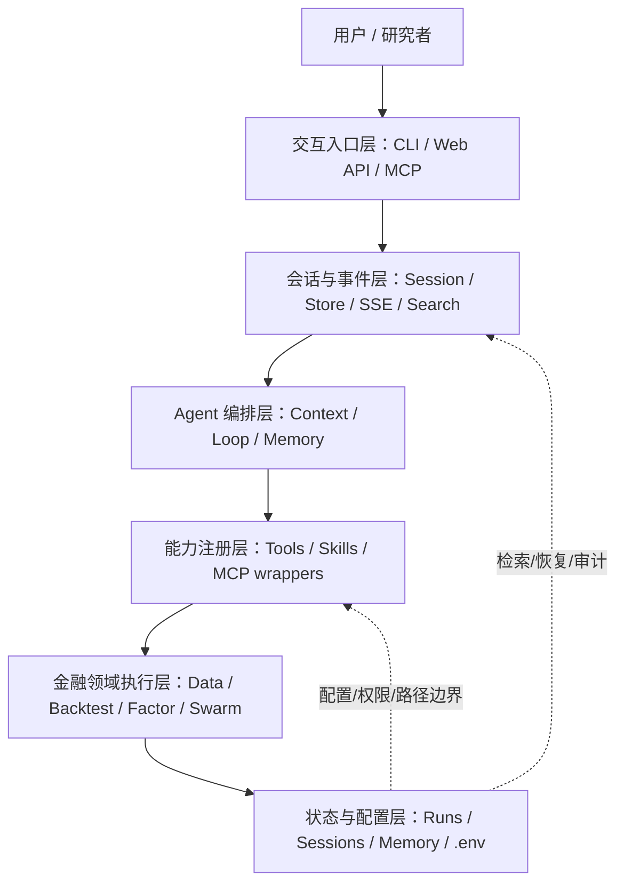
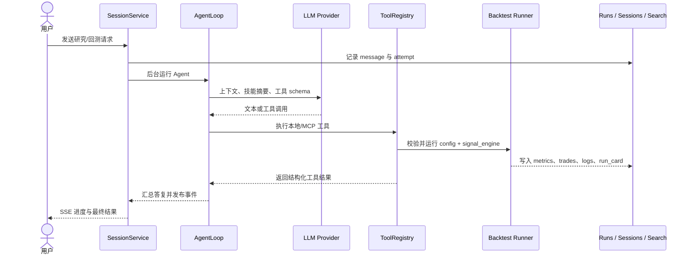

# Vibe-Trading 技术实现与架构设计学习指南

> [!abstract] 文档定位
> 这篇文档重点解释 Vibe-Trading 如何把自然语言、LLM agent、金融数据加载、回测、因子评估、MCP 和 Web/API 串成一个金融研究工作空间。

> [!warning] 边界提示
> 本文关注系统设计、数据流、状态管理和风险边界，不构成投资建议，也不应被当作真实交易执行方案。

> [!tip] Obsidian 导航
> 统一索引见 [[开源项目架构设计文档索引]]；如需比较通用 agent runtime 的执行边界，可对照 [[codex-learning-technical-guide-v2|Codex]]、[[openclaw-architecture-learning-guide|OpenClaw]] 和 [[hermes-architecture-learning-guide|Hermes Agent]]。

> [!example] 快速跳转
> - [[#3. 整体架构如何分层|整体架构分层]]
> - [[#3.1 架构总图|架构总图]]
> - [[#4. 一次核心操作从输入到输出的完整生命周期|核心操作生命周期]]
> - [[#6. 数据流和控制流如何流动|数据流与控制流]]
> - [[#7. 核心实现机制是什么|核心实现机制]]
> - [[#10. 安全边界和风险模型是什么|安全边界和风险模型]]
> - [[#13. 开源源码阅读路径|源码阅读路径]]

> [!info] 版本与范围
> 本文基于 2026-05-22 可访问的 Vibe-Trading 官方 GitHub README、Wiki、PyPI、release notes 与主分支源码阅读整理。项目仍在快速迭代，工具数量、技能数量、接口名称和 release 版本可能变化；涉及未来能力、生产部署能力或源码未明确说明的细节均标注为“官方未说明 / 基于现有资料推断”。

## 30 秒速览

| 维度 | 结论 |
|---|---|
| 技术类型 | **AI 系统 / 金融研究与回测工作空间**，同时提供 CLI、Web/API、MCP 插件、量化数据加载与回测能力。不是数据库、编译器、通用 Web 框架，也不是券商交易执行系统。 |
| 解决的问题 | 把自然语言金融研究问题转成可执行的市场数据获取、策略代码、回测、因子评估、报告与可追溯研究记录。[S1](#s1) [S2](#s2) |
| 核心边界 | 官方明确定位为研究、模拟和回测；不下真实订单，不构成投资建议。[S1](#s1) [S2](#s2) |
| 主要入口 | `vibe-trading` 终端、`vibe-trading serve` Web/API 服务、`vibe-trading-mcp` MCP 插件，以及 Docker 部署入口。[S1](#s1) [S3](#s3) [S26](#s26) |
| 核心内部结构 | 会话层 → Agent 编排层 → 工具/技能注册层 → 金融领域执行层（数据加载、回测、因子、swarm）→ 文件化状态与事件层。 |
| 状态与存储 | run 目录、会话 JSON/JSONL、SSE 事件缓冲、SQLite FTS5 搜索库、文件化长期 memory、`.env` 与 `~/.vibe-trading/agent.json`。 [S18](#s18) [S19](#s19) [S20](#s20) [S21](#s21) [S22](#s22) |
| 风险模型 | 主要风险不是交易所撮合风险，而是 LLM 输出错误、生成代码执行、数据源不完整、路径越界、API 暴露、密钥泄漏、MCP 外部工具信任边界。 |
| 阅读源码入口 | README → `pyproject.toml` → `agent/api_server.py`/session → `agent/src/agent/*` → `agent/src/tools/*` → `agent/backtest/*` → `agent/src/factors/*` → `agent/src/swarm/*` → MCP 与前端。 |

> [!summary] 一句话结论
> Vibe-Trading 的架构重点不是“让 LLM 直接做金融判断”，而是用 Agent 把研究入口、工具调用、回测产物、因子评估、状态记录和集成入口串成一个可追溯的金融研究工作台。

> [!question] 阅读时先抓三个问题
> - 用户请求如何从自然语言进入 session、AgentLoop 和工具链？
> - 金融数据、回测配置、生成代码和 artifacts 分别落在哪里？
> - 哪些边界是官方明确实现的，哪些只是适合本地研究的风险假设？

---

## 1. 它是什么，解决什么问题，不是什么

Vibe-Trading 是一个开源的自然语言金融研究工作空间：用户用自然语言提出研究问题，系统连接 LLM、市场数据加载器、策略生成、回测引擎、报告导出与持久化研究记忆，将“想法 → 数据 → 策略/因子 → 回测/评估 → 报告”的链路组织起来。[S1](#s1) 官方 Wiki 也把它描述为面向金融研究的 AI agent，连接自然语言 prompt、市场数据、回测、swarm 分析、交易日志诊断和可复现实验产物。[S2](#s2)

更准确地说，它是一个**面向量化研究的 AI 应用系统**，而不是单一模型、单一回测库或单一 UI。它把多种组件粘合在一起：LLM provider、工具注册器、技能库、数据源 fallback、回测 runner、文件化 session、SSE 事件、MCP server/client、React 前端和 Docker 镜像。[S1](#s1) [S4](#s4)

它主要解决三类问题：

1. **降低研究入口门槛**：把自然语言问题路由到合适的数据源、技能说明和工具链，而不是要求研究者先手写完整脚本。
2. **提高实验可复现性**：每次回测/研究运行写入 run 目录、配置、代码、日志、指标和 run card，便于复盘。[S13](#s13) [S14](#s14)
3. **把多源金融数据和多市场规则放在同一个工作流里**：A/HK/US 股票、crypto、期货、外汇、基金、宏观等市场通过 loader registry、fallback chain 与不同 backtest engine 组合。[S15](#s15) [S17](#s17)

它**不是什么**同样重要：

- **不是券商交易执行系统**：官方明确说明不执行真实交易、没有 live trading。它适合研究、模拟、回测与报告，不适合作为订单路由或真实资金自动交易系统。[S1](#s1) [S2](#s2)
- **不是数据库或数据仓库**：它有文件、SQLite FTS 与状态目录，但这些是研究状态与搜索辅助，不是通用查询数据库。
- **不是通用 Agent 框架**：它确实有 ReAct 风格 Agent 循环和工具调用，但重点是金融研究工作流，而不是给所有行业通用的 agent runtime。[S8](#s8)
- **不是低延迟交易平台**：源码和文档强调的是日线/选项/多市场回测、Alpha Zoo、报告和 Web/API，不是纳秒/毫秒级交易路径。官方未说明任何低延迟撮合、风控网关或交易所直连设计。

<details>
<summary>为什么判断为“AI 系统 / 金融研究工作空间”，而不是“回测框架”？</summary>

如果只看 `agent/backtest`，它像回测系统；如果只看 `agent/src/agent`，它像 AI agent；如果只看 `frontend` 和 `api_server.py`，它像 Web 应用。综合 README、Wiki、PyPI 和源码后，最贴切的类型是：**用 AI 编排金融研究、回测和报告产出的应用系统**。回测只是核心领域执行模块之一，而不是全部。[S1](#s1) [S2](#s2) [S4](#s4)

</details>

---

## 2. 它在技术生态中的位置

Vibe-Trading 位于四类生态之间：

| 生态层 | Vibe-Trading 的关系 | 典型组件 |
|---|---|---|
| LLM 与 Agent 工具生态 | 使用 LLM provider 把自然语言转成行动；源码中有 `ChatLLM` 封装、工具绑定、流式输出和 reasoning 字段兼容。[S28](#s28) | OpenRouter、OpenAI、DeepSeek、Gemini、Ollama 等 provider 配置。[S27](#s27) |
| 金融数据生态 | 多数据源拉取并 fallback；`source="auto"` 可按 symbol market route 到 loader。[S15](#s15) [S16](#s16) | Tushare、AkShare、yfinance、OKX、CCXT、Futu 等。 |
| 量化研究生态 | 内置多种 backtest engine、因子库、Alpha Zoo、IC bench、策略与报告产物。[S6](#s6) [S13](#s13) [S29](#s29) | daily/options/composite engine、452 alphas、75 skills 等。 |
| 开发与集成生态 | 通过 CLI、FastAPI、React Web UI、MCP server 和 MCP client 对外提供入口。[S1](#s1) [S24](#s24) [S25](#s25) | 终端、Web 浏览器、MCP host、外部 MCP server。 |

和传统量化平台相比，它把“研究者交互入口”前移到自然语言和 Agent；和通用 Agent 框架相比，它把大量能力写死在金融研究领域，包括数据源、回测 runner、Alpha registry、技能库和市场规则。

---

## 3. 整体架构如何分层

可以把 Vibe-Trading 看成六层：

### 3.1 架构总图



### 3.2 分层职责表

| 层级 | 作用 | 代表源码/组件 | 关键事实 |
|---|---|---|---|
| 交互入口层 | 接收用户输入，呈现结果 | CLI/TUI、FastAPI API server、React 前端、MCP server | README 列出 CLI、`serve` 与 `vibe-trading-mcp` 入口；API server 有 session、runs、backtest、swarm、settings 等 endpoint。[S1](#s1) |
| 会话与事件层 | 把对话、attempt、事件流和搜索连接起来 | `session/service.py`、`store.py`、`events.py`、`search.py` | 会话文件化保存；SSE event bus 支持缓冲、replay、heartbeat；SQLite FTS5 建索引。[S18](#s18) [S19](#s19) [S20](#s20) [S21](#s21) |
| Agent 编排层 | 构造上下文、调用 LLM、执行工具、压缩上下文、更新 memory | `agent/loop.py`、`context.py`、`memory.py` | ReAct core loop、五层上下文管理、工具结果整形、memory recall、auto compact。[S8](#s8) [S9](#s9) [S22](#s22) |
| 能力注册层 | 管理工具、技能、外部 MCP 工具 | `agent/tools.py`、`tools/__init__.py`、`skills.py`、`tools/mcp.py` | 工具通过 subclass 自动发现；技能从 bundled/user 目录加载；MCP client 可把外部 server tool 包装成本地 tool。[S10](#s10) [S11](#s11) [S12](#s12) [S25](#s25) |
| 金融领域执行层 | 获取数据、跑回测、跑因子、跑 swarm、生成产物 | `backtest/*`、`factors/*`、`swarm/*`、`tools/backtest_tool.py` | backtest runner 读 config 与 signal_engine；loader fallback；composite engine 处理跨市场；swarm DAG 分层并行。[S13](#s13) [S15](#s15) [S17](#s17) [S30](#s30) |
| 状态与配置层 | 保存运行文件、会话、memory、`.env`、MCP 配置和允许路径 | runs、sessions、`~/.vibe-trading/memory`、`.env`、`agent.json` | `.env` 配置 provider、数据源、API auth、shell 工具开关、allowed roots；config loader 对 session MCP server 有限制。[S23](#s23) [S26](#s26) [S27](#s27) |

这套分层的一个特点是：**没有把所有能力集中在一个“大模型调用”里**。LLM 负责规划和选择行动；真实的数据读取、回测、文件写入、因子计算、swarm 任务调度都由本地 Python 模块执行。

---

## 4. 一次核心操作从输入到输出的完整生命周期

下面以“用户要求回测一个策略”为例，描述从输入到输出的路径。

```text
用户自然语言请求
  ↓
CLI / Web API / MCP 入口
  ↓
SessionService 创建 message 与 attempt，发布事件
  ↓
ContextBuilder 构造系统提示、技能摘要、memory recall、历史消息
  ↓
AgentLoop 调 LLM，得到文本或工具调用
  ↓
ToolRegistry 执行工具：写 config、写 signal_engine.py、调用 backtest
  ↓
BacktestTool 校验 run_dir/config/code，Runner 启动 backtest.runner 子进程
  ↓
backtest.runner 选择 loader → 获取数据 → 选择 engine → 运行回测
  ↓
metrics/equity/trades/run_card/stdout/stderr 写入 run 目录
  ↓
Agent 汇总结果，Session/Event 层流式返回，Search/Memory 可记录后续检索
```



### 4.1 输入进入会话层

Web/API 模式下，`SessionService.send_message` 会保存用户消息、创建 attempt，并用后台任务运行 Agent；它还把事件转成 SSE，供前端实时显示。[S18](#s18) 会话数据由 `SessionStore` 保存到 `sessions/{session_id}/session.json`、`messages.jsonl` 和 attempt 文件中。[S19](#s19)

CLI 模式下，入口更直接，但仍然围绕同一套 Agent、ToolRegistry、run_dir 和 memory 工作。PyPI 与 README 的命令入口显示包提供 `vibe-trading` 和 `vibe-trading-mcp` 两个主要 console scripts。[S3](#s3) [S4](#s4)

### 4.2 Agent 构造上下文

`context.py` 会把工具数量、技能数量、可用数据源、swarm、技能加载规则、持久 memory snapshot 等放进系统上下文，并从长期 memory 中按当前输入召回相关条目。[S9](#s9) 这一步的作用不是“替用户交易”，而是把一次金融研究请求转成可执行研究流程。

### 4.3 LLM 选择工具和技能

Agent loop 是项目中 AI 编排的核心。源码注释称它是 ReAct core loop，并包含五层上下文管理、工具执行、trace、auto compact 和 memory update。[S8](#s8) 工具由 `ToolRegistry` 注册，工具 schema 可绑定给 LLM；执行结果统一变成 JSON 结构，异常会被捕获并返回。[S11](#s11)

### 4.4 工具执行回测

`BacktestTool` 要求 run 目录下存在 `config.json` 与 `code/signal_engine.py`，校验 source 属于允许集合，并通过 `Runner` 执行 `backtest/runner.py`。[S13](#s13) `Runner` 负责 subprocess 执行、stdout/stderr 日志与 artifacts 收集，artifact contract 包括 equity、metrics、trades、run_card 等。[S14](#s14)

### 4.5 数据加载与 engine 选择

`backtest.runner` 会校验 config schema，支持 `source="auto"` 按 symbol market 分组路由 loader，也会在 primary loader 返回空数据时尝试 fallback chain。[S29](#s29) loader registry 定义 A 股、美股、港股、crypto、futures、fund、macro、forex 等市场的 fallback 顺序。[S15](#s15) Engine 选择根据 source 和 symbol market：crypto、China A、global equity、futures、forex、options 或跨市场 composite。[S17](#s17) [S29](#s29)

### 4.6 输出与可观测产物

执行结果写回 run 目录，由 Agent 汇总成自然语言答复，同时前端通过 SSE 接收过程事件。事件层支持每个 session 的事件缓冲、队列和 heartbeat；搜索层用 SQLite FTS5 索引 session/message 内容以便检索。[S20](#s20) [S21](#s21)

---

## 5. 关键模块分别负责什么，如何协作

| 模块 | 责任 | 输入 | 输出 | 协作关系 |
|---|---|---|---|---|
| `agent/src/agent/context.py` | 构造 prompt、系统规则、技能摘要、memory recall 与消息格式 | 用户消息、历史消息、工具/技能注册信息、memory | LLM 消息列表 | 为 AgentLoop 提供上下文。[S9](#s9) |
| `agent/src/agent/loop.py` | ReAct 循环、LLM stream、工具调用、上下文压缩、trace、memory update | 消息、ToolRegistry、LLM、workspace memory | 最终回答、工具执行事件、trace | 调用 ToolRegistry、ContextBuilder、PersistentMemory。[S8](#s8) |
| `agent/src/agent/tools.py` | 工具基础类、schema、执行包装、异常捕获 | 工具参数 | JSON 工具结果 | 所有本地工具与 MCP wrapper 的共同接口。[S11](#s11) |
| `agent/src/tools/__init__.py` | 自动发现工具、按策略启用 shell/swarm/MCP wrapper | 配置、memory、allowed tool set | ToolRegistry | 连接本地工具和外部 MCP 工具。[S12](#s12) |
| `agent/src/agent/skills.py` | 加载 bundled/user 技能，支持 progressive disclosure | SKILL.md 文件 | 技能描述与完整内容 | 让 Agent 先看技能摘要，需要时再加载全文。[S10](#s10) |
| `agent/src/session/service.py` | Web session 生命周期、后台 Agent 执行、SSE 事件、取消 | API 请求、session_id | attempt、event、assistant message | 连接前端/API 与 AgentLoop。[S18](#s18) |
| `agent/src/session/store.py` | 文件化 session/messages/attempts | 会话对象与消息 | JSON/JSONL 文件 | 提供可恢复的对话记录。[S19](#s19) |
| `agent/src/session/events.py` | SSE 事件总线 | 后台事件 | 客户端事件流 | 支持缓冲、replay、heartbeat。[S20](#s20) |
| `agent/src/memory/persistent.py` | 文件化长期 memory | user/feedback/project/reference 记忆 | MEMORY.md 与条目文件 | Agent 启动时读取 snapshot，运行后可更新。[S22](#s22) |
| `agent/src/tools/backtest_tool.py` | 回测工具入口，校验 run_dir/config/source/code | run_dir | artifacts 与错误信息 | 调用 Runner 与 backtest.runner。[S13](#s13) |
| `agent/src/core/runner.py` | subprocess 执行和 artifact 收集 | Python module、run_dir | stdout/stderr、artifact map | 为回测等代码执行提供统一外壳。[S14](#s14) |
| `agent/backtest/loaders/*` | 多数据源拉取、fallback、重试预算 | codes/date/source | DataFrame map | 被 backtest.runner 和 engine 使用。[S15](#s15) [S16](#s16) |
| `agent/backtest/engines/*` | 按市场规则执行回测 | config、loader、signal_engine | metrics/equity/trades | composite engine 可跨市场共享资金池。[S17](#s17) |
| `agent/src/factors/*` | Alpha registry、metadata 校验、IC bench | alpha id、panel、universe | factor df、bench summary | Alpha Zoo、Web UI、工具调用共享同一 registry/bench runner。[S6](#s6) [S30](#s30) |
| `agent/src/swarm/*` | YAML preset、DAG 校验、分层并行任务、事件与取消 | preset、variables | swarm run、task results | 用多个 worker 组织复杂研究任务。[S31](#s31) [S32](#s32) |
| `agent/mcp_server.py` | 对 MCP host 暴露 Vibe-Trading 工具 | MCP 请求 | MCP tool 结果 | README 称暴露 22 个 MCP 工具。[S1](#s1) [S24](#s24) |
| `agent/src/tools/mcp.py` | MCP client，把外部 server tool 包装成本地工具 | `agent.json` MCP server 配置 | `mcp_<server>_<tool>` wrapper | 让 Agent 可调用外部 MCP 工具；工具命名做 collision 处理。[S25](#s25) |

---

## 6. 数据流和控制流如何流动

### 6.1 数据流

```text
市场数据源
  ├─ Tushare / AkShare / yfinance / OKX / CCXT / Futu
  ↓
DataLoader.fetch(codes, start_date, end_date, fields, interval)
  ↓
code -> pandas.DataFrame(open/high/low/close/volume/...)
  ↓
Backtest Engine / Alpha Bench / Grounding
  ↓
metrics.csv / equity.csv / trades.csv / run_card.json / report.md
  ↓
Agent 总结 + Web 前端展示 + session/search/memory 可选记录
```

数据流的关键设计是**多源 fallback**。loader registry 为不同 market type 定义 fallback chain；`runner.py` 在 `source="auto"` 模式下按 symbol 检测市场类型并分别取数。[S15](#s15) [S29](#s29) 这不是数据库级别的复制或缓存，而是研究执行时的数据源选择和容错策略。

### 6.2 控制流

```text
用户输入
  ↓
SessionService / CLI
  ↓
AgentLoop iteration N
  ├─ LLM stream text / tool call
  ├─ ToolRegistry 执行工具
  │   ├─ readonly 工具可并行
  │   └─ write/side-effect 工具串行或受约束
  ├─ 工具结果回填消息
  ├─ 上下文可能 micro-compact / auto-compact
  └─ 直到 final answer 或达到限制
```

`loop.py` 中可以看到工具处理、只读工具并行、非 repeatable 调用去重、heartbeat/progress、auto compact 等机制。[S8](#s8) 这些术语不是外加的抽象，而是项目源码真实存在的控制流。

<details>
<summary>数据流和控制流的差别</summary>

数据流回答“数据从哪里来、变成什么、写到哪里”；控制流回答“谁决定下一步做什么、何时调用哪个模块”。在 Vibe-Trading 中，数据流主要穿过 loader、engine、artifact；控制流主要穿过 session、AgentLoop、ToolRegistry 和 Runner。

</details>

---

## 7. 核心实现机制是什么

> [!tip] 源码阅读抓手
> 本节可以按“LLM 负责选择行动，本地模块负责执行事实动作”来读。只要看到涉及文件、数据、回测、因子或外部 MCP 的地方，都应追踪其工具边界、输入校验和产物写入位置。

### 7.1 ReAct 风格 Agent 循环，但被金融研究域约束

`AgentLoop` 不是任意聊天机器人循环。它有固定的上下文构造、工具执行、trace、memory 更新和压缩机制，并被系统提示约束为研究/回测/报告工作流。[S8](#s8) `context.py` 明确把技能加载、数据源、swarm 与研究流程写进 prompt 结构。[S9](#s9)

### 7.2 Progressive skill loading

技能库不是一次性全部塞进上下文。`skills.py` 从 bundled 与 user 目录读取 `SKILL.md`，先暴露描述，需要时再加载完整技能内容；用户技能目录 `~/.vibe-trading/skills/user` 可以覆盖 bundled skill。[S10](#s10) 这降低了上下文压力，也让领域知识可扩展。

### 7.3 工具注册与 schema 化执行

工具基类定义名称、描述、参数 schema、可用性、repeatable、readonly 等属性；`ToolRegistry` 统一注册和执行。[S11](#s11) `tools/__init__.py` 通过导入模块发现 `BaseTool` subclass，并根据 shell policy、memory、MCP config 等构建 registry。[S12](#s12)

### 7.4 回测 runner 的 artifact contract

回测不是直接在 Agent 内联执行，而是通过 `BacktestTool` 与 `Runner` 将 run 目录作为边界：读取 `config.json` 和 `code/signal_engine.py`，执行 `backtest.runner`，收集 metrics、trades、equity、run_card、日志等 artifacts。[S13](#s13) [S14](#s14) 这种设计让一次实验有明确输入、输出和可复盘文件。

### 7.5 数据源 fallback 与市场路由

`DataLoader` protocol 定义 fetch 返回 `symbol -> DataFrame`；base loader 包含日期校验、重试预算等辅助。[S16](#s16) loader registry 为不同市场设定 fallback chain，例如 A 股、US、HK、crypto、futures、fund、macro、forex 等。[S15](#s15) `runner.py` 进一步支持 `source="auto"`，按 symbol 分组后选择 loader 与 engine。[S29](#s29)

### 7.6 多市场 engine 与 composite engine

`CompositeEngine` 被设计为跨市场组合引擎：子引擎充当“市场规则手册”，组合层持有共享资金池和全局状态，并处理 A 股 T+1、crypto funding/liquidation、forex swap 等差异。[S17](#s17) 这说明它不是把所有市场规则硬塞进一个简单日线引擎，而是在 engine 层分离市场规则。

### 7.7 Alpha Zoo 的静态 metadata 和 bench

v0.1.8 release note 称 Alpha Zoo 包含 452 个 alpha、REST/SSE bench、Web UI、工具集成、安全/硬化与 hypothesis registry 等能力。[S6](#s6) registry 源码显示 alpha metadata 来自每个 zoo 模块中的 `__alpha_meta__` 字面量，加载 metadata 时通过 AST 静态解析而非 import，且限制 id 格式和 YAML 大小。[S30](#s30) bench runner 计算 IC series、IR、alive/reversed/dead 分类，并输出 API-shaped summary。[S33](#s33)

### 7.8 Swarm DAG 编排

Swarm 不是所有任务同时乱跑。`runtime.py` 注释称它是 Swarm DAG orchestration runtime：按拓扑层调度，层内并行、层间串行，后台 daemon thread 执行，支持取消和事件 callback。[S31](#s31) preset loader 从 YAML 构造 agents/tasks，校验 DAG、模板变量、input_from 上游关系，并可 dry-run inspect。[S32](#s32)

### 7.9 MCP 的双向角色

Vibe-Trading 既能作为 MCP server 暴露自身工具，也能作为 MCP client 调外部 MCP server。README 中列出 MCP plugin 暴露 22 个工具；`mcp_server.py` 源码也展示了 `list_skills`、`load_skill`、`backtest`、`get_market_data`、`read_document`、`swarm`、`list_runs` 等工具。[S1](#s1) [S24](#s24) `tools/mcp.py` 则负责将外部 MCP server 的工具包装成本地 `mcp_<server>_<tool>`，支持 stdio、SSE、streamable HTTP，并对名称冲突做处理。[S25](#s25)

---

## 8. 状态、存储、缓存、配置和扩展机制如何设计

### 8.1 状态与存储

| 状态类型 | 存放位置/实现 | 作用 | 备注 |
|---|---|---|---|
| Run artifacts | `agent/runs`、`~/.vibe-trading/shadow_runs` 等允许 run roots | 保存一次研究/回测的配置、代码、日志、metrics、trades、run_card | run_dir 受 `safe_run_dir` 与 allowed roots 限制。[S13](#s13) [S23](#s23) |
| Session | `sessions/{session_id}` 下 JSON/JSONL | 保存对话、attempt、状态 | 文件化，适合本地/单节点工作空间。[S19](#s19) |
| SSE 事件 | 内存 buffer + queue | 前端实时进度、重连 replay、heartbeat | 每 session buffer 最大 500、queue 最大 200、heartbeat 30 秒。[S20](#s20) |
| 搜索索引 | `~/.vibe-trading/sessions.db` SQLite FTS5 | session/message 搜索 | 启用 WAL，message 内容截断后建索引。[S21](#s21) |
| 长期 memory | `~/.vibe-trading/memory`，`MEMORY.md` + entry files | 跨会话保存用户偏好、反馈、项目/reference 记忆 | 文件化 tokenization 与 relevance scoring；初始化时 snapshot 冻结。[S22](#s22) |
| Swarm run/task | `.swarm/runs` 等 store | 保存 DAG run、task、event、结果 | runtime 和 store 协作，具体路径由 swarm store 决定；README 也列出 swarm 目录。[S1](#s1) [S31](#s31) |

### 8.2 缓存

官方源码中能明确确认的“缓存/缓冲”主要有：SSE event buffer、session search SQLite FTS、alpha bench job TTL、工具 registry/cache 等。[S20](#s20) [S21](#s21) [S6](#s6) 对市场数据是否有统一缓存层，官方 README 和已读源码未说明；不同数据库或第三方库可能有各自缓存，但不能把它视为 Vibe-Trading 的统一数据缓存设计。

### 8.3 配置

核心配置来自 `.env`、环境变量和 MCP `agent.json`：

```bash
LANGCHAIN_PROVIDER=openrouter
LANGCHAIN_MODEL_NAME=deepseek/deepseek-v3.2
OPENROUTER_API_KEY=...
TUSHARE_TOKEN=...
API_AUTH_KEY=...
VIBE_TRADING_ENABLE_SHELL_TOOLS=0
VIBE_TRADING_ALLOWED_FILE_ROOTS=...
VIBE_TRADING_ALLOWED_RUN_ROOTS=...
```

`.env.example` 列出 LLM provider、数据源、API Server、安全、shell 工具和 allowed roots 等配置项。[S26](#s26) `llm.py` 的 provider factory 会把不同 provider 的 API key/base URL 映射到 OpenAI-compatible ChatOpenAI 接口，同时保留 reasoning 字段并处理 OpenAI Codex/Ollama 等特殊路径。[S27](#s27)

`config/loader.py` 和 `config/schema.py` 定义了 JSON/YAML 配置加载、MCP server 配置 schema、transport 类型和 session MCP server 的限制；session 中传入 MCP server 需要通过 `ALLOW_SESSION_MCP_SERVERS=1` 显式允许。[S34](#s34) [S35](#s35)

### 8.4 扩展机制

| 扩展点 | 做法 | 风险/注意 |
|---|---|---|
| 新工具 | 新建 `BaseTool` subclass，随 `tools/__init__.py` 自动发现并注册。[S11](#s11) [S12](#s12) | 注意 readonly/repeatable/schema/错误处理。 |
| 新技能 | 添加 `SKILL.md` 到 bundled 或 user skill 目录；user skill 可覆盖 bundled。[S10](#s10) | 技能是给 Agent 的操作说明，不是直接执行代码。 |
| 新数据源 | 实现 DataLoader protocol，注册到 loader registry/fallback chain。[S15](#s15) [S16](#s16) | 要处理可用性、日期、字段、重试、空数据 fallback。 |
| 新市场规则 | 添加/修改 backtest engine 或 composite 子规则。[S17](#s17) | 市场规则和资金状态要分清，避免混用交易制度。 |
| 新 alpha | 添加 zoo module 和 `__alpha_meta__` 字面量；registry 用 AST 读 metadata。[S30](#s30) | metadata id/schema 有严格限制，避免 import-time 副作用。 |
| 新 swarm 流程 | 增加 YAML preset；preset loader 会校验 DAG 和模板变量。[S32](#s32) | 关注依赖方向、input_from 是否真上游。 |
| 外部工具 | 在 `~/.vibe-trading/agent.json` 配置 MCP server。[S1](#s1) [S25](#s25) | 外部 MCP 工具的副作用与权限需由用户自行信任和隔离。 |

---

## 9. 它运行在哪里，如何部署，有哪些运行模式

### 9.1 本地 Python/CLI 模式

PyPI 包名是 `vibe-trading-ai`，官方 quick start 使用 `pip install vibe-trading-ai`，然后运行 `vibe-trading`、`vibe-trading serve` 或 `vibe-trading-mcp`。[S1](#s1) [S3](#s3) `pyproject.toml` 要求 Python `>=3.11`，并定义了 console scripts。[S4](#s4)

适合：本地研究者、Notebook/终端用户、想快速跑 prompt-to-backtest 的场景。

### 9.2 Web/API 模式

`vibe-trading serve` 启动 FastAPI server，并服务前端静态文件。README 列出 health、chat、runs、backtest、swarms、alpha zoo、settings、sessions 等 endpoint。[S1](#s1) 这适合浏览器研究工作台、远程但受控的团队内部服务。

远程部署必须配置 `API_AUTH_KEY`，CORS 也要按允许 origin 配置；README 和 `.env.example` 都强调不要把无 auth 的 8899 端口暴露到公网。[S1](#s1) [S26](#s26)

### 9.3 MCP 插件模式

`vibe-trading-mcp` 默认可作为 stdio MCP server，也支持 SSE transport。README 称它对 MCP host 暴露 22 个工具，包括 skill、backtest、market data、document、swarm、runs 等。[S1](#s1) `mcp_server.py` 源码印证了这些工具类别。[S24](#s24)

适合：在支持 MCP 的桌面/IDE/AI 客户端中，把 Vibe-Trading 当作金融研究工具箱。

### 9.4 MCP client 模式

Vibe-Trading 也可以读取 `~/.vibe-trading/agent.json`，连接外部 MCP servers，支持 stdio、SSE、streamable HTTP；v1 限制包括仅支持 tools、不支持 resources/prompts、无 hot reload、swarm path 不走 MCP client 等。[S1](#s1) [S25](#s25)

### 9.5 Docker 模式

Dockerfile 使用 Node 20 构建前端，再用 Python 3.11 slim 作为运行镜像；容器创建非 root 用户 `vibe`，暴露 8899，并默认执行 `vibe-trading serve --host 0.0.0.0 --port 8899`。[S36](#s36) docker-compose 将服务端口绑定到 `127.0.0.1:8899`，挂载 runs 和 sessions volume，并提供前端 dev profile。[S37](#s37)

这说明 Docker 模式主要是**可重复本地/内网部署**，不是官方明确声明的多租户 SaaS 平台。多实例横向扩展、共享会话存储、集中式队列等生产分布式设计，官方未说明。

---

## 10. 安全边界和风险模型是什么

Vibe-Trading 的安全边界应按“本地研究工作台”理解，而不是强隔离云平台。

### 10.1 明确安全边界

| 边界 | 已实现/官方说明 | 含义 |
|---|---|---|
| 交易边界 | 不执行 live trades，不提供投资建议。[S1](#s1) [S2](#s2) | 最大风险通常不是真实订单误发，而是研究结论误用。 |
| API 暴露边界 | 非本地客户端需 `API_AUTH_KEY`；无 auth dev mode 仅 loopback；远程部署需限制 CORS。[S1](#s1) [S26](#s26) | 不能无鉴权暴露到公网。 |
| Shell 工具边界 | shell-capable tools 默认仅本地/可信场景；远程 API 需显式 env 开关。[S1](#s1) [S26](#s26) | 生成命令执行属于高风险能力。 |
| 文件路径边界 | `safe_path`/`safe_user_path`/`safe_run_dir` 限制工具读写根目录，拒绝 UNC 等路径。[S23](#s23) | 防止任意文件读写，但不是 OS 级隔离。 |
| Backtest code 边界 | runner 对 `signal_engine.py` 做 AST 检查，拒绝 import-time 可执行语句；run_dir 也走 allowed roots。[S29](#s29) | 降低导入时副作用风险，但策略方法体仍会在运行中执行。 |
| MCP 边界 | session 级 MCP server 配置默认受限，外部 MCP 工具被 wrapper 后纳入工具注册。[S25](#s25) [S34](#s34) | 外部工具应按不可信扩展处理。 |
| 密钥日志边界 | provider loader 对 `.env` 路径和 base URL 做脱敏日志，避免泄露 OS 用户名/API key。[S27](#s27) | 有助排查配置，同时降低敏感信息暴露。 |

### 10.2 主要风险

1. **研究误用风险**：回测结果可能受数据源质量、幸存者偏差、lookahead、交易成本建模不足等影响。官方 disclaimer 已说明不构成投资建议。[S1](#s1)
2. **生成代码风险**：虽然 runner 有 AST import-time 检查和 run_dir whitelist，但官方未说明 seccomp、chroot、per-run container 或类似强隔离机制；因此不能把它当作安全沙箱。
3. **外部数据和 provider 风险**：LLM provider、市场数据 API、MCP server 都可能返回错误或暴露数据。密钥要放在 `.env`，并控制服务访问范围。[S26](#s26) [S27](#s27)
4. **Web/API 暴露风险**：无 `API_AUTH_KEY` 的 8899 端口不应对公网开放。docker-compose 默认绑定 `127.0.0.1`，这是合理的本地防护姿态。[S37](#s37)
5. **路径与上传文件风险**：`read_document`、trade journal、write/read file 依赖 allowed roots。不要把用户 home 或生产机敏感目录加入 allowed roots，除非明确知道后果。[S23](#s23)

---

## 11. 性能、可靠性和可观测性如何考虑

### 11.1 性能

Vibe-Trading 的性能目标更像“交互式研究效率”，不是低延迟交易吞吐。

| 机制 | 性能意义 | 来源 |
|---|---|---|
| readonly 工具并行执行 | 对多个读操作可减少等待时间 | `AgentLoop` 中有 read/write batching 与 parallel readonly 处理。[S8](#s8) |
| 会话后台线程池 | Web 请求不直接阻塞到 Agent 完成 | `SessionService` 使用专用线程池运行 agent。[S18](#s18) |
| SSE stream | 前端可实时显示进度，不必等待最终回答 | event bus 支持 heartbeat/replay。[S20](#s20) |
| context compact | 控制长对话和工具输出导致的 token 膨胀 | `AgentLoop` auto compact/microcompact。[S8](#s8) |
| Alpha bench job 限流 | release note 提到 background bench job、2 concurrent semaphore、1-hour TTL、15-second heartbeat | v0.1.8 release。[S6](#s6) |
| 数据 fallback | 某个数据源不可用时尝试其他数据源 | loader registry 与 runner fallback。[S15](#s15) [S29](#s29) |

官方未提供统一基准测试结果，例如“每秒请求数”“最大并发会话数”或“多节点吞吐”。因此不要按高并发 SaaS 或高频交易系统预期它的性能。

### 11.2 可靠性

可靠性来自几类机制：

- **输入校验**：backtest config 用 pydantic schema 校验 codes、日期、interval、engine、source 等。[S29](#s29)
- **数据源 fallback**：loader registry 和 runner 都能在数据源不可用或返回空时尝试备选。[S15](#s15) [S29](#s29)
- **任务取消和超时**：swarm runtime 有 cancel event、worker retry、layer deadline；Agent/Runner 也有 timeout 设置。[S31](#s31) [S26](#s26)
- **文件化恢复**：session、attempt、run artifacts、swarm run 都写入文件系统，便于中断后排查。[S19](#s19) [S31](#s31)
- **错误规整**：Tool.execute 捕获异常，MCP wrapper 不重试有副作用的 remote tool call，减少重复副作用风险。[S11](#s11) [S25](#s25)

### 11.3 可观测性

可观测性主要通过 artifact 和事件实现：

| 可观测对象 | 方式 |
|---|---|
| Agent 过程 | trace、tool call、thinking/stream、auto compact 记录；具体 trace 文件格式以源码为准。[S8](#s8) |
| 回测执行 | stdout/stderr log、metrics、equity、trades、run_card artifacts。[S13](#s13) [S14](#s14) |
| Web 进度 | SSE event bus、heartbeat、replay。[S20](#s20) |
| 历史搜索 | SQLite FTS5 session/message index。[S21](#s21) |
| Swarm | run/task status、事件、token 累计、final report。[S31](#s31) |
| Alpha bench | REST/SSE progress、sanitized error、job TTL，来自 release note。[S6](#s6) |

---

## 12. 和相关竞品或相邻技术的架构差异

| 对比对象 | 对方定位 | Vibe-Trading 的差异 |
|---|---|---|
| Microsoft Qlib | Qlib 是 AI-oriented quantitative investment platform，覆盖数据处理、模型训练、回测、alpha seeking、risk modeling、portfolio optimization、order execution 等链路。[S38](#s38) | Vibe-Trading 更强调自然语言入口、Agent 工具编排、研究产物和 Web/MCP 工作空间；它没有表现为完整 ML 训练平台或生产级 order execution 平台。 |
| Backtrader | Backtrader 是 Python backtesting/trading framework，让用户写可复用策略、指标和 analyzers。[S39](#s39) | Backtrader 更像代码级回测框架；Vibe-Trading 在回测外包了一层 Agent、技能、数据 fallback、report、session、MCP 与 Web UI。 |
| LangGraph | LangGraph 是低层 agent orchestration runtime，强调 durable execution、streaming、human-in-the-loop、memory 等。[S40](#s40) | Vibe-Trading 不是通用 orchestration runtime；它自己实现 AgentLoop/session/swarm，并把能力绑定到金融研究领域。 |
| AutoGen | AutoGen 是构建 AI agents 和应用的框架，Core 是事件驱动的可扩展 multi-agent 系统框架。[S41](#s41) | Vibe-Trading 的 swarm 是金融研究 preset/DAG/worker 体系，不是通用多智能体编程框架。 |
| 券商/交易 API | 真实下单、账户、风控、清结算、订单状态 | Vibe-Trading 官方声明不做 live trading；它最多到研究、模拟、回测和报告。[S1](#s1) |

一个简化判断：如果你要训练预测模型和做量化 ML pipeline，先看 Qlib；如果你要手写策略框架，Backtrader 这类库更直接；如果你要设计通用 agent orchestration，LangGraph/AutoGen 更贴近；如果你要“用自然语言组织金融研究与回测产物”，Vibe-Trading 的定位更合适。

---

## 13. 开源源码阅读路径

Vibe-Trading 是开源项目，源码阅读建议按“入口 → 编排 → 工具 → 金融执行 → 状态 → 扩展”顺序。

### 第一阶段：确认产品边界

1. `README.md`：理解 What is、workflow、Quick start、API、MCP、project structure、security defaults、disclaimer。[S1](#s1)
2. Wiki home：用更产品化的语言理解 route/ground/test/deliver 和 no live trading 边界。[S2](#s2)
3. `pyproject.toml`：确认包名、Python 版本、依赖和 console scripts。[S4](#s4)
4. release notes：看 v0.1.4 首发能力和 v0.1.8 Alpha Zoo/Trust Layer 的变化。[S6](#s6) [S7](#s7)

### 第二阶段：读 Agent 主线

1. `agent/src/agent/context.py`：看系统提示如何把金融工作流、工具、技能和 memory 组织起来。[S9](#s9)
2. `agent/src/agent/loop.py`：看核心循环、工具执行、context compact、trace 与 memory update。[S8](#s8)
3. `agent/src/agent/tools.py` + `agent/src/tools/__init__.py`：看工具接口和自动注册。[S11](#s11) [S12](#s12)
4. `agent/src/agent/skills.py`：看技能库加载和 progressive disclosure。[S10](#s10)

### 第三阶段：读 Web session 和状态

1. `agent/src/session/service.py`：看 API 请求如何转成后台 Agent attempt。[S18](#s18)
2. `agent/src/session/store.py`：看 session/messages/attempts 文件结构。[S19](#s19)
3. `agent/src/session/events.py`：看 SSE event bus、heartbeat 和 replay。[S20](#s20)
4. `agent/src/session/search.py`：看 SQLite FTS5 索引。[S21](#s21)
5. `agent/src/memory/persistent.py`：看长期 memory 文件化设计。[S22](#s22)

### 第四阶段：读回测与数据

1. `agent/src/tools/backtest_tool.py`：理解工具入口和 run_dir contract。[S13](#s13)
2. `agent/src/core/runner.py`：理解 subprocess 和 artifact 收集。[S14](#s14)
3. `agent/backtest/runner.py`：理解 config schema、signal_engine 加载、source auto、engine route。[S29](#s29)
4. `agent/backtest/loaders/base.py` 与 `registry.py`：理解 DataLoader protocol 与 fallback chain。[S15](#s15) [S16](#s16)
5. `agent/backtest/engines/composite.py`：理解跨市场资金和规则协调。[S17](#s17)

### 第五阶段：读 Alpha、Swarm、MCP

1. `agent/src/factors/registry.py`：理解 Alpha metadata 静态扫描与 schema。[S30](#s30)
2. `agent/src/factors/bench_runner.py`：理解 IC bench 和 alive/reversed/dead 分类。[S33](#s33)
3. `agent/src/swarm/presets.py` 与 `runtime.py`：理解 YAML preset、DAG 校验、分层并行调度。[S31](#s31) [S32](#s32)
4. `agent/mcp_server.py`：理解它作为 MCP server 暴露的工具。[S24](#s24)
5. `agent/src/tools/mcp.py`：理解它作为 MCP client 调外部工具的 wrapper 机制。[S25](#s25)

---

## 14. 常见误区、实践建议和最终总结

### 常见误区

| 误区 | 正确认识 |
|---|---|
| “它会自动帮我真实交易。” | 官方明确不执行 live trades，不是券商/交易执行系统。[S1](#s1) [S2](#s2) |
| “只要 Agent 给出回测结果就能用真钱。” | 回测只是研究证据之一，还要检查数据质量、交易成本、lookahead、幸存者偏差、风险暴露和 out-of-sample。 |
| “这是一个通用 Agent 框架。” | 它可以调用工具和跑 swarm，但核心能力深度绑定金融研究和回测。 |
| “Docker 运行就是安全隔离。” | Dockerfile 创建非 root 用户是好实践，但官方未说明 per-run 强隔离。生成代码执行仍要谨慎。[S36](#s36) |
| “allowed roots 可以随便设。” | allowed roots 是文件访问边界。把 home、密钥目录或生产目录加入会扩大风险面。[S23](#s23) |
| “数据源 fallback 等于数据一定正确。” | fallback 只能提高可用性，不保证不同数据源口径一致。 |

### 实践建议

1. **先小范围本地运行**：优先用 loopback Web/API 或 CLI，不要无鉴权暴露 8899。
2. **固定 run 目录和结果文件**：每个研究问题都检查 `config.json`、`signal_engine.py`、metrics、trades、run_card 和日志。
3. **对生成策略代码做人工审阅**：尤其是仓位、交易成本、lookahead、日期边界和市场规则。
4. **把技能当作操作手册，而不是事实来源**：技能能指导 Agent 选择流程，但金融结论仍要看数据和回测产物。
5. **谨慎启用 shell 与外部 MCP**：只在可信环境里启用，并限制文件根目录和 API auth。
6. **把 Vibe-Trading 放在研究链路，而不是执行链路**：真实交易前需要独立风控、审计、合规、订单管理和人工/系统确认。

### 后续维护建议

- **项目 release 更新时**：优先复核 README、release notes、`pyproject.toml`、MCP 工具数量、Alpha Zoo 数量和安全默认值。
- **源码结构变化时**：优先复核 `agent/src/agent/*`、`agent/src/tools/*`、`agent/backtest/*`、`agent/src/session/*` 和 `agent/src/swarm/*`，这些目录决定本文的大部分架构判断。
- **补充真实运行经验时**：把本地 run 目录、典型失败样例、性能瓶颈和安全配置写成独立小节，不要混进官方事实来源里。

### 最终总结

Vibe-Trading 的核心价值不在于“又写了一个回测引擎”，而在于把金融研究的多步骤流程产品化：自然语言入口、技能引导、工具调用、数据 fallback、回测 artifacts、因子 bench、swarm 分析、Web/API/MCP 入口和文件化状态组成了一套研究工作空间。它适合学习和加速量化研究实验，但不应被误认为真实交易执行系统或强隔离云平台。

架构上，它的设计取舍非常明确：用文件化状态和本地工具提高可审计性，用 LLM 编排减少手工 glue code，用 domain-specific backtest/data/factor/swarm 模块承载金融逻辑。理解它时，应沿着“一次研究操作如何从 prompt 走到 artifact”的路径阅读源码，而不是只盯着某个单独模块。

---

## 资料来源（官方/一手优先）

<a id="s1"></a>[S1] Vibe-Trading GitHub README：What is、workflow、Quick start、API、MCP、Project Structure、Security defaults、Disclaimer。https://github.com/HKUDS/Vibe-Trading

<a id="s2"></a>[S2] Vibe-Trading Wiki Home。https://vibetrading.wiki/home/

<a id="s3"></a>[S3] PyPI `vibe-trading-ai`。https://pypi.org/project/vibe-trading-ai/

<a id="s4"></a>[S4] `pyproject.toml`。https://github.com/HKUDS/Vibe-Trading/blob/main/pyproject.toml

<a id="s5"></a>[S5] `CONTRIBUTING.md`。https://github.com/HKUDS/Vibe-Trading/blob/main/CONTRIBUTING.md

<a id="s6"></a>[S6] Vibe-Trading v0.1.8 release notes。https://github.com/HKUDS/Vibe-Trading/releases/tag/v0.1.8

<a id="s7"></a>[S7] Vibe-Trading v0.1.4 release notes。https://github.com/HKUDS/Vibe-Trading/releases/tag/v0.1.4

<a id="s8"></a>[S8] `agent/src/agent/loop.py`。https://github.com/HKUDS/Vibe-Trading/blob/main/agent/src/agent/loop.py

<a id="s9"></a>[S9] `agent/src/agent/context.py`。https://github.com/HKUDS/Vibe-Trading/blob/main/agent/src/agent/context.py

<a id="s10"></a>[S10] `agent/src/agent/skills.py`。https://github.com/HKUDS/Vibe-Trading/blob/main/agent/src/agent/skills.py

<a id="s11"></a>[S11] `agent/src/agent/tools.py`。https://github.com/HKUDS/Vibe-Trading/blob/main/agent/src/agent/tools.py

<a id="s12"></a>[S12] `agent/src/tools/__init__.py`。https://github.com/HKUDS/Vibe-Trading/blob/main/agent/src/tools/__init__.py

<a id="s13"></a>[S13] `agent/src/tools/backtest_tool.py`。https://github.com/HKUDS/Vibe-Trading/blob/main/agent/src/tools/backtest_tool.py

<a id="s14"></a>[S14] `agent/src/core/runner.py`。https://github.com/HKUDS/Vibe-Trading/blob/main/agent/src/core/runner.py

<a id="s15"></a>[S15] `agent/backtest/loaders/registry.py`。https://github.com/HKUDS/Vibe-Trading/blob/main/agent/backtest/loaders/registry.py

<a id="s16"></a>[S16] `agent/backtest/loaders/base.py`。https://github.com/HKUDS/Vibe-Trading/blob/main/agent/backtest/loaders/base.py

<a id="s17"></a>[S17] `agent/backtest/engines/composite.py`。https://github.com/HKUDS/Vibe-Trading/blob/main/agent/backtest/engines/composite.py

<a id="s18"></a>[S18] `agent/src/session/service.py`。https://github.com/HKUDS/Vibe-Trading/blob/main/agent/src/session/service.py

<a id="s19"></a>[S19] `agent/src/session/store.py`。https://github.com/HKUDS/Vibe-Trading/blob/main/agent/src/session/store.py

<a id="s20"></a>[S20] `agent/src/session/events.py`。https://github.com/HKUDS/Vibe-Trading/blob/main/agent/src/session/events.py

<a id="s21"></a>[S21] `agent/src/session/search.py`。https://github.com/HKUDS/Vibe-Trading/blob/main/agent/src/session/search.py

<a id="s22"></a>[S22] `agent/src/memory/persistent.py`。https://github.com/HKUDS/Vibe-Trading/blob/main/agent/src/memory/persistent.py

<a id="s23"></a>[S23] `agent/src/tools/path_utils.py`。https://github.com/HKUDS/Vibe-Trading/blob/main/agent/src/tools/path_utils.py

<a id="s24"></a>[S24] `agent/mcp_server.py`。https://github.com/HKUDS/Vibe-Trading/blob/main/agent/mcp_server.py

<a id="s25"></a>[S25] `agent/src/tools/mcp.py`。https://github.com/HKUDS/Vibe-Trading/blob/main/agent/src/tools/mcp.py

<a id="s26"></a>[S26] `agent/.env.example`。https://github.com/HKUDS/Vibe-Trading/blob/main/agent/.env.example

<a id="s27"></a>[S27] `agent/src/providers/llm.py` 与 `llm_providers.json`。https://github.com/HKUDS/Vibe-Trading/blob/main/agent/src/providers/llm.py

<a id="s28"></a>[S28] `agent/src/providers/chat.py`。https://github.com/HKUDS/Vibe-Trading/blob/main/agent/src/providers/chat.py

<a id="s29"></a>[S29] `agent/backtest/runner.py`。https://github.com/HKUDS/Vibe-Trading/blob/main/agent/backtest/runner.py

<a id="s30"></a>[S30] `agent/src/factors/registry.py`。https://github.com/HKUDS/Vibe-Trading/blob/main/agent/src/factors/registry.py

<a id="s31"></a>[S31] `agent/src/swarm/runtime.py`。https://github.com/HKUDS/Vibe-Trading/blob/main/agent/src/swarm/runtime.py

<a id="s32"></a>[S32] `agent/src/swarm/presets.py`。https://github.com/HKUDS/Vibe-Trading/blob/main/agent/src/swarm/presets.py

<a id="s33"></a>[S33] `agent/src/factors/bench_runner.py`。https://github.com/HKUDS/Vibe-Trading/blob/main/agent/src/factors/bench_runner.py

<a id="s34"></a>[S34] `agent/src/config/loader.py`。https://github.com/HKUDS/Vibe-Trading/blob/main/agent/src/config/loader.py

<a id="s35"></a>[S35] `agent/src/config/schema.py`。https://github.com/HKUDS/Vibe-Trading/blob/main/agent/src/config/schema.py

<a id="s36"></a>[S36] Dockerfile。https://github.com/HKUDS/Vibe-Trading/blob/main/Dockerfile

<a id="s37"></a>[S37] docker-compose.yml。https://github.com/HKUDS/Vibe-Trading/blob/main/docker-compose.yml

<a id="s38"></a>[S38] Microsoft Qlib README。https://github.com/microsoft/qlib

<a id="s39"></a>[S39] Backtrader official website。https://www.backtrader.com/

<a id="s40"></a>[S40] LangGraph overview docs。https://docs.langchain.com/oss/python/langgraph/overview

<a id="s41"></a>[S41] Microsoft AutoGen docs。https://microsoft.github.io/autogen/dev/
